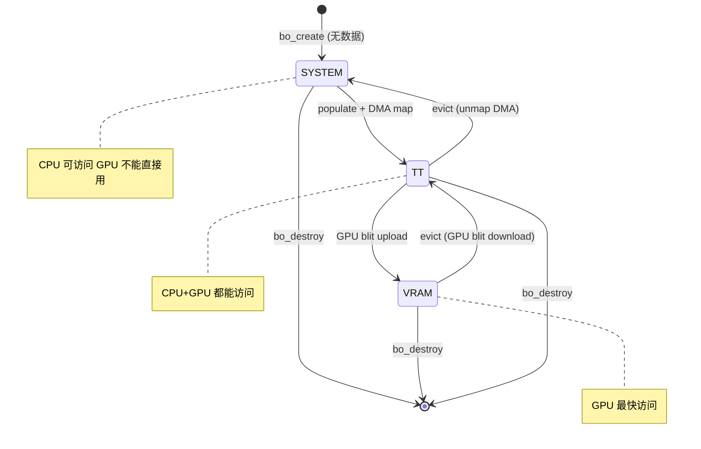
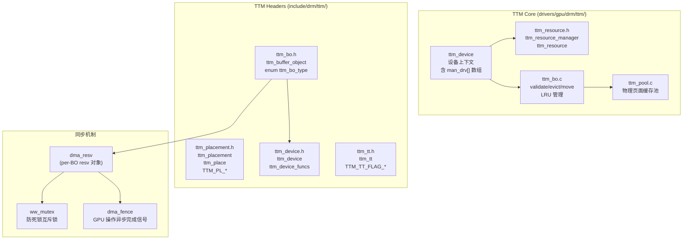
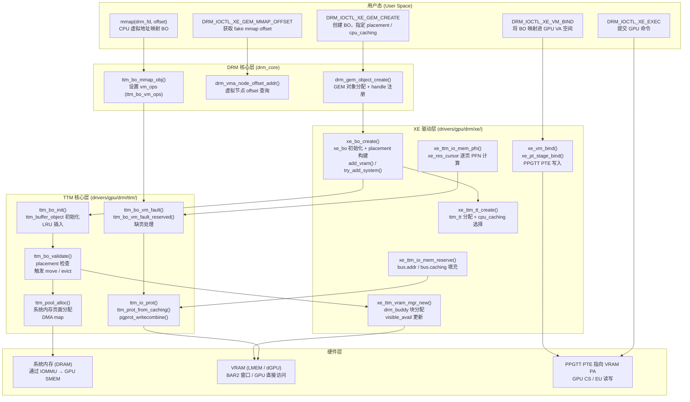
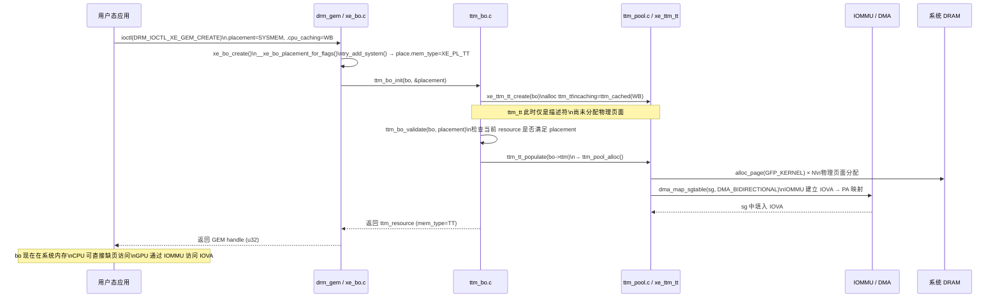
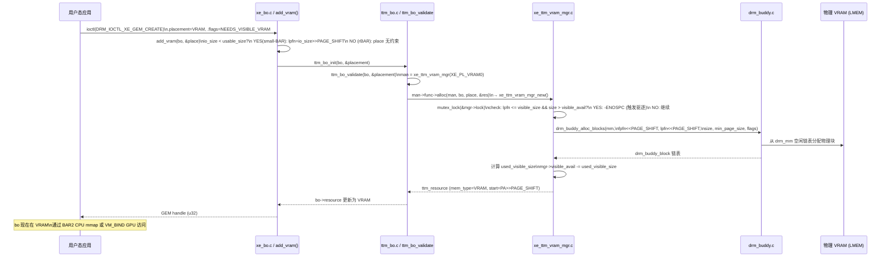
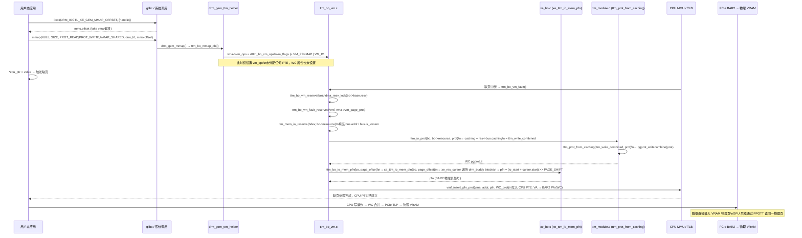
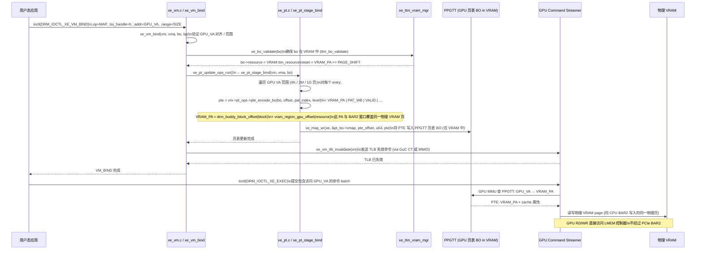
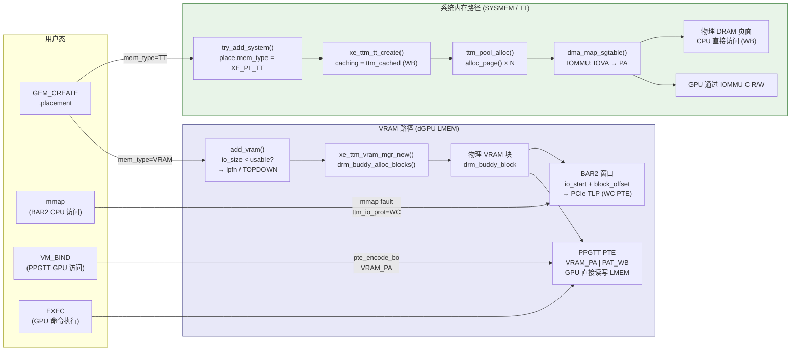

# Part 1: TTM 框架基础 (TTM Framework Overview)

> **Source files**: `include/drm/ttm/ttm_bo.h`, `include/drm/ttm/ttm_device.h`,  
> `include/drm/ttm/ttm_resource.h`, `include/drm/ttm/ttm_placement.h`,  
> `include/drm/ttm/ttm_tt.h`, `drivers/gpu/drm/ttm/`

---

## 1.1 TTM 整体架构与设计目标

TTM (Translation Table Manager) 是 Linux DRM 子系统中专用于 GPU 显存管理的核心框架，最初由 Tungsten Graphics 开发，后合入主线内核。它解决了 GPU 驱动中最核心的问题：**如何在多种内存类型（显存、系统内存、Stolen 内存）之间自动搬移缓冲区对象（Buffer Objects），同时保持 GPU 的并发执行**。

### TTM 解决的核心问题

```
问题一: 内存压力
  GPU 显存容量有限 (4GB ~ 80GB)
  → 当显存满时，必须将不活跃 BO 驱逐(evict)到系统内存
  → BO 再次被使用时，需要迁移(migrate)回显存

问题二: CPU/GPU 可见性
  系统内存 CPU 可直接访问，GPU 需要通过 GTT (Graphics Translation Table) 映射
  显存 GPU 直接访问，CPU 只能通过 BAR 窗口访问

问题三: 并发安全
  多个 CPU 线程 / GPU 引擎同时操作 BO
  → 需要引用计数 + reservation 锁保护
```

### TTM vs GEM 的关系

```
┌─────────────────────────────────────────┐
│              用户空间 (libdrm)            │
│   DRM_IOCTL_XE_GEM_CREATE               │
│   DRM_IOCTL_XE_GEM_MMAP_OFFSET          │
└──────────────────┬──────────────────────┘
                   │
┌──────────────────▼──────────────────────┐
│              GEM 层 (drm_gem)            │
│  drm_gem_object  ← 用户可见的 GEM object │
│  GEM handle → fd (prime) 导出/导入       │
└──────────────────┬──────────────────────┘
                   │  内嵌关系
┌──────────────────▼──────────────────────┐
│              TTM 层                      │
│  ttm_buffer_object → 内存管理核心        │
│  placement / eviction / migration        │
└──────────────────┬──────────────────────┘
                   │
        ┌──────────┴──────────┐
        ▼                     ▼
  ┌──────────┐         ┌──────────────┐
  │ VRAM mgr │         │  TT/System   │
  │(drm_buddy)│        │  mgr (pages) │
  └──────────┘         └──────────────┘
```

GEM 只负责用户空间对象生命周期（handle、fd、refcount），**TTM 才是真正管理物理内存的层**。`drm_gem_object` 内嵌在 `ttm_buffer_object` 的 `base` 字段中。

---

## 1.2 ttm_device — 设备级别生命周期

`ttm_device` 是 TTM 在设备层面的上下文，每个 GPU 设备有一个实例。它持有所有内存类型管理器、LRU 列表，以及指向驱动回调函数的指针。

```c
// include/drm/ttm/ttm_device.h
struct ttm_device {
    struct list_head device_list;      // 全局 TTM 设备链表
    const struct ttm_device_funcs *funcs; // 驱动回调函数表 ← 最重要
    
    struct ttm_resource_manager sysman; // 系统内存管理器(内嵌)
    struct ttm_resource_manager *man_drv[TTM_NUM_MEM_TYPES]; // 所有内存类型管理器数组
    
    // LRU 列表：按 priority 分级，eviction 从低 priority 开始
    struct ttm_lru_bulk_move *lru_bulk_move;
    spinlock_t lru_lock;
    
    struct drm_vma_offset_manager *vma_manager; // mmap 地址空间管理
    struct list_head pinned;           // 所有 pinned BO 链表
};
```

### ttm_device_init 调用（Xe 中）

```c
// drivers/gpu/drm/xe/xe_bo.c
int xe_bo_init(struct xe_device *xe)
{
    int err;

    // 初始化 TTM 设备核心
    err = ttm_device_init(&xe->ttm,             // struct ttm_device
                          &xe_ttm_funcs,         // 驱动回调表(见 Part 3)
                          xe->drm.dev,           // 底层 device
                          xe->drm.anon_inode->i_mapping,
                          xe->drm.vma_offset_manager,
                          false,   // no_io_mem_pfn
                          false);  // use_dma32
    ...
    // 注册各内存类型管理器(见 Part 7)
    xe_ttm_sys_mgr_init(xe);
    for_each_mem_region(...)
        xe_ttm_vram_mgr_init(xe, mr);
    xe_ttm_stolen_mgr_init(xe);
}
```

### ttm_device_funcs — 驱动回调表

```c
// include/drm/ttm/ttm_device.h
struct ttm_device_funcs {
    // TT 页面管理
    struct ttm_tt *(*ttm_tt_create)(struct ttm_buffer_object *, u32 page_flags);
    int  (*ttm_tt_populate)(struct ttm_device *, struct ttm_tt *, ctx);
    void (*ttm_tt_unpopulate)(struct ttm_device *, struct ttm_tt *);
    void (*ttm_tt_destroy)(struct ttm_device *, struct ttm_tt *);

    // BO 迁移与驱逐
    void (*evict_flags)(struct ttm_buffer_object *, struct ttm_placement *);
    int  (*move)(struct ttm_buffer_object *, bool evict, ctx, new_mem, hop);
    bool (*eviction_valuable)(struct ttm_buffer_object *, const struct ttm_place *);

    // MMIO/CPU 访问
    int  (*io_mem_reserve)(struct ttm_device *, struct ttm_resource *);
    unsigned long (*io_mem_pfn)(struct ttm_buffer_object *, unsigned long page_offset);
    int  (*access_memory)(struct ttm_buffer_object *, uint64_t, void *, int, int);

    // 通知钩子
    void (*release_notify)(struct ttm_buffer_object *);
    void (*delete_mem_notify)(struct ttm_buffer_object *);
    void (*swap_notify)(struct ttm_buffer_object *);
};
```

---

## 1.3 ttm_buffer_object 结构剖析

`ttm_buffer_object` 是 TTM 的核心对象，代表一块 GPU 可使用的内存缓冲区。

```c
// include/drm/ttm/ttm_bo.h
struct ttm_buffer_object {
    // ─── GEM 基类 ───────────────────────────
    struct drm_gem_object base;     // .resv: dma_resv (ww_mutex 所在)
                                    // .gpuva.list: 关联的 GPU VMA 链表

    // ─── 初始化后不变 ────────────────────────
    struct ttm_device    *bdev;     // 所属设备
    enum ttm_bo_type      type;     // device / kernel / sg
    uint32_t page_alignment;        // 物理页对齐要求
    void (*destroy)(struct ttm_buffer_object *); // 自定义销毁函数

    // ─── 引用计数 ────────────────────────────
    struct kref kref;               // 归零时触发 destroy

    // ─── reservation lock 保护 ───────────────
    struct ttm_resource  *resource; // 当前物理内存位置描述
    struct ttm_tt        *ttm;      // TT 页面后备(系统内存时有效)
    bool deleted;                   // 是否已被标记删除
    struct ttm_lru_bulk_move *bulk_move; // LRU bulk 迁移组
    unsigned priority;              // LRU 优先级(越低越先被驱逐)
    unsigned pin_count;             // pin 计数(>0 则不可驱逐)

    // ─── 其他 ────────────────────────────────
    struct work_struct delayed_delete; // 延迟销毁工作项
    struct sg_table *sg;            // DMA-buf 外部页面(sg BO)
};
```

### enum ttm_bo_type 详解

| 类型 | 说明 | Xe 使用场景 |
|------|------|------------|
| `ttm_bo_type_device` | 用户空间可 mmap 的 BO | GEM_CREATE 用户 BO |
| `ttm_bo_type_kernel` | 仅内核使用，不可 mmap | 页表 BO、固件 BO、GGTT |
| `ttm_bo_type_sg` | 来自 DMA-buf 的外部 scatter-gather | dma_buf import |

---

## 1.4 ttm_resource 与 ttm_resource_manager

`ttm_resource` 描述 BO **当前的物理内存位置**，由 `ttm_resource_manager::alloc()` 分配：

```c
// include/drm/ttm/ttm_resource.h
struct ttm_resource {
    // ─── LRU 节点 ────────────────────────────
    struct ttm_lru_item lru;        // TTM LRU 链表节点

    // ─── 位置描述 ────────────────────────────
    uint32_t mem_type;              // XE_PL_SYSTEM / XE_PL_TT / XE_PL_VRAM0 ...
    uint32_t placement;             // TTM_PL_FLAG_* 标志(连续/topdown等)
    uint64_t start;                 // 在该内存类型中的起始页帧号(PFN)
                                    // 非连续则为 XE_BO_INVALID_OFFSET

    // ─── 大小 ────────────────────────────────
    size_t   size;                  // 字节大小

    struct ttm_buffer_object *bo;   // 反向指针
    struct ttm_resource_manager *man; // 所属管理器
};
```

`ttm_resource_manager` 是每种内存类型的管理器接口：

```c
// include/drm/ttm/ttm_resource.h
struct ttm_resource_manager {
    bool use_type;     // 是否启用此内存类型
    bool use_tt;       // 此类型是否使用 TT 页面后备(SYSTEM/TT=true, VRAM=false)
    uint64_t size;     // 管理的总内存大小(页数)
    
    const struct ttm_resource_manager_func *func; // alloc/free/intersects/compatible
    
    struct ttm_lru_bulk_move *move;  // bulk eviction 列表
    struct list_head lru[TTM_MAX_BO_PRIORITY]; // 分优先级 LRU 列表
};

struct ttm_resource_manager_func {
    int  (*alloc)(man, bo, place, **res);       // 分配内存
    void (*free)(man, *res);                     // 释放内存
    bool (*intersects)(man, *res, *place, size); // 驱逐候选筛选
    bool (*compatible)(man, *res, *place, size); // 判断是否需要迁移
    void (*debug)(man, *printer);                // debugfs 输出
};
```

### 内存类型管理器注册

```c
// TTM 内置宏：将 manager 注册到 bdev->man_drv[mem_type]
ttm_set_driver_manager(bdev, mem_type, manager);

// 获取指定 mem_type 的管理器
mgr = ttm_manager_type(bdev, mem_type);
```

---

## 1.5 ttm_placement 与 ttm_place

`ttm_placement` 是 BO 创建或迁移时指定的**候选内存位置列表**，TTM 按顺序尝试，第一个成功的即为结果：

```c
// include/drm/ttm/ttm_placement.h
struct ttm_placement {
    unsigned int  num_placement;        // 候选数量(Xe 最多 3 个)
    const struct ttm_place *placement;  // 候选数组指针
};

struct ttm_place {
    unsigned int fpfn;    // first valid page frame number (范围下界)
    unsigned long lpfn;   // last valid page frame number  (范围上界, 0=no limit)
    uint32_t mem_type;    // XE_PL_VRAM0 / XE_PL_TT / XE_PL_SYSTEM ...
    uint32_t flags;       // TTM_PL_FLAG_* 组合
};
```

### TTM_PL_FLAG_* 标志含义

| 标志 | 含义 |
|------|------|
| `TTM_PL_FLAG_DESIRED` | 首选位置（优先尝试） |
| `TTM_PL_FLAG_FALLBACK` | 备用位置（首选失败后尝试） |
| `TTM_PL_FLAG_TOPDOWN` | 从地址空间顶端分配（远离 BAR 窗口） |
| `TTM_PL_FLAG_CONTIGUOUS` | 要求物理连续（用于 vmap、DMA 等） |
| `TTM_PL_FLAG_TEMPORARY` | 临时位置（multihop 中转用） |

### TTM_PL_* 内存类型常量

```c
// include/drm/ttm/ttm_placement.h
#define TTM_PL_SYSTEM  0   // 虚拟系统内存（无 DMA 地址）
#define TTM_PL_TT      1   // GTT 映射的系统内存（有 DMA 地址）
#define TTM_PL_VRAM    2   // 显存（驱动自定义扩展基础）
#define TTM_PL_PRIV    3   // 驱动私有内存类型
// ...
#define TTM_NUM_MEM_TYPES 9
```

---

## 1.6 ttm_tt — TT 页面后备

`ttm_tt` 管理系统内存页面，当 BO 位于 `SYSTEM` 或 `TT` 时有效：

```c
// include/drm/ttm/ttm_tt.h
struct ttm_tt {
    struct ttm_device *bdev;
    uint32_t page_flags;     // TTM_TT_FLAG_* 
    uint64_t num_pages;      // 页面数量
    struct page **pages;     // 页面指针数组(populate 后填充)
    enum ttm_caching caching; // CPU 缓存模式: WB/WC/UC
    
    // DMA 相关
    struct sg_table *sg;     // DMA 散列表(外部 dmabuf)
};

// TTM_TT_FLAG_*
#define TTM_TT_FLAG_SWAPPED        BIT(0) // 被 swap 到磁盘
#define TTM_TT_FLAG_ZERO_ALLOC     BIT(1) // 分配时需要清零
#define TTM_TT_FLAG_EXTERNAL       BIT(2) // 外部管理的页面
#define TTM_TT_FLAG_EXTERNAL_MAPPABLE BIT(3) // 外部页面可映射

// 生命周期
ttm_tt_create()    → 驱动 ttm_tt_create 回调: 分配 ttm_tt 结构
ttm_tt_populate()  → 驱动回调: 分配实际物理页面
ttm_tt_unpopulate()→ 驱动回调: 释放物理页面(但保留结构)
ttm_tt_destroy()   → 驱动回调: 释放 ttm_tt 结构本身
```

### ttm_pool — 页面缓存池

TTM 内建页面池，避免频繁 `alloc_page` / `free_page`：

```c
// drivers/gpu/drm/ttm/ttm_pool.c
// Xe 的 xe_ttm_tt_populate 调用:
ttm_pool_alloc(&xe->ttm.pool, tt, ctx);
// 释放:
ttm_pool_free(&xe->ttm.pool, tt);
```

---

## 1.7 dma_resv 与 ww_mutex

每个 `ttm_buffer_object` 内嵌一个 `dma_resv`（通过 `drm_gem_object.resv`），它是 BO 并发访问的核心同步机制：

```
dma_resv
    └── ww_mutex lock      → 互斥保护（防死锁: wound-wait）
    └── fence list (RCU)   → 追踪 GPU 操作完成的 dma_fence
```

### ww_mutex 死锁预防原理

```
普通 mutex 场景（死锁）:
  线程A: lock(B1) → 等待 lock(B2)
  线程B: lock(B2) → 等待 lock(B1)   ← 死锁!

ww_mutex（wound-wait）:
  每个 lock 操作有 ww_acquire_ctx（时间戳）
  若检测到循环等待：较年轻的持有者被 wound（强制解锁并返回 -EDEADLK）
  受害者 cleanup 后慢路径重获锁
```

### 在 TTM 中的使用模式

```c
// 单个 BO 锁定（无死锁风险）
dma_resv_lock(&bo->ttm.base.resv, NULL);  // ctx=NULL

// 多个 BO 锁定（VM_BIND 路径，通过 drm_exec）
struct drm_exec exec;
drm_exec_init(&exec, DRM_EXEC_INTERRUPTIBLE_WAIT, 0);
drm_exec_until_all_locked(&exec) {
    drm_exec_prepare_obj(&exec, &bo->ttm.base, 1);
}
// ... 操作 BO ...
drm_exec_fini(&exec);
```

---

## 1.8 TTM LRU 与驱逐框架

TTM 维护每种内存类型的 LRU 列表，当内存不足时按 LRU 顺序驱逐：

```c
// 驱逐核心流程 (ttm_bo.c)
ttm_bo_evict_first(bdev, man, ctx)
    ├── 从 LRU 尾部取出 BO（最久未使用）
    ├── 调用 bo->bdev->funcs->evict_flags() → 获取驱逐目标 placement
    ├── ttm_bo_validate(bo, evict_placement, ctx) → 触发实际搬移
    │       └── 调用 bo->bdev->funcs->move()
    └── 更新 LRU

// BO 优先级（Xe 中）
#define XE_BO_PRIORITY_NORMAL   1
bo->ttm.priority = XE_BO_PRIORITY_NORMAL;
// 数字越小 → 越先被驱逐
```

### TTM 驱逐整体状态机



---

## 架构总图



---

## 关键常量速查

```c
// 内存类型 ID
TTM_PL_SYSTEM  = 0   XE_PL_SYSTEM = TTM_PL_SYSTEM
TTM_PL_TT      = 1   XE_PL_TT     = TTM_PL_TT
TTM_PL_VRAM    = 2   XE_PL_VRAM0  = TTM_PL_VRAM
                     XE_PL_VRAM1  = 3
                     XE_PL_STOLEN = 8 (TTM_NUM_MEM_TYPES-1)

// LRU 优先级范围
TTM_MAX_BO_PRIORITY = 4   (0..3, 数字小的先被驱逐)

// Xe 默认优先级
XE_BO_PRIORITY_NORMAL = 1
```

---

## 1.9 用户态到 XE TTM 的完整路径图解

本节用五张图从不同维度展示用户态操作如何流经 DRM / XE 驱动最终落地到 TTM 内存管理层。

---

### 图 1：整体分层架构（用户态 → TTM）



---

### 图 2：系统内存（SYSMEM）BO 创建完整序列

CPU 内存路径：用户态请求分配在系统内存的 BO。



---

### 图 3：VRAM（GPU 显存）BO 创建完整序列

GPU 内存路径：用户态请求分配在 dGPU 显存的 BO。



---

### 图 4：CPU 通过 mmap/BAR2 访问 VRAM（缺页处理序列）



---

### 图 5：GPU 通过 PPGTT VM_BIND 访问 VRAM（GPU VA → 物理 VRAM）



---

### 图 6：CPU 内存 vs GPU 内存完整对比（双路径汇总）


