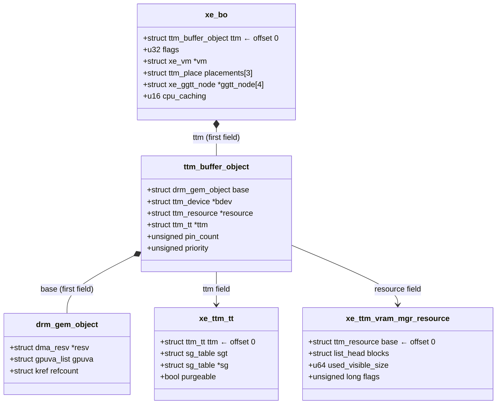
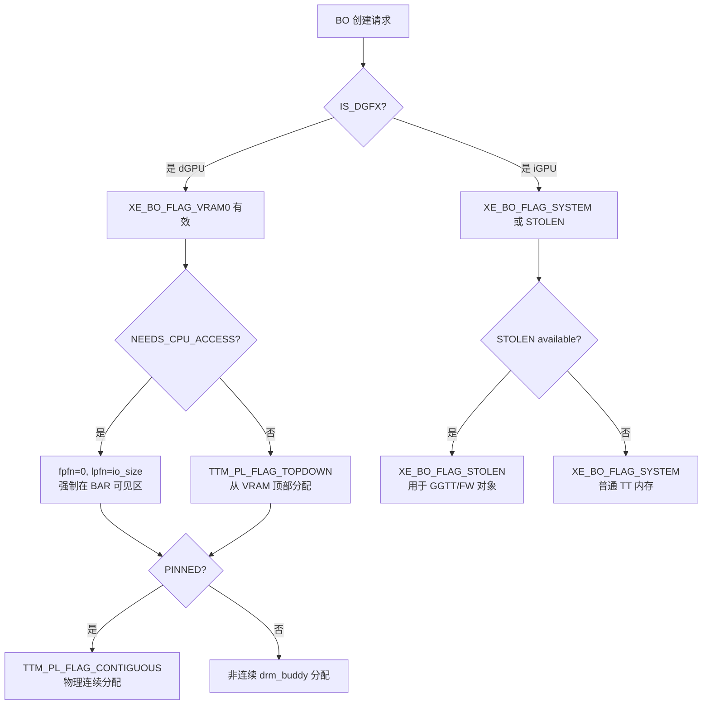

# Part 2: Xe KMD 核心数据结构

> **Source files**: `drivers/gpu/drm/xe/xe_bo_types.h`, `drivers/gpu/drm/xe/xe_bo.h`

---

## 2.1 struct xe_bo — Xe Buffer Object 全字段解析

`xe_bo` 是 Xe KMD 对 TTM buffer object 的封装。**`ttm` 字段必须是第一个成员**，这是 `container_of` 宏零偏移优化的要求。

```c
// drivers/gpu/drm/xe/xe_bo_types.h
struct xe_bo {
    // ══════════════════════════════════════════
    // TTM 基类 (必须第一个！)
    // ══════════════════════════════════════════
    struct ttm_buffer_object ttm;
    //   └─ ttm.base         : drm_gem_object (GEM handle, resv, gpuva.list)
    //   └─ ttm.bdev         : &xe->ttm (xe_device 内的 ttm_device)
    //   └─ ttm.resource     : 当前内存位置 (xe_ttm_vram_mgr_resource 等)
    //   └─ ttm.ttm          : xe_ttm_tt (系统内存时的页面后备)
    //   └─ ttm.priority     : LRU 优先级
    //   └─ ttm.pin_count    : pin 计数

    // ══════════════════════════════════════════
    // 挂起/恢复备份
    // ══════════════════════════════════════════
    struct xe_bo *backup_obj;   // 挂起时 VRAM BO 的系统内存备份
    struct xe_bo *parent_obj;   // 若本 BO 是 backup_obj，此指向原始 BO

    // ══════════════════════════════════════════
    // 标志与所有权
    // ══════════════════════════════════════════
    u32 flags;                  // XE_BO_FLAG_* 位图(见 2.3 节)
    struct xe_vm   *vm;         // 所属 VM(extobj 时为 NULL)
    struct xe_tile *tile;       // 所属 tile(kernel BO only)

    // ══════════════════════════════════════════
    // TTM Placement
    // ══════════════════════════════════════════
    struct ttm_place     placements[XE_BO_MAX_PLACEMENTS]; // 候选位置数组(最多3)
    struct ttm_placement placement;   // 当前 placement(含 .placement 指针和 num 计数)

    // ══════════════════════════════════════════
    // GGTT 映射
    // ══════════════════════════════════════════
    struct xe_ggtt_node *ggtt_node[XE_MAX_TILES_PER_DEVICE];
    //   每个 tile 可能有独立的 GGTT 映射节点

    // ══════════════════════════════════════════
    // CPU 访问
    // ══════════════════════════════════════════
    struct iosys_map   vmap;    // kernel CPU vmap (pinned 连续 BO 使用)
    struct ttm_bo_kmap_obj kmap; // 内部 kmap 对象(短暂 CPU 访问)

    // ══════════════════════════════════════════
    // 管理链表
    // ══════════════════════════════════════════
    struct list_head pinned_link; // 链入 xe_device 的 pinned BO 链表

    // ══════════════════════════════════════════
    // 安全/加密
    // ══════════════════════════════════════════
    u32 pxp_key_instance;       // PXP 加密 key 实例(0 = 不加密)

    // ══════════════════════════════════════════
    // CCS (Compressed Color Surface)
    // ══════════════════════════════════════════
    bool ccs_cleared;           // CCS 元数据区域是否已清零
    struct xe_bb *bb_ccs[XE_SRIOV_VF_CCS_CTX_COUNT]; // VF: CCS BB 指令

    // ══════════════════════════════════════════
    // CPU 缓存模式
    // ══════════════════════════════════════════
    u16 cpu_caching;            // DRM_XE_GEM_CPU_CACHING_WB / WC

    // ══════════════════════════════════════════
    // SVM (Shared Virtual Memory)
    // ══════════════════════════════════════════
    struct drm_pagemap_devmem devmem_allocation; // SVM device memory alloc
    struct list_head vram_userfault_link;        // SVM userfault 链表节点

    // ══════════════════════════════════════════
    // 内存对齐
    // ══════════════════════════════════════════
    u64 min_align;              // 覆盖默认对齐要求(部分特殊 BO 使用)

    // ══════════════════════════════════════════
    // 生命周期追踪
    // ══════════════════════════════════════════
    int  update_index;          // 若是页表 BO，记录更新索引
    bool created;               // 是否已通过初始创建阶段
    struct llist_node freed;    // 延迟释放链表节点(lockless)
};
```

### 内存布局示意

```
┌─────────────────────────────────────────────────────┐ offset 0
│  struct ttm_buffer_object ttm                        │
│    ├─ struct drm_gem_object base                     │
│    │    ├─ struct dma_resv *resv  ←─────────────────── ww_mutex 所在
│    │    └─ struct gpuva_list gpuva.list               │
│    ├─ struct ttm_device *bdev    ←──────────── &xe->ttm
│    ├─ enum ttm_bo_type type                          │
│    ├─ struct ttm_resource *resource                  │
│    ├─ struct ttm_tt *ttm         ←──────────── xe_ttm_tt
│    ├─ unsigned pin_count                             │
│    └─ unsigned priority                              │
├─────────────────────────────────────────────────────┤
│  struct xe_bo * backup_obj                           │
│  struct xe_bo * parent_obj                           │
│  u32 flags          ← XE_BO_FLAG_*                  │
│  struct xe_vm *vm                                    │
│  struct xe_tile *tile                                │
│  struct ttm_place placements[3]                      │
│  struct ttm_placement placement                      │
│  struct xe_ggtt_node *ggtt_node[4]                   │
│  struct iosys_map vmap                               │
│  ...                                                 │
└─────────────────────────────────────────────────────┘
```

---

## 2.2 container_of 转换宏

#### 零偏移的具体收益

`container_of` 宏展开为（[include/linux/container_of.h](include/linux/container_of.h)）：

```c
#define container_of(ptr, type, member) ({
    void *__mptr = (void *)(ptr);
    (( type *)(__mptr - offsetof(type, member)));  // ← 关键：减去偏移量
})
```

**当 `ttm` 是第一个成员时**，`offsetof(struct xe_bo, ttm) == 0`：

```c
// ttm_to_xe_bo() 展开后：
(struct xe_bo *)(__mptr - 0)
// 编译器直接优化为：
(struct xe_bo *)(__mptr)       // ← 纯类型转换，无任何减法指令
```

**若 `ttm` 不是第一个成员**（假设在偏移 `0x40` 处）：

```c
(struct xe_bo *)(__mptr - 0x40)
// 必须生成一条减法指令：
//   x86-64:  sub  rax, 0x40
//   ARM64:   sub  x0, x0, #64
```

**汇编级对比（`ttm_to_xe_bo` 在 TTM callback 中每次调用都会触发）**：

```asm
; ttm 是第一个成员（offset=0）—— 编译产物：什么都没有
; 调用前: rdi = ttm_buffer_object*
; 调用后: rdi = xe_bo*          ← 指针值完全不变，零开销

; ttm 不是第一个成员（offset=0x40）—— 编译产物：
  sub   rdi, 0x40               ← 额外一条减法，污染流水线寄存器重命名
```

**好处不止于此**——当 `ttm` 在偏移 0 处，编译器还能进行：

| 优化 | 说明 |
|------|------|
| **指针等价推断** | 编译器知道 `&xe_bo->ttm == (void*)xe_bo`，可跨函数消除冗余转换 |
| **别名分析简化** | 指向同一地址的两种类型指针，编译器可安全推断不存在意外别名 |
| **内联后零代码生成** | `ttm_to_xe_bo()` 被内联时，整个调用完全消失（`mov`→`nop` 级优化） |
| **Cache line 对齐** | TTM 基类字段（`resv`/`resource` 等）从 cache line 起始处开始，减少跨行访问 |

**实际影响**：`ttm_to_xe_bo()` 在 TTM 核心回调（`xe_ttm_bo_destroy`、`xe_ttm_move`、`xe_ttm_io_mem_reserve` 等）中**每次 BO 操作都调用**。在高频 GPU workload 下（每帧数千次 BO 操作），这是一个实质性的热路径优化。

---

由于 `ttm` 是 `xe_bo` 的第一个字段，`container_of` 偏移为 0，无性能损失：

```c
// drivers/gpu/drm/xe/xe_bo.h

// ttm_buffer_object → xe_bo
static inline struct xe_bo *
ttm_to_xe_bo(const struct ttm_buffer_object *bo)
{
    return container_of(bo, struct xe_bo, ttm);
}

// drm_gem_object → xe_bo  (gem.base 是 ttm 的第一个成员，所以两级 container_of)
static inline struct xe_bo *
gem_to_xe_bo(const struct drm_gem_object *obj)
{
    return container_of(obj, struct xe_bo, ttm.base);
}

// ttm_device → xe_device
static inline struct xe_device *
ttm_to_xe_device(struct ttm_device *bdev)
{
    return container_of(bdev, struct xe_device, ttm);
}

// 快捷获取 xe_device
static inline struct xe_device *xe_bo_device(struct xe_bo *bo)
{
    return ttm_to_xe_device(bo->ttm.bdev);
}
```

### 对象层次关系图



---

## 2.3 XE_PL_* 内存类型常量

```c
// drivers/gpu/drm/xe/xe_bo.h

// 与 TTM 内置常量对齐
#define XE_PL_SYSTEM    TTM_PL_SYSTEM           // = 0
#define XE_PL_TT        TTM_PL_TT               // = 1  (GTT 映射的系统内存)
#define XE_PL_VRAM0     TTM_PL_VRAM             // = 2  (tile-0 LMEM)
#define XE_PL_VRAM1     (XE_PL_VRAM0 + 1)      // = 3  (tile-1 LMEM, 多 tile dGPU)
#define XE_PL_STOLEN    (TTM_NUM_MEM_TYPES - 1) // = 8  (BIOS Stolen 内存)
```

### 内存类型访问特性矩阵

| 内存类型 | `mem_type` | CPU 可访问 | GPU 可访问 | DMA 地址 | 物理连续 | 管理器 |
|---------|-----------|-----------|-----------|---------|---------|--------|
| `XE_PL_SYSTEM` | 0 | ✅ 直接 | ❌ | ❌ | ❌ （页面分散） | `xe_ttm_sys_mgr` |
| `XE_PL_TT` | 1 | ✅ 直接 | ✅ via GTT | ✅ | ❌ | `xe_ttm_sys_mgr` |
| `XE_PL_VRAM0` | 2 | ⚠️ via BAR | ✅ 直接 | ✅ | ⚠️ 取决于分配 | `xe_ttm_vram_mgr` |
| `XE_PL_VRAM1` | 3 | ⚠️ via BAR | ✅ 直接 | ✅ | ⚠️ 取决于分配 | `xe_ttm_vram_mgr` |
| `XE_PL_STOLEN` | 8 | ⚠️ via GGTT/BAR | ✅ 直接 | ✅ | ✅ 总是连续 | `xe_ttm_stolen_mgr` |

> ⚠️ VRAM CPU 访问受限于 `io_size`（BAR 窗口大小），超出部分 CPU 无法直接访问

### 内存名称映射

```c
// xe_bo.c:44
const char *const xe_mem_type_to_name[TTM_NUM_MEM_TYPES] = {
    [XE_PL_SYSTEM] = "system",
    [XE_PL_TT]     = "gtt",
    [XE_PL_VRAM0]  = "vram0",
    [XE_PL_VRAM1]  = "vram1",
    [XE_PL_STOLEN] = "stolen"
};
// 用于 dmesg 日志输出
```

---

## 2.4 XE_BO_FLAG_* 完整标志位

```c
// drivers/gpu/drm/xe/xe_bo.h

// ─── 用户/系统标识 ─────────────────────────────────
#define XE_BO_FLAG_USER             BIT(0)   // 用户空间 GEM 对象

// ─── 内存位置偏好（必须连续排布！VRAM_MASK 依赖此）──
#define XE_BO_FLAG_SYSTEM           BIT(1)   // 允许/偏好系统内存(TT placement)
#define XE_BO_FLAG_VRAM0            BIT(2)   // 允许/偏好 tile-0 VRAM
#define XE_BO_FLAG_VRAM1            BIT(3)   // 允许/偏好 tile-1 VRAM
#define XE_BO_FLAG_VRAM_MASK        (BIT(2)|BIT(3))
// 辅助宏：根据 vram 对象选择标志
#define XE_BO_FLAG_VRAM(vram)       (XE_BO_FLAG_VRAM0 << ((vram)->id))
// dGFX 使用 VRAM，iGFX 使用 SYSTEM
#define XE_BO_FLAG_VRAM_IF_DGFX(tile) ...

// ─── 特殊内存 ─────────────────────────────────────
#define XE_BO_FLAG_STOLEN           BIT(4)   // 使用 Stolen 内存
#define XE_BO_FLAG_GGTT             BIT(5)   // 需要 GGTT 映射（已废弃,用GGTT0-3）

// ─── 分配约束 ─────────────────────────────────────
#define XE_BO_FLAG_IGNORE_MIN_PAGE_SIZE BIT(6) // 忽略最小页面大小约束
#define XE_BO_FLAG_PINNED           BIT(7)   // pin 住,不可被驱逐
#define XE_BO_FLAG_NO_RESV_EVICT    BIT(8)   // 不可通过注册的 resv 驱逐
#define XE_BO_FLAG_DEFER_BACKING    BIT(9)   // 延迟 TT populate(懒分配)
#define XE_BO_FLAG_SCANOUT          BIT(10)  // Display 扫描输出BO(必须在BAR内)
#define XE_BO_FLAG_FIXED_PLACEMENT  BIT(11)  // 不可迁移(固定位置)
#define XE_BO_FLAG_PAGETABLE        BIT(12)  // 页表 BO(WC caching)
#define XE_BO_FLAG_NEEDS_CPU_ACCESS BIT(13)  // 必须 CPU 可访问(在 BAR 可见区)
#define XE_BO_FLAG_NEEDS_UC         BIT(14)  // 需要 Uncached CPU 映射
#define XE_BO_FLAG_NEEDS_64K        BIT(15)  // 64KB 页面对齐
#define XE_BO_FLAG_NEEDS_2M         BIT(16)  // 2MB 页面对齐

// ─── 操作行为 ─────────────────────────────────────
#define XE_BO_FLAG_GGTT_INVALIDATE  BIT(17)  // move 后需要 GGTT TLB 刷新
#define XE_BO_FLAG_PINNED_NORESTORE BIT(18)  // 挂起时不恢复(内容可丢弃)
#define XE_BO_FLAG_PINNED_LATE_RESTORE BIT(19) // 挂起时延迟恢复

// ─── 按 tile 绑定 GGTT ─────────────────────────────
#define XE_BO_FLAG_GGTT0            BIT(20)  // tile-0 GGTT 映射
#define XE_BO_FLAG_GGTT1            BIT(21)  // tile-1 GGTT 映射
#define XE_BO_FLAG_GGTT2            BIT(22)  // tile-2 GGTT 映射
#define XE_BO_FLAG_GGTT3            BIT(23)  // tile-3 GGTT 映射
#define XE_BO_FLAG_GGTT_ALL         (BIT(20)|BIT(21)|BIT(22)|BIT(23))

// ─── SVM/UMM 特殊用途 ──────────────────────────────
#define XE_BO_FLAG_CPU_ADDR_MIRROR  BIT(24)  // SVM CPU 地址镜像 BO
#define XE_BO_FLAG_FORCE_USER_VRAM  BIT(25)  // kernel BO 强制使用 user VRAM 分区

// ─── 内部测试 ──────────────────────────────────────
#define XE_BO_FLAG_INTERNAL_TEST    BIT(30)
#define XE_BO_FLAG_INTERNAL_64K     BIT(31)  // 内部: 使用 64K 页面
```

### 标志组合语义示例

```c
// 用户 BO，优先 VRAM，降级 SYSTEM
flags = XE_BO_FLAG_USER | XE_BO_FLAG_VRAM0 | XE_BO_FLAG_SYSTEM;

// 页表 BO，固定在 TT，需要 WC caching
flags = XE_BO_FLAG_PAGETABLE | XE_BO_FLAG_SYSTEM | XE_BO_FLAG_PINNED;

// Display scanout，必须在 BAR 可见 VRAM 区
flags = XE_BO_FLAG_SCANOUT | XE_BO_FLAG_VRAM0 | XE_BO_FLAG_NEEDS_CPU_ACCESS;

// GuC 固件 BO，放 Stolen，CPU 可访问，固定不移动
flags = XE_BO_FLAG_STOLEN | XE_BO_FLAG_NEEDS_CPU_ACCESS | XE_BO_FLAG_PINNED;
```

### 标志位决策流程图



---

## 2.5 xe_ggtt_node — GGTT 映射节点

当 `XE_BO_FLAG_GGTT0/1/2/3` 被设置时，BO 会被映射到对应 tile 的 GGTT：

```c
// drivers/gpu/drm/xe/xe_ggtt_types.h
struct xe_ggtt_node {
    struct drm_mm_node base; // drm_mm 分配节点(含 start/size)
    struct xe_ggtt *ggtt;    // 所属 GGTT
};

// xe_bo 中
struct xe_ggtt_node *ggtt_node[XE_MAX_TILES_PER_DEVICE]; // 最多 4 个 tile
```

GGTT 映射主要用于：
1. **内核 CPU 访问 VRAM**（通过 GGTT BAR 窗口）
2. **GuC/HuC 固件访问**（使用 GGTT 地址）
3. **Display Engine 扫描输出**（旧式 GGTT 映射）

---

## 2.6 xe_ttm_tt — 子类化的 ttm_tt

```c
// drivers/gpu/drm/xe/xe_bo.c (内部定义)
struct xe_ttm_tt {
    struct ttm_tt ttm;      // 必须第一个成员
    struct sg_table sgt;    // 内嵌 sg_table (非 dmabuf 路径使用)
    struct sg_table *sg;    // 指向 sgt 或外部 sg (dmabuf 路径)
    bool purgeable;         // 内容可被 shrinker 丢弃
};
```

这个结构在 `xe_ttm_tt_create()` 中分配，当 BO 位于 SYSTEM 或 TT 时存在。

---

## 相关关键函数速查

| 函数 | 文件 | 说明 |
|------|------|------|
| `ttm_to_xe_bo()` | `xe_bo.h` | `ttm_buffer_object → xe_bo` |
| `gem_to_xe_bo()` | `xe_bo.h` | `drm_gem_object → xe_bo` |
| `xe_bo_device()` | `xe_bo.h` | 获取 `xe_device` |
| `xe_bo_is_vram()` | `xe_bo.c` | 判断是否在 VRAM/Stolen |
| `xe_bo_is_stolen()` | `xe_bo.c` | 判断是否在 Stolen |
| `xe_bo_has_single_placement()` | `xe_bo.c` | 是否只有一个 placement |
| `xe_bo_is_pinned()` | `xe_bo.h` | `pin_count > 0` |
| `xe_bo_size()` | `xe_bo.h` | `bo->ttm.base.size` |
