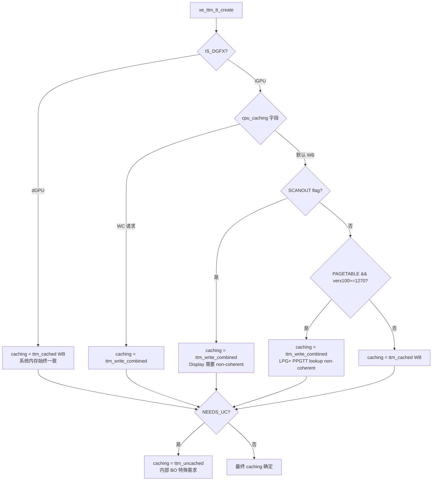
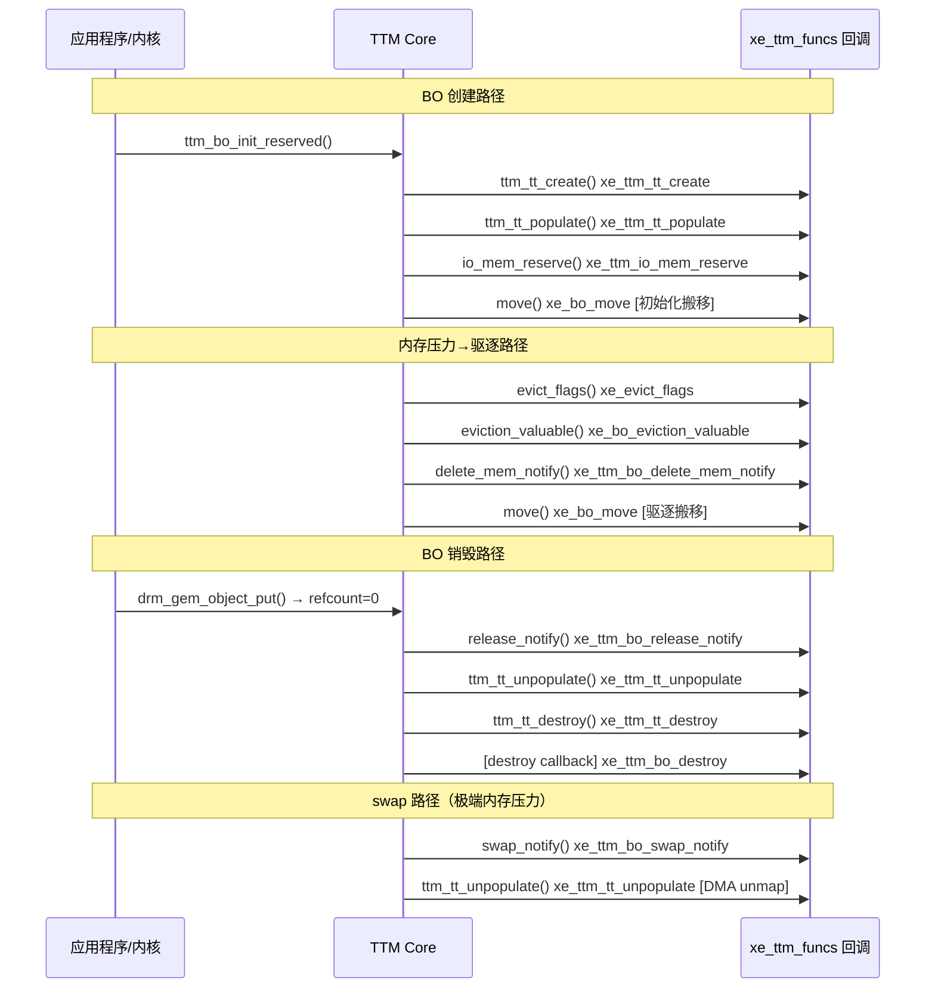

# Part 3: xe_ttm_funcs — TTM 驱动回调表

> **Source file**: `drivers/gpu/drm/xe/xe_bo.c:1688`

---

## 3.1 xe_ttm_funcs 全貌

`xe_ttm_funcs` 是 Xe 向 TTM 框架注册的完整回调函数表，TTM core 通过这些函数驱动 Xe 的内存管理行为：

```c
// drivers/gpu/drm/xe/xe_bo.c:1688
const struct ttm_device_funcs xe_ttm_funcs = {
    // ─── TT 页面生命周期 ─────────────────────────────────
    .ttm_tt_create     = xe_ttm_tt_create,      // 分配 xe_ttm_tt 结构
    .ttm_tt_populate   = xe_ttm_tt_populate,    // 分配物理页 + 建立 DMA 映射
    .ttm_tt_unpopulate = xe_ttm_tt_unpopulate,  // 释放物理页面
    .ttm_tt_destroy    = xe_ttm_tt_destroy,     // 释放 xe_ttm_tt 结构

    // ─── BO 驱逐与迁移 ────────────────────────────────────
    .evict_flags        = xe_evict_flags,           // 决定驱逐目标 placement
    .move               = xe_bo_move,               // 执行实际内存搬移
    .eviction_valuable  = xe_bo_eviction_valuable,  // 判断驱逐是否值得

    // ─── MMIO / CPU 直接访问 ─────────────────────────────
    .io_mem_reserve     = xe_ttm_io_mem_reserve,    // 预留 VRAM BAR MMIO 映射
    .io_mem_pfn         = xe_ttm_io_mem_pfn,        // 返回 VRAM 页面的 PFN
    .access_memory      = xe_ttm_access_memory,     // debugfs 内存读写

    // ─── 通知钩子 ────────────────────────────────────────
    .release_notify     = xe_ttm_bo_release_notify,     // GEM refcount 归零时
    .delete_mem_notify  = xe_ttm_bo_delete_mem_notify,  // BO 从 mem_type 移除时
    .swap_notify        = xe_ttm_bo_swap_notify,        // BO 被 OS swap 到磁盘时
};
```

---

## 3.2 TT 页面组：`xe_ttm_tt_create` / `populate` / `unpopulate` / `destroy`

### 3.2.1 `xe_ttm_tt_create` — 创建 TT 对象

当 BO 需要系统内存后备时（SYSTEM 或 TT placement），TTM 调用此函数分配 `ttm_tt` 结构：

```c
// xe_bo.c:472
static struct ttm_tt *xe_ttm_tt_create(struct ttm_buffer_object *ttm_bo,
                                        u32 page_flags)
{
    struct xe_bo *bo = ttm_to_xe_bo(ttm_bo);
    struct xe_device *xe = xe_bo_device(bo);
    struct xe_ttm_tt *xe_tt;
    enum ttm_caching caching = ttm_cached; // 默认 WB

    xe_tt = kzalloc(sizeof(*xe_tt), GFP_KERNEL);

    // ① 计算 CCS 额外页面（iGPU 压缩元数据）
    extra_pages = 0;
    if (xe_bo_needs_ccs_pages(bo))
        extra_pages = DIV_ROUND_UP(xe_device_ccs_bytes(xe, size), PAGE_SIZE);

    // ② 确定 CPU caching 模式
    if (!IS_DGFX(xe)) {
        switch (bo->cpu_caching) {
        case DRM_XE_GEM_CPU_CACHING_WC:
            caching = ttm_write_combined; // WC: 用于 scanout/pagetable
            break;
        default:
            caching = ttm_cached;        // WB: 普通 BO
        }
        // Scanout 和页表 BO 特殊处理
        if ((!bo->cpu_caching && bo->flags & XE_BO_FLAG_SCANOUT) ||
            (xe->info.graphics_verx100 >= 1270 &&
             bo->flags & XE_BO_FLAG_PAGETABLE))
            caching = ttm_write_combined;
    }
    /*
     * DGFX system memory is always WB / ttm_cached, since
     * other caching modes are only supported on x86. DGFX
     * GPU system memory accesses are always coherent with the
     * CPU.
     */
    // DGFX 系统内存始终 WB (GPU 访问通过 GTT 保持一致性)

    if (bo->flags & XE_BO_FLAG_NEEDS_UC)
        caching = ttm_uncached;

    // ③ 非 sg BO 标记为外部可映射
    if (ttm_bo->type != ttm_bo_type_sg)
        page_flags |= TTM_TT_FLAG_EXTERNAL | TTM_TT_FLAG_EXTERNAL_MAPPABLE;

    // ④ 初始化 ttm_tt 基类
    ttm_tt_init(&xe_tt->ttm, &bo->ttm, page_flags, caching, extra_pages);

    return &xe_tt->ttm;
}
```

### CPU Caching 模式决策树



### 为什么 dGPU 系统内存**始终** WB？

这是整个 caching 模型中最容易被误解的一点。结论是：**dGPU 对系统内存的访问自带硬件级 PCIe Snoop，WB 天然安全**。

#### 关键：PCIe "Snoop" 机制

dGPU 通过 PCIe 总线访问主机系统内存（DRAM）。在 x86 平台上，dGPU 发出的内存读写 PCIe TLP 默认启用 **Snoop**（No Snoop bit = 0）：

```
CPU 写（WB 缓存）：
  CPU core → 写入 L1/L2/L3 cache（脏行，未即时写 DRAM）

dGPU 读（从系统内存）：
  GPU → PCIe TLP (MRd, No_Snoop=0) →
  PCIe RC 接收到请求 →
  RC 向所有 CPU core 广播 Snoop 请求 →
  持有脏行的 core 强制将数据回写到 DRAM（或直接转发给 GPU）→
  GPU 拿到最新数据（与 CPU cache 一致）
```

这个 snoop 过程由 **x86 CPU 的 cache coherency 协议（MESI/MESIF）+ PCIe RC 硬件**自动完成，驱动软件无需任何干预。因此：

- CPU 用 WB 写系统内存 → **数据可能仍在 L3 cache**
- GPU 通过 PCIe 读同一地址 → **RC snoop 强制刷新 → GPU 读到新数据**
- **不需要 clflush，不需要 WC，WB 已经足够**

#### PAT coh_mode：驱动侧确认 snoop 路径

xe 驱动在 PPGTT PTE 中通过 PAT index 控制 GPU 侧的 coherency 模式（`xe_pat.c`）：

```c
// xe_pat.c: Xe2 PAT coh_mode 字段含义
// coh_mode = 0 → no snoop（GPU 不发 snoop 请求，可能读到 stale 数据）
// coh_mode = 2 → 1-way coherent（GPU 读时 snoop CPU cache，CPU 读不 snoop GPU）
// coh_mode = 3 → 2-way coherent（双向 snoop）

#define XE_COH_NONE          1   // no snoop
#define XE_COH_AT_LEAST_1WAY 2   // at least 1-way snoop
```

当驱动将 dGPU 系统内存 BO 绑定到 PPGTT 时，使用带 `XE_COH_AT_LEAST_1WAY` 的 PAT index，即 `coh_mode >= 2`（1-way 或 2-way coherent）。这意味着 GPU 每次读该内存都发出带 snoop 的 PCIe TLP，保证读到 CPU cache 中的最新值。

uAPI 层也有这个约束（`xe_drm.h`）：

```c
/*
 * @cpu_caching: ...
 * The exception is when mapping system memory (including data evicted
 * to system) on discrete GPUs. The caching mode selected will
 * then be overridden to DRM_XE_GEM_CPU_CACHING_WB, and coherency
 * between GPU- and CPU is guaranteed.
 */
```

#### 为什么 iGPU 部分场景不能用 WB？

iGPU 不走 PCIe 总线，直接共享 CPU 的 LLC（L3 cache）。与 dGPU 的 snoop 机制不同，iGPU 的某些访问路径完全**绕过 LLC**，根本看不到 CPU 的缓存数据：

| iGPU 访问场景 | LLC 可见？ | 是否 coherent | 需要 CPU WC？ |
|--------------|-----------|--------------|-------------|
| 普通 EU/CS 读写（WB PAT） | ✅ 通过 LLC | ✅ coherent | 否，WB 够用 |
| Display 引擎扫描（plane scan-out） | ❌ 直读 DRAM | ❌ **non-coherent** | **是** |
| Xe_LPG+ PPGTT 页表遍历 | ❌ 硬件行为改变 | ❌ **non-coherent** | **是** |

Display 引擎是独立固定功能硬件，它直接读 DRAM 的 framebuffer，不经过 LLC。如果 CPU 用 WB 写 framebuffer 数据（留在 L3 cache 未刷到 DRAM），display 引擎读到的就是**旧数据**，导致画面撕裂或错误。因此 framebuffer 必须用 WC，强制 CPU 写操作直接写到 DRAM。

#### 总结

| 平台 | 系统内存 CPU caching | 原因 |
|------|---------------------|------|
| **dGPU (DG2/PVC/BMG...)** | **始终 WB** (`ttm_cached`) | PCIe TLP snoop 机制保证 CPU cache 与 GPU 读一致，WB 安全高效 |
| iGPU 普通 BO | WB (`ttm_cached`) | 共享 LLC，GPU/CPU 都走 LLC → coherent |
| iGPU display scanout BO | **WC** (`ttm_write_combined`) | display 引擎绕过 LLC 直读 DRAM → CPU 需 WC 防 stale |
| iGPU Xe_LPG+ 页表 BO | **WC** (`ttm_write_combined`) | PPGTT walk 在该代平台不走 LLC → 需要 WC |

### 3.2.2 `xe_ttm_tt_populate` — 分配物理页面

```c
static int xe_ttm_tt_populate(struct ttm_device *ttm_dev,
                               struct ttm_tt *tt,
                               struct ttm_operation_ctx *ctx)
{
    struct xe_device *xe = ttm_to_xe_device(ttm_dev);
    struct xe_ttm_tt *xe_tt = container_of(tt, struct xe_ttm_tt, ttm);

    // 外部 dmabuf sg BO 不需要 populate
    if (tt->page_flags & TTM_TT_FLAG_EXTERNAL)
        return 0;

    // 通过 TTM 页面池分配物理页（支持 WB/WC/UC 缓存模式）
    err = ttm_pool_alloc(&ttm_dev->pool, tt, ctx);
    if (err)
        return err;

    // 记录到 shrinker（内存压力时可回收）
    xe_ttm_tt_account_add(xe, tt);

    return 0;
}
```

`ttm_pool_alloc` 内部逻辑：
- 优先从页面缓存池取（避免 `alloc_page` 开销）
- 失败则调用内核页面分配器
- 按 caching 模式设置 PTE 属性（set_memory_wc 等）

> **重要**：`populate` **只分配物理页**，不建立 DMA 映射。DMA 映射由 `xe_bo_move()` 中的 `xe_tt_map_sg()` 负责（在 BO 移动到 `XE_PL_TT` 时调用）。

### 3.2.2b `xe_tt_map_sg` / `xe_tt_unmap_sg` — DMA 映射生命周期

#### 什么是 DMA 映射

CPU 访问内存用**虚拟地址 → 物理地址**（MMU），GPU 等外设 DMA 访问内存用 **DMA 地址（IOVA）**（IOMMU）：

```
无 IOMMU（老系统）:          有 IOMMU（现代系统）:
  DMA 地址 == 物理地址          物理页 PA:0x1A3000
  设备直接用物理地址              → IOMMU 映射
                                → IOVA:0x00200000
  CPU VA ──MMU──► PA           CPU VA ──MMU──► PA
  GPU DMA addr == PA           GPU DMA addr ──IOMMU──► PA
```

优势：IOMMU 可将物理散页映射为 GPU 视角的**连续 IOVA**，同时提供 DMA 隔离保护。

#### `sg_table` 数据结构

系统内存的物理页通常**物理不连续**，`sg_table` 描述这些碎片页及其 DMA 地址：

```c
// struct xe_ttm_tt 中的字段：
struct xe_ttm_tt {
    struct ttm_tt    ttm;
    struct sg_table  sgt;   // sg_table 本体（内嵌）
    struct sg_table *sg;    // 指向 sgt（NULL 表示未映射）
    bool purgeable;
};

// sg_table 由 scatterlist 数组组成：
struct scatterlist {
    unsigned long  page_link;    // → struct page（物理页）
    unsigned int   offset;
    unsigned int   length;       // 页内长度
    dma_addr_t     dma_address;  // ← DMA 映射后填充，GPU PTE 使用此值
    unsigned int   dma_length;   // IOMMU 合并后的段长度
};
```

#### `xe_tt_map_sg()` 完整实现

```c
// xe_bo.c:383 — 在 xe_bo_move() 移动到 XE_PL_TT 时调用
static int xe_tt_map_sg(struct xe_device *xe, struct ttm_tt *tt)
{
    struct xe_ttm_tt *xe_tt = container_of(tt, struct xe_ttm_tt, ttm);

    if (xe_tt->sg)
        return 0;  // 幂等：已映射则跳过

    // ① 从 tt->pages[] 构建 scatterlist
    //    物理连续的相邻页会合并为一个 entry
    ret = sg_alloc_table_from_pages_segment(
            &xe_tt->sgt,
            tt->pages,                          // struct page * 数组
            tt->num_pages,
            0,
            (u64)tt->num_pages << PAGE_SHIFT,
            xe_sg_segment_size(xe->drm.dev),    // IOMMU segment 大小上限
            GFP_KERNEL);

    xe_tt->sg = &xe_tt->sgt;

    // ② 通知 IOMMU/DMA 层建立映射（填充每个 entry 的 dma_address）
    ret = dma_map_sgtable(
            xe->drm.dev,
            xe_tt->sg,
            DMA_BIDIRECTIONAL,          // GPU 可读可写
            DMA_ATTR_SKIP_CPU_SYNC);    // 跳过软件 cache flush（硬件 coherency）
    return ret;
}
```

#### 建立映射后的地址转换

```
示例：4 个物理页（两个不连续段）

tt->pages[]:  PA=0x1A3000  PA=0x7B2000  PA=0x7B3000  PA=0x5C1000
                               └─── 物理连续，合并 ───┘
                    ↓ sg_alloc_table_from_pages_segment()
sgl[0]: page[0],  length=4K
sgl[1]: page[1-2],length=8K   ← 两页合并
sgl[2]: page[3],  length=4K
                    ↓ dma_map_sgtable()  → IOMMU 建立 IOVA
sgl[0]: dma_address=IOVA_A, dma_length=4K
sgl[1]: dma_address=IOVA_B, dma_length=8K
sgl[2]: dma_address=IOVA_C, dma_length=4K
```

#### DMA 地址如何写入 GPU 页表（PPGTT PTE）

```c
// xe_res_cursor.h:323 — 遍历 sg 时提取 DMA 地址
static inline u64 xe_res_dma(const struct xe_res_cursor *cur)
{
    if (cur->sgl)
        return sg_dma_address(cur->sgl) + cur->start;  // IOVA + 页内偏移
    ...
}

// PTE 构建（xe_pt.c 等）：
u64 pte = xe_res_dma(&cur);          // 取 IOVA
pte |= XE_PTE_PRESENT | XE_PTE_WRITABLE | caching_bits;
// 写入 PPGTT 页表

// GPU 执行时的完整路径：
// GPU VA → PPGTT → IOVA → IOMMU → PA → DRAM
```

#### `DMA_ATTR_SKIP_CPU_SYNC` 的意义

```
普通流式 DMA（网卡等）:              Xe TTM DMA:
  CPU 写 → cache flush              GPU 通过 PPGTT 访问
         → 设备 DMA 读              CPU cache ↔ GPU LLC
         → cache invalidate         由硬件 cache coherency 协议自动同步
         → CPU 读                   → 不需要软件 sync，SKIP_CPU_SYNC
```

#### IOMMU 内部机制：IOVA 到 PA 的翻译

**IOMMU 不是被动等待，它主动坐在 PCIe 总线上拦截所有 DMA 事务。** 翻译依赖两张在 `dma_map_sgtable()` 调用时已写好的硬件页表。

**第一张表 — Context Table（设备绑定关系，启动时建立）：**

```
PCI 设备有唯一 BDF 号（Bus:Device:Function），如 0000:00:02.0（GPU）

IOMMU Context Table（RTADDR_REG 寄存器指向其根地址）:

  BDF=00:02.0 → Context Entry
                  ├── SLPTPTR: 指向该设备的 IOMMU 二级页表根
                  ├── AW: 地址宽度（39/48/57 位）
                  └── DID: Domain ID（用于 IOTLB flush）

  BDF=00:1f.0 → Context Entry（另一个设备，独立页表）

每个 PCI 设备/group 在 Linux 下有独立的 IOMMU domain，
即独立的二级页表，互相隔离。
```

**第二张表 — IOMMU 二级页表（`iommu_map_sg()` 时写入）：**

```
IOVA: 0x00200000  （4 级页表，结构与 CPU MMU 页表类似但独立）
  L4[0] → L3[0] → L2[1] → L1[0] → PTE: PA=0x1A3000, R/W/Present

dma_map_sgtable()
  └─► iommu_dma_alloc_iova()   从红黑树管理的 IOVA 空间分配连续地址
  └─► iommu_map_sg()           逐段写入 IOMMU 二级页表（IOVA → PA 条目）
```

**GPU 发出 DMA 时，IOMMU 硬件自动执行翻译：**

```
GPU 执行着色器，访问 IOVA=0x00101234:

GPU ──READ(IOVA=0x00101234, requester=BDF:00:02.0)──► PCIe 总线
                                                          │
                                              IOMMU 硬件拦截
                                              ① 用 BDF 查 Context Table
                                                 → 找到该设备的页表根
                                              ② 用 IOVA 查二级页表（4 级）
                                                 → 命中 PTE: PA=0x7B2234
                                              ③ 将 PCIe 事务地址替换为 PA
                                                          │
                                              ──READ(PA=0x7B2234)──► DRAM
GPU ◄────────────────────────────────────────── 数据返回（GPU 不感知翻译）
```

**IOTLB — IOMMU 的翻译缓存（类比 CPU TLB）：**

```
首次访问 IOVA → IOTLB miss → 查 4 级页表（4 次内存访问）→ 填入 IOTLB
后续访问同 IOVA → IOTLB hit → 直接出 PA（极低延迟）

dma_unmap_sgtable() 时必须 flush IOTLB:
  iommu_iotlb_sync() / iommu_flush_tlb_all()
  否则: IOTLB 缓存旧 IOVA→PA 映射
       GPU 可访问已释放页面 → 数据损坏 / 安全漏洞
```

**与 CPU MMU 的对比：**

| 属性 | CPU MMU | IOMMU |
|------|---------|-------|
| 查表触发者 | CPU 执行指令 | 外设发 PCIe DMA 事务 |
| 索引键 | CR3（per-process） | BDF → Context Entry（per-device） |
| 翻译表位置 | 进程页表（内存） | IOMMU domain 页表（内存） |
| TLB flush | `invlpg` / `CR3` 重载 | IOMMU MMIO 命令（`iommu_flush_tlb_all`） |
| 配置时机 | `mmap`/缺页中断（懒惰） | `dma_map_*()` 显式调用（预先建好） |

#### IOMMU 物理位置与 PCIe TLP 的关系

**IOMMU 不是外部独立芯片，而是物理集成在 Root Complex 内部的翻译单元。** PCIe 总线上的 TLP 不会被就地修改，而是在 RC 内部被终结、翻译、再以 PA 转发。

```
┌─────────────────────────────────────────────────────┐
│                  CPU Package (SoC)                  │
│                                                     │
│  ┌──────────┐    ┌──────────────────────────────┐   │
│  │   Core   │    │       Root Complex           │   │
│  │   + MMU  │    │  ┌────────────────────────┐  │   │
│  └──────────┘    │  │  PCIe Root Port(s)     │  │   │
│                  │  └──────────┬─────────────┘  │   │
│                  │             │ 入站 TLP        │   │
│                  │  ┌──────────▼─────────────┐  │   │
│                  │  │  IOMMU 翻译单元(VT-d)   │  │ ← IOMMU 在这里
│                  │  │  ┌──────────────────┐  │  │   │
│                  │  │  │ Context Table    │  │  │   │
│                  │  │  │ IOTLB            │  │  │   │
│                  │  │  │ Page Table Walker│  │  │   │
│                  │  └──┼──────────────────┼──┘  │   │
│                  │     │ IOVA → PA        │     │   │
│                  │  ┌──▼──────────────────▼──┐  │   │
│                  │  │  System Interconnect   │  │   │
│                  │  │  (Ring Bus / Mesh)     │  │   │
│                  └──┴────────────┬───────────┴──┘   │
│                                  │ PA                │
│                  ┌───────────────▼───────────────┐  │
│                  │       Memory Controller        │  │
│                  └───────────────────────────────┘  │
└─────────────────────────────────────────────────────┘
          │
     PCIe 下行
          │
    ┌─────┴─────┐
    │    GPU    │  发出 TLP: addr=IOVA
    └───────────┘
```

**TLP 在 RC 内部的三阶段处理：**

```
阶段 1: GPU 在 PCIe 总线上发出 TLP（addr = IOVA，总线上不做任何修改）
─────────────────────────────────────────────────────────────────────
  TLP Header: Type=MemRd, Addr=0x00101234(IOVA), ReqID=0x0002(BDF 00:02.0)

阶段 2: RC 终结入站 TLP，IOMMU 翻译单元串行介入
─────────────────────────────────────────────────
  ① IOTLB hit?  → 直接得 PA（极低延迟）
  ② IOTLB miss  → 用 ReqID 查 Context Table → 得页表根
                → 4 级页表 walk: IOVA=0x00101234 → PA=0x7B2234
                → 结果填入 IOTLB

阶段 3: RC 以 PA 构造新的内部事务，发往 System Interconnect → DRAM
─────────────────────────────────────────────────────────────────────
  原 TLP 已被消费，新事务 addr = 0x7B2234 (PA)
  GPU 完全不感知翻译过程
```

**设计要点总结：**

| 问题 | 答案 |
|------|------|
| IOMMU 在哪里？ | 集成在 Root Complex 内部，不在 PCIe 总线上 |
| PCIe TLP 被就地修改吗？ | 不，TLP 到 RC 后被**终结**，RC 重新构造内部事务 |
| 翻译是同步还是异步？ | **同步串行**，IOTLB miss 时 RC 阻塞等待 page table walk |
| 为何 IOMMU 必须在 RC 内？ | 只有 RC 才能提取 TLP 的 ReqID(BDF)，外部设备无法做 per-device 隔离 |

#### 无 IOMMU 或 IOMMU 关闭时的路径

当系统无 IOMMU 硬件，或通过 `intel_iommu=off` / `iommu=off` 禁用时，**阶段 2 完全消失**，RC 直接把 TLP 中的地址当作 PA 转发：

```
有 IOMMU（正常路径）:
  GPU TLP(addr=IOVA) → RC 终结 → IOMMU 翻译 → PA → Memory Controller

无 IOMMU / IOMMU 关闭:
  GPU TLP(addr=PA)   → RC 直接转发 → PA → Memory Controller
  （RC 对 TLP 地址零处理，就是一个简单的包路由）
```

**内核驱动侧的对应变化：**

`dma_map_sgtable()` 的行为由内核 DMA 框架根据是否存在 IOMMU domain 自动切换：

```
有 IOMMU:   dma_map_sgtable()
              └─► iommu_dma_map_sg()
                    ├── iommu_dma_alloc_iova()   分配 IOVA
                    └── iommu_map_sg()           写 IOMMU 二级页表
              返回 sg->dma_address = IOVA         ← GPU 用这个地址

无 IOMMU:   dma_map_sgtable()
              └─► dma_direct_map_sg()
                    └── phys_to_dma(page_to_phys(page))   直接取 PA
              返回 sg->dma_address = PA           ← GPU 用的就是真实物理地址
```

`xe_res_dma()` 读取的 `sg->dma_address` 在两种情况下含义不同，但驱动代码**无需区分**，DMA 框架对上层透明屏蔽了差异。

**安全与隔离含义：**

| 模式 | GPU 能访问的地址范围 | 隔离性 |
|------|---------------------|-------|
| IOMMU 开启 | 仅驱动显式 `dma_map` 的页面（IOMMU 页表控制） | 强：越界访问被 IOMMU 拦截，触发 DMA fault |
| IOMMU 关闭 | **全部物理内存**（RC 不过滤） | 无：GPU bug/攻击可读写任意 PA，包括内核内存 |

这也是为何虚拟化和安全敏感场景（Intel VT-d passthrough、AMD-Vi）**必须开启 IOMMU** 的根本原因。

### 3.2.3 `xe_ttm_tt_unpopulate` — 释放物理页面

```c
static void xe_ttm_tt_unpopulate(struct ttm_device *ttm_dev, struct ttm_tt *tt)
{
    struct xe_device *xe = ttm_to_xe_device(ttm_dev);
    struct xe_ttm_tt *xe_tt = container_of(tt, struct xe_ttm_tt, ttm);

    if (tt->page_flags & TTM_TT_FLAG_EXTERNAL)
        return;

    xe_tt_unmap_sg(xe, tt);                    // 解除 DMA 映射
    xe_ttm_tt_account_subtract(xe, tt);        // 更新 shrinker 计数
    ttm_pool_free(&ttm_dev->pool, tt);         // 归还页面到池
}
```

---

## 3.3 `xe_ttm_io_mem_reserve` / `xe_ttm_io_mem_pfn` — VRAM MMIO 访问

```c
// xe_bo.c:630
static int xe_ttm_io_mem_reserve(struct ttm_device *bdev,
                                  struct ttm_resource *mem)
{
    struct xe_device *xe = ttm_to_xe_device(bdev);

    switch (mem->mem_type) {
    case XE_PL_SYSTEM:
        return 0;   // 系统内存无需 MMIO 预留

    case XE_PL_TT:
        return 0;   // TT 内存通过 DMA 映射，无需 MMIO

    case XE_PL_VRAM0:
    case XE_PL_VRAM1: {
        // 设置 VRAM 的 CPU 映射基址（BAR2 窗口）
        struct xe_ttm_vram_mgr_resource *vres =
            to_xe_ttm_vram_mgr_resource(mem);
        struct xe_vram_region *vram = res_to_mem_region(mem);

        if (mem->start == XE_BO_INVALID_OFFSET)
            return -EINVAL;  // 非连续 BO 不能做 MMIO 映射

        // bus_base = PCI BAR 基地址 + BO 在 VRAM 内的偏移
        mem->bus.offset = vram->io_start + ((u64)mem->start << PAGE_SHIFT);
        mem->bus.is_iomem = true;
        mem->bus.caching = ttm_write_combined;
        return 0;
    }

    case XE_PL_STOLEN:
        return xe_ttm_stolen_io_mem_reserve(xe, mem);
    }
    return -EINVAL;
}
```

```c
// 返回指定页面偏移的 PFN（用于 mmap/fault 处理）
static unsigned long xe_ttm_io_mem_pfn(struct ttm_buffer_object *ttm_bo,
                                        unsigned long page_offset)
{
    struct xe_bo *bo = ttm_to_xe_bo(ttm_bo);
    struct ttm_resource *res = ttm_bo->resource;

    // VRAM: bus.offset 已在 io_mem_reserve 中设置
    return (res->bus.offset >> PAGE_SHIFT) + page_offset;
}
```

---

## 3.4 生命周期通知钩子

### `xe_ttm_bo_release_notify` — GEM 引用归零

```c
// 当 drm_gem_object refcount 降为 0 时被调用
// 注意：此时 TTM 还未销毁 BO，只是最后一个用户释放了引用
static void xe_ttm_bo_release_notify(struct ttm_buffer_object *ttm_bo)
{
    struct xe_bo *bo = ttm_to_xe_bo(ttm_bo);
    struct xe_device *xe = xe_bo_device(bo);

    // 清除 GGTT 映射（如果有）
    // 更新 drm_client statistics
    // 通知 PXP 加密 BO 销毁
    trace_xe_bo_release(bo);
}
```

### `xe_ttm_bo_delete_mem_notify` — BO 从内存类型移除

```c
// 在 BO 从某个 mem_type 移除时调用（move 之前）
// 用于清理 GGTT 映射、VM 页表等资源
static void xe_ttm_bo_delete_mem_notify(struct ttm_buffer_object *ttm_bo)
{
    struct xe_bo *bo = ttm_to_xe_bo(ttm_bo);

    // BO 即将从当前内存位置移走
    // 删除所有 GGTT mappings（per-tile）
    // 触发 GPU 页表无效化
}
```

### `xe_ttm_bo_swap_notify` — OS 内存压力 swap

```c
// 当系统内存压力极高，OS 决定将 TT 页面 swap 到磁盘时调用
// TTM backup 机制支持此场景
static void xe_ttm_bo_swap_notify(struct ttm_buffer_object *ttm_bo)
{
    struct xe_ttm_tt *xe_tt =
        container_of(ttm_bo->ttm, struct xe_ttm_tt, ttm);

    // 解除 DMA 映射（页面即将被 swap out）
    xe_tt_unmap_sg(xe_bo_device(ttm_to_xe_bo(ttm_bo)), ttm_bo->ttm);
}
```

---

## 3.5 `xe_bo_eviction_valuable` — 驱逐价值判断

TTM 在驱逐候选时调用此函数判断是否值得驱逐特定 BO：

```c
static bool xe_bo_eviction_valuable(struct ttm_buffer_object *bo,
                                     const struct ttm_place *place)
{
    // 默认情况下，所有 VRAM BO 都可驱逐
    // 但以下情况不值得或不允许驱逐:

    // 1. pin 住的 BO 不可驱逐(pin_count 检查由 TTM core 处理)
    // 2. NO_RESV_EVICT 标志
    if (bo->flags & XE_BO_FLAG_NO_RESV_EVICT)
        return false;

    // 3. 调用 TTM 默认实现
    return ttm_bo_eviction_valuable(bo, place);
}
```

---

## 3.6 回调调用时序



---

## 3.7 xe_ttm_access_memory — debugfs 内存访问

```c
// 供 debugfs 使用，允许工具读取/写入 BO 内容
static int xe_ttm_access_memory(struct ttm_buffer_object *ttm_bo,
                                  uint64_t offset, void *buf,
                                  int len, int write)
{
    struct xe_bo *bo = ttm_to_xe_bo(ttm_bo);

    if (xe_bo_is_vram(bo)) {
        // VRAM: 通过 BAR 窗口访问
        // 使用 memcpy_fromio / memcpy_toio
        void __iomem *vaddr = ...; // BAR + offset
        if (write)
            memcpy_toio(vaddr + offset, buf, len);
        else
            memcpy_fromio(buf, vaddr + offset, len);
    } else {
        // SYSTEM/TT: 通过 kmap 访问
        // ttm_bo_kmap → access → ttm_bo_kunmap
    }
}
```

---

## 回调功能速查表

| 回调 | 触发时机 | 核心操作 |
|------|---------|---------|
| `ttm_tt_create` | BO 首次需要系统内存后备 | 分配 `xe_ttm_tt`，设置 caching 模式 |
| `ttm_tt_populate` | TT 需要实际物理页面 | `ttm_pool_alloc`，DMA 映射建立 |
| `ttm_tt_unpopulate` | TT 页面释放 | DMA unmap，`ttm_pool_free` |
| `ttm_tt_destroy` | TT 结构销毁 | `kfree(xe_tt)` |
| `evict_flags` | TTM 需要知道驱逐目标 | 返回 `tt_placement` 或 `sys_placement` |
| `move` | BO 需要在内存类型间移动 | GPU blit 或 null move（见 Part 5） |
| `eviction_valuable` | 评估驱逐候选 | 检查 `NO_RESV_EVICT` 等标志 |
| `io_mem_reserve` | VRAM BO 需要 CPU MMIO 访问 | 设置 `mem->bus.offset` |
| `io_mem_pfn` | mmap fault 需要 PFN | 返回 BAR 内的 PFN |
| `access_memory` | debugfs 内存访问 | BAR memcpy 或 kmap |
| `release_notify` | GEM refcount 归零 | 清理 GGTT，通知 PXP |
| `delete_mem_notify` | BO 离开当前 mem_type | 清理 GGTT 映射 |
| `swap_notify` | OS swap-out TT 页面 | 解除 DMA 映射 |
