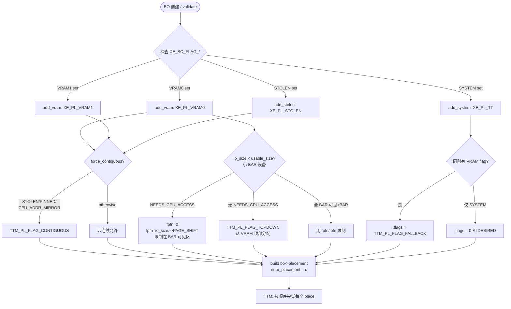
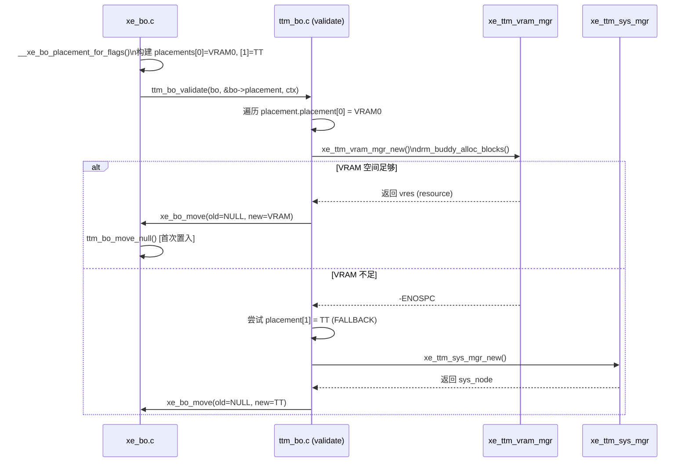

# Part 4: Placement 策略

> **Source file**: `drivers/gpu/drm/xe/xe_bo.c` (lines 185–370)

---

## 4.1 静态 placement 对象

Xe 定义了三个全局静态 placement 对象，用于驱逐和回退路径（不涉及动态 BO 创建）：

```c
// xe_bo.c:50 — 系统内存（无 DMA 映射）
static const struct ttm_place sys_placement_flags = {
    .fpfn = 0, .lpfn = 0,
    .mem_type = XE_PL_SYSTEM,
    .flags = 0,
};
static struct ttm_placement sys_placement = {
    .num_placement = 1,
    .placement = &sys_placement_flags,
};

// xe_bo.c:71 — TT 优先，SYSTEM 备用（驱逐默认目标）
static const struct ttm_place tt_placement_flags[] = {
    {
        .fpfn = 0, .lpfn = 0,
        .mem_type = XE_PL_TT,
        .flags = TTM_PL_FLAG_DESIRED,    // ← 首选 TT
    },
    {
        .fpfn = 0, .lpfn = 0,
        .mem_type = XE_PL_SYSTEM,
        .flags = TTM_PL_FLAG_FALLBACK,   // ← TT 满时退回 SYSTEM
    }
};
static struct ttm_placement tt_placement = {
    .num_placement = 2,
    .placement = tt_placement_flags,
};

// 清除/销毁 placement（设备拔出时使用）
static struct ttm_placement purge_placement;  // num_placement = 0
```

### 静态 placement 使用场景

```
xe_evict_flags()
    ├── device 拔出          → purge_placement  (nums=0, 直接销毁内容)
    ├── CPU_ADDR_MIRROR BO   → sys_placement    (SVM 镜像, 回系统)
    ├── VRAM/STOLEN BO       → tt_placement     (TT DESIRED + SYSTEM FALLBACK)
    └── TT BO                → sys_placement    (退回无 DMA 的系统内存)
```

---

## 4.2 `xe_bo_placement_for_flags()` 全流程

这是 BO 创建时构建 `bo->placements[]` 数组的核心函数。它按以下顺序调用三个子函数：

```c
// xe_bo.c:345
static int __xe_bo_placement_for_flags(struct xe_device *xe, struct xe_bo *bo,
                                        u32 bo_flags, enum ttm_bo_type type)
{
    u32 c = 0;  // placement 候选计数

    try_add_vram(xe, bo, bo_flags, type, &c);    // ① 最先尝试 VRAM（优先级最高）
    try_add_system(xe, bo, bo_flags, &c);         // ② 其次系统内存 (TT)
    try_add_stolen(xe, bo, bo_flags, &c);         // ③ 最后 Stolen 内存

    if (!c) return -EINVAL;  // 至少需要一个候选

    bo->placement = (struct ttm_placement) {
        .num_placement = c,
        .placement = bo->placements,  // 指向 bo->placements[] 数组
    };
    return 0;
}
```

> **注意**：三个 placement 的顺序决定了 TTM validate 时的尝试优先级。**VRAM 总是先于 SYSTEM**。

### 4.2.1 `try_add_vram()` — VRAM placement 构建

```c
// xe_bo.c:288
static void try_add_vram(struct xe_device *xe, struct xe_bo *bo,
                          u32 bo_flags, enum ttm_bo_type type, u32 *c)
{
    u32 vram_flag;

    // 遍历所有 VRAM bit（VRAM0 和/或 VRAM1）
    for_each_set_bo_vram_flag(vram_flag, bo_flags) {
        // 决定使用 kernel VRAM 分区还是 user VRAM 分区
        u32 pl = bo_vram_flags_to_vram_placement(xe, bo_flags, vram_flag, type);
        add_vram(xe, bo, bo->placements, bo_flags, pl, c);
    }
}

static void add_vram(struct xe_device *xe, struct xe_bo *bo,
                     struct ttm_place *places, u32 bo_flags, u32 mem_type, u32 *c)
{
    struct ttm_place place = { .mem_type = mem_type };
    struct xe_vram_region *vram = ...;
    u64 io_size = vram->io_size;  // BAR 窗口可见大小

    // ① 是否需要物理连续？
    if (force_contiguous(bo_flags))
        place.flags |= TTM_PL_FLAG_CONTIGUOUS;

    // ② BAR 大小约束处理
    if (io_size < vram->usable_size) {
        if (bo_flags & XE_BO_FLAG_NEEDS_CPU_ACCESS) {
            // CPU 必须能访问 → 限制在 BAR 可见区
            place.fpfn = 0;
            place.lpfn = io_size >> PAGE_SHIFT;  // 上界 = BAR 边界
        } else {
            // 否则从 VRAM 顶端分配（远离 BAR 窗口，留 BAR 给 scanout 等）
            place.flags |= TTM_PL_FLAG_TOPDOWN;
        }
    }
    // io_size == usable_size 时（rBAR 使能）无限制，整个 VRAM 都可访问

    places[*c] = place;
    *c += 1;
}
```

### 4.2.2 Kernel VRAM 分区 vs User VRAM 分区

```c
// xe_bo.c:258
static u32 bo_vram_flags_to_vram_placement(struct xe_device *xe,
                                            u32 bo_flags, u32 vram_flag,
                                            enum ttm_bo_type type)
{
    u8 tile_id = vram_bo_flag_to_tile_id(xe, vram_flag);

    if (type == ttm_bo_type_kernel && !(bo_flags & XE_BO_FLAG_FORCE_USER_VRAM))
        return xe->tiles[tile_id].mem.kernel_vram->placement;  // kernel 分区
    else
        return xe->tiles[tile_id].mem.vram->placement;         // user 分区
}
```

**为什么要分区？**
- **Kernel VRAM 分区**：固定在 VRAM 底部，始终在 BAR 可见区内，供驱动内部对象使用
- **User VRAM 分区**：VRAM 剩余部分，大 BAR 设备几乎全部 VRAM；小 BAR 设备可 TOPDOWN 放顶部

### 4.2.3 `try_add_system()` — 系统内存 placement

```c
// xe_bo.c:186
static void try_add_system(struct xe_device *xe, struct xe_bo *bo,
                            u32 bo_flags, u32 *c)
{
    if (bo_flags & XE_BO_FLAG_SYSTEM) {
        bo->placements[*c] = (struct ttm_place) {
            .mem_type = XE_PL_TT,
            // 若同时有 VRAM flag → 标为 FALLBACK
            // 若仅有 SYSTEM flag → 无 flag（即 DESIRED）
            .flags = (bo_flags & XE_BO_FLAG_VRAM_MASK) ?
                     TTM_PL_FLAG_FALLBACK : 0,
        };
        *c += 1;
    }
}
```

### 4.2.4 `try_add_stolen()` — Stolen 内存 placement

```c
// xe_bo.c:300
static void try_add_stolen(struct xe_device *xe, struct xe_bo *bo,
                            u32 bo_flags, u32 *c)
{
    if (bo_flags & XE_BO_FLAG_STOLEN) {
        bo->placements[*c] = (struct ttm_place) {
            .mem_type = XE_PL_STOLEN,
            // Stolen 内存的连续性条件与 VRAM 相同
            .flags = force_contiguous(bo_flags) ?
                     TTM_PL_FLAG_CONTIGUOUS : 0,
        };
        *c += 1;
    }
}
```

---

## 4.3 `force_contiguous()` — 物理连续性条件

```c
// xe_bo.c:202
static bool force_contiguous(u32 bo_flags)
{
    // Stolen 内存用户期望连续（CPU 访问依赖连续 io_base）
    if (bo_flags & XE_BO_FLAG_STOLEN)
        return true;

    // PINNED（非延迟恢复）需要 vmap → 必须连续
    if (bo_flags & XE_BO_FLAG_PINNED &&
        !(bo_flags & XE_BO_FLAG_PINNED_LATE_RESTORE))
        return true;

    // SVM CPU 地址镜像 BO 需要连续（用于建立 CPU 连续映射）
    if (bo_flags & XE_BO_FLAG_CPU_ADDR_MIRROR)
        return true;

    // NEEDS_CPU_ACCESS + PINNED 组合（挂起/恢复时需要 xe_bo_vmap）
    return (bo_flags & XE_BO_FLAG_NEEDS_CPU_ACCESS) &&
           (bo_flags & XE_BO_FLAG_PINNED);
}
```

**连续 vs 非连续的影响**：

| 属性 | 连续分配 | 非连续分配 |
|------|---------|----------|
| `vres->base.start` | 有效 PFN（drm_buddy 首块偏移） | `XE_BO_INVALID_OFFSET` |
| `xe_bo_vmap()` | ✅ 支持（单次 ioremap）| ❌ 不支持 |
| GGTT 映射 | ✅ 连续 GTT entries | ❌ 需要多段映射 |
| 内存利用率 | ⚠️ 可能有外碎片 | ✅ 更高效 |

---

## 4.4 `xe_evict_flags()` — 驱逐目标决策

当 TTM 需要知道驱逐一个 BO 后应该放到哪里时，调用此函数：

```c
// xe_bo.c:322
static void xe_evict_flags(struct ttm_buffer_object *tbo,
                            struct ttm_placement *placement)
{
    struct xe_device *xe = container_of(tbo->bdev, typeof(*xe), ttm);
    bool device_unplugged = drm_dev_is_unplugged(&xe->drm);
    struct xe_bo *bo;

    // 非 xe_bo（不应出现在正常路径）
    if (!xe_bo_is_xe_bo(tbo)) {
        if (tbo->type == ttm_bo_type_sg) {
            placement->num_placement = 0;  // sg BO 不做驱逐
            return;
        }
        *placement = device_unplugged ? purge_placement : sys_placement;
        return;
    }

    bo = ttm_to_xe_bo(tbo);

    // SVM CPU 镜像 BO 始终驱逐到系统内存
    if (bo->flags & XE_BO_FLAG_CPU_ADDR_MIRROR) {
        *placement = sys_placement;
        return;
    }

    // 设备拔出（非 dmabuf）→ 清除内容
    if (device_unplugged && !tbo->base.dma_buf) {
        *placement = purge_placement;
        return;
    }

    // 按当前内存类型决定驱逐目标
    switch (tbo->resource->mem_type) {
    case XE_PL_VRAM0:
    case XE_PL_VRAM1:
    case XE_PL_STOLEN:
        *placement = tt_placement;   // → TT(DESIRED) + SYSTEM(FALLBACK)
        break;
    case XE_PL_TT:
    default:
        *placement = sys_placement;  // → SYSTEM（释放 DMA 地址）
        break;
    }
}
```

---

## 4.5 Placement 完整决策流程图



---

## 4.6 典型 BO 的 placement 配置

| BO 类型 | flags | placement[0] | placement[1] | placement[2] |
|---------|-------|-------------|-------------|-------------|
| 用户 BO（dGPU） | VRAM0\|SYSTEM\|USER | VRAM0 TOPDOWN | TT FALLBACK | — |
| 页表 BO | PAGETABLE\|SYSTEM\|PINNED | TT CONTIGUOUS | — | — |
| Display scanout | SCANOUT\|VRAM0\|NEEDS_CPU_ACCESS | VRAM0 [0..BAR] CONTIGUOUS | — | — |
| GuC 固件 | STOLEN\|PINNED | STOLEN CONTIGUOUS | — | — |
| HW context | VRAM0\|PINNED | VRAM0 CONTIGUOUS | — | — |
| iGPU 用户 BO | SYSTEM\|USER | TT DESIRED | — | — |
| Backup BO（挂起） | SYSTEM | TT DESIRED | SYSTEM FALLBACK | — |

---

## 4.7 BAR 窗口约束详解

```
物理地址空间（dGPU, 小 BAR 场景）:

VRAM 物理布局（例：8 GB VRAM）:
┌─────────────────────────────────────────────┐ VRAM 基地址
│  Kernel VRAM 分区                            │ ← 始终在 BAR 可见区
│  ┌─────────────────────────────┐            │
│  │  GGTT 页表 BO               │ fpfn=0     │
│  │  GuC/HuC 固件 BO            │ CONTIGUOUS │
│  │  HW Context BO              │ NEEDS_CPU  │
│  └─────────────────────────────┘            │
│                                              │
│◄──── io_size (BAR 窗口, 例 256 MB) ─────────►│
│  ↑ 所有 NEEDS_CPU_ACCESS BO 必须在此范围内   │
│                                              │
│  User VRAM 分区（非 NEEDS_CPU_ACCESS）        │
│  ┌─────────────────────────────────────────┐│
│  │  用户 BO (TTM_PL_FLAG_TOPDOWN 分配)      ││ ← 从顶部向下
│  │  页表 BO (非 Pinned)                    ││
│  └─────────────────────────────────────────┘│
└─────────────────────────────────────────────┘ VRAM 顶部 (8 GB)

注: rBAR 使能时 io_size == usable_size，所有区域 CPU 均可访问
```

---

## 4.8 placement 选择与 `ttm_bo_validate()` 的交互


