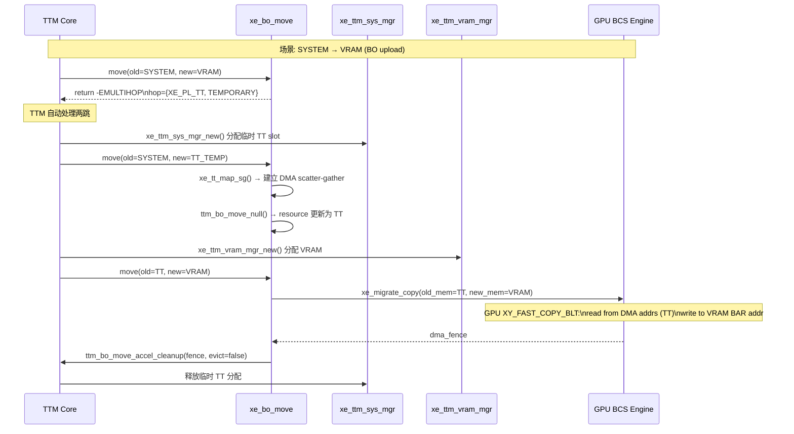
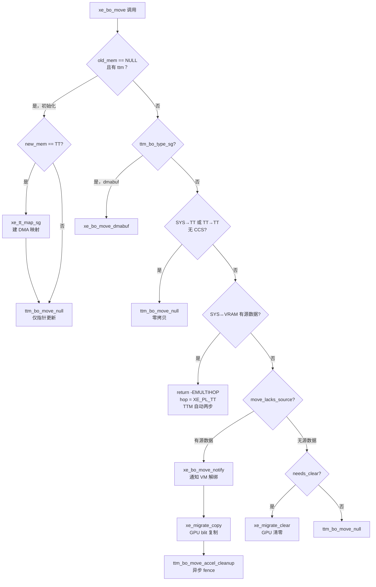

# Part 5: BO 移动与迁移机制

> **Source file**: `drivers/gpu/drm/xe/xe_bo.c:839`

---

## 5.1 `xe_bo_move()` — TTM Move 回调总览

`xe_bo_move` 是 TTM 调用的实际搬移函数，当 BO 需要从一种内存类型移动到另一种时触发。它是整个迁移系统的核心。

```c
// xe_bo.c:839
static int xe_bo_move(struct ttm_buffer_object *ttm_bo, bool evict,
                      struct ttm_operation_ctx *ctx,
                      struct ttm_resource *new_mem,
                      struct ttm_place *hop)
{
    struct xe_device *xe = ttm_to_xe_device(ttm_bo->bdev);
    struct xe_bo *bo = ttm_to_xe_bo(ttm_bo);
    struct ttm_resource *old_mem = ttm_bo->resource;
    u32 old_mem_type = old_mem ? old_mem->mem_type : XE_PL_SYSTEM;
    struct ttm_tt *ttm = ttm_bo->ttm;
    struct xe_migrate *migrate = NULL;
    struct dma_fence *fence;
    bool move_lacks_source;
    bool tt_has_data;
    bool needs_clear;
    // iGPU CCS: 系统内存也需要 CCS 元数据
    bool handle_system_ccs = (!IS_DGFX(xe) && xe_bo_needs_ccs_pages(bo) &&
                               ttm && ttm_tt_is_populated(ttm));
    ...
```

---

## 5.2 六条搬移路径详解

### 路径 1：BO 创建初始化（old_mem == NULL）

```c
    // BO 首次创建，还没有内存来源
    if ((!old_mem && ttm) && !handle_system_ccs) {
        if (new_mem->mem_type == XE_PL_TT)
            ret = xe_tt_map_sg(xe, ttm);  // 建立 DMA scatter-gather
        if (!ret)
            ttm_bo_move_null(ttm_bo, new_mem);  // 零开销：直接更新指针
        goto out;
    }
```

`ttm_bo_move_null` 仅更新 `bo->ttm.resource` 指针，无任何数据复制。

### 路径 2：DMA-buf SG BO

```c
    if (ttm_bo->type == ttm_bo_type_sg) {
        if (new_mem->mem_type == XE_PL_SYSTEM)
            ret = xe_bo_move_notify(bo, ctx);  // 通知 VM 解绑
        if (!ret)
            ret = xe_bo_move_dmabuf(ttm_bo, new_mem);
        return ret;
    }
```

`xe_bo_move_dmabuf` 处理 prime import/export 的 sg list 重新映射。

### 路径 3：SYSTEM ↔ TT（无 CCS）

```c
    // SYSTEM 和 TT 之间的移动本质上只是 DMA 映射状态的改变
    if (old_mem_type == XE_PL_SYSTEM && new_mem->mem_type == XE_PL_TT &&
        !handle_system_ccs) {
        ttm_bo_move_null(ttm_bo, new_mem);  // 只更新 resource，TT populate 已完成
        goto out;
    }

    // TT → TT（multihop 的临时中间态）
    if (old_mem_type == XE_PL_TT && new_mem->mem_type == XE_PL_TT) {
        ttm_bo_move_null(ttm_bo, new_mem);
        goto out;
    }
```

#### SYSTEM → TT 时 `xe_tt_map_sg` 的触发点

注意：`ttm_bo_move_null` 只更新 resource 指针，真正的 DMA 映射是在**路径 1（初次进入 TT）**或被 TTM core 的 `ttm_bo_handle_move_mem` 在调用 `move()` 前通过 `ttm_bo_populate()` → `xe_ttm_tt_populate()` 后，再由 `xe_bo_move` 显式调用 `xe_tt_map_sg` 建立的：

```c
// xe_bo_move() 内，路径 1（创建时 new_mem=TT）:
if (!old_mem && ttm) {
    if (new_mem->mem_type == XE_PL_TT)
        ret = xe_tt_map_sg(xe, ttm);   // ← 在此建立 DMA 映射
    ttm_bo_move_null(ttm_bo, new_mem);
    goto out;
}

// SYSTEM → TT 路径中，TTM core 负责 populate（分配页），
// xe_bo_move 随后做 ttm_bo_move_null（仅指针更新）。
// DMA 映射此前已在首次从 SYSTEM 移入 TT 时建立。
```

#### DMA 映射详细机制

`xe_tt_map_sg()` 完成两件事：

**第一步**：`sg_alloc_table_from_pages_segment` — 将 `tt->pages[]`（物理散页）构建成 scatterlist，合并物理连续的相邻页：

```
tt->pages[]:  PA=0x1A3000  PA=0x7B2000  PA=0x7B3000  PA=0x5C1000
                               └──── 物理连续，合并 ────┘
              ↓ sg_alloc_table_from_pages_segment()
sgl[0]: PA=0x1A3000, len=4K
sgl[1]: PA=0x7B2000, len=8K  ← 两页合并为一个 entry
sgl[2]: PA=0x5C1000, len=4K
```

**第二步**：`dma_map_sgtable` — 通知 IOMMU 建立 IOVA 映射，填充每个 entry 的 `dma_address`：

```
              ↓ dma_map_sgtable(DMA_BIDIRECTIONAL, SKIP_CPU_SYNC)
sgl[0]: dma_address=IOVA_A  (GPU 用此地址访问 PA=0x1A3000)
sgl[1]: dma_address=IOVA_B  (GPU 用此地址访问 PA=0x7B2000~0x7B3FFF)
sgl[2]: dma_address=IOVA_C  (GPU 用此地址访问 PA=0x5C1000)
```

这些 IOVA 随后通过 `xe_res_dma(&cursor)` 写入 GPU PPGTT 页表 PTE，GPU 访问时经由 IOMMU 翻译到真实物理地址：

```
GPU VA → PPGTT PTE → IOVA → IOMMU → 物理 PA → DRAM
```

### 路径 4：需要 MULTIHOP — SYSTEM ↔ VRAM（最关键！）

```c
    if (!move_lacks_source &&
        ((old_mem_type == XE_PL_SYSTEM && resource_is_vram(new_mem)) ||
         (mem_type_is_vram(old_mem_type) && new_mem->mem_type == XE_PL_SYSTEM))) {

        // 返回 hop（中间跳板），告知 TTM 需要两步操作
        hop->fpfn = 0;
        hop->lpfn = 0;
        hop->mem_type = XE_PL_TT;                  // 必须经过 TT 中转
        hop->flags = TTM_PL_FLAG_TEMPORARY;        // 临时 TT 分配
        ret = -EMULTIHOP;                          // 特殊错误码，不是真正错误
        goto out;
    }
```

**为什么必须 MULTIHOP？**
- SYSTEM 页面没有 DMA 地址，GPU 无法直接 DMA 读取
- TTM 会先将 SYSTEM → TT（建立 DMA 映射），再 TT → VRAM（GPU blit）

### 路径 5：TT ↔ VRAM / VRAM ↔ VRAM（GPU Blit 搬移）

```c
    // 选择 migrate engine（基于目标内存所属 tile）
    if (bo->tile)
        migrate = bo->tile->migrate;
    else if (resource_is_vram(new_mem))
        migrate = mem_type_to_migrate(xe, new_mem->mem_type);
    else if (resource_is_vram(old_mem))
        migrate = mem_type_to_migrate(xe, old_mem_type);

    // 需要清零（新设备 BO 或 TTM_TT_FLAG_ZERO_ALLOC）
    needs_clear = (ttm && ttm->page_flags & TTM_TT_FLAG_ZERO_ALLOC) ||
                  (!ttm && ttm_bo->type == ttm_bo_type_device);

    if (!move_lacks_source) {
        // 有源数据：执行复制
        fence = xe_migrate_copy(migrate, bo, bo, old_mem, new_mem, false);
    } else if (needs_clear) {
        // 无源数据但需要清零：执行 GPU clear
        fence = xe_migrate_clear(migrate, bo, new_mem, XE_MIGRATE_CLEAR_FLAG_FULL);
    } else {
        // 无源数据且不需要清零：null move
        ttm_bo_move_null(ttm_bo, new_mem);
        goto out;
    }

    // 等待 fence 或异步完成（evict 时立即解绑 old_mem）
    ret = ttm_bo_move_accel_cleanup(ttm_bo, fence, evict, false, new_mem);
    dma_fence_put(fence);
```

### 路径 6：TT → SYSTEM（驱逐到无 DMA 系统内存）

```c
    if (old_mem_type == XE_PL_TT && new_mem->mem_type == XE_PL_SYSTEM) {
        // 等待所有 GPU 操作完成（必须同步，因为将解除 DMA 映射）
        long timeout = dma_resv_wait_timeout(ttm_bo->base.resv,
                                              DMA_RESV_USAGE_BOOKKEEP,
                                              false, MAX_SCHEDULE_TIMEOUT);
        if (!handle_system_ccs) {
            ttm_bo_move_null(ttm_bo, new_mem);  // 仅更新 resource
            // unpopulate 由 TTM 之后调用 → 解除 DMA 映射
            goto out;
        }
    }
```

---

## 5.3 MULTIHOP 两跳搬移详解



```
物理路径图:

SYSTEM 页面                    TT (CPU DRAM, GPU DMA 可见)
┌─────────────────┐           ┌──────────────────────────────┐
│  page[0]: 0xABC │──populate─►│  DMA addr: 0x1234_0000       │
│  page[1]: 0xDEF │           │  DMA addr: 0x1234_1000       │         VRAM (LMEM)
│  ...            │           │  ...                         │         ┌───────────┐
└─────────────────┘           └──────────────────────────────┘         │           │
                                          │                            │  BO 数据  │
                                          └─── GPU BCS DMA read ──────►│  (GPU blit)│
                                                                        └───────────┘
```

---

## 5.4 `xe_bo_move_notify()` — 迁移前通知

在 BO 实际移动之前，必须通知所有相关的 GPU 虚拟映射解绑：

```c
// xe_bo.c:798
static int xe_bo_move_notify(struct xe_bo *bo,
                              struct ttm_operation_ctx *ctx)
{
    struct xe_device *xe = xe_bo_device(bo);
    struct drm_gpuvm_bo *vm_bo;

    // 遍历所有绑定到此 BO 的 GPU VMA
    drm_gem_for_each_gpuvm_bo(vm_bo, &bo->ttm.base) {
        struct xe_vm *vm = gpuvm_to_xe_vm(vm_bo->vm);

        // 触发 GPU 页表无效化
        ret = xe_vm_invalidate_vma(vma);
        if (ret)
            return ret;
    }

    // 等待 GPU 完成所有使用此 BO 的操作
    // (通过 dma_resv fence 机制等待)
    return 0;
}
```

### 通知触发条件

```c
// xe_bo_move() 中的调用点
if (!move_lacks_source && !xe_bo_is_pinned(bo)) {
    ret = xe_bo_move_notify(bo, ctx);  // 有数据源且未 pin → 通知
}
// 以下情况跳过通知:
// - move_lacks_source: BO 无数据（新分配）
// - xe_bo_is_pinned(bo): pin 住的 BO 不会被驱逐
```

---

## 5.5 `ttm_bo_move_accel_cleanup()` — 异步迁移完成

```c
// drivers/gpu/drm/ttm/ttm_bo_util.c
int ttm_bo_move_accel_cleanup(struct ttm_buffer_object *bo,
                               struct dma_fence *fence,
                               bool evict,
                               bool pipeline,
                               struct ttm_resource *new_mem)
{
    if (evict) {
        // 驱逐路径: 创建 ghost BO 持有 old_mem + fence
        // 主 BO 立即切换到 new_mem，不阻塞
        // Ghost BO 在 fence 完成后销毁
    } else {
        // 普通迁移: 将 fence 加入 BO 的 resv
        // 等待 fence 完成才能访问 new_mem 数据
        dma_resv_add_fence(bo->base.resv, fence, DMA_RESV_USAGE_KERNEL);
    }
    ttm_bo_assign_mem(bo, new_mem);  // 更新 bo->resource
    return 0;
}
```

### 异步清理时序

```mermaid
gantt
    title BO 迁移异步时序
    dateFormat X
    axisFormat %s

    section CPU
    xe_bo_move() 提交 GPU job : 0, 1
    ttm_bo_move_accel_cleanup() 返回 : 1, 2
    CPU 继续执行其他任务 : 2, 8

    section GPU BCS
    等待调度 : 0, 2
    执行 XY_FAST_COPY_BLT : 2, 7
    发出 dma_fence 信号 : 7, 8

    section TTM
    old_mem ghost BO 持有: 0, 7
    fence 完成释放 old_mem : 7, 8
    new_mem 对后续操作可用 : 1, 8
```



---

## 5.6 `move_lacks_source` 与 `needs_clear` 逻辑

```c
// 是否有有效的源数据？
bool tt_has_data = ttm && (ttm_tt_is_populated(ttm) || ttm_tt_is_swapped(ttm));

bool move_lacks_source = !old_mem ||
    (handle_system_ccs ? (!bo->ccs_cleared) :
     (!mem_type_is_vram(old_mem_type) && !tt_has_data));
// 解释:
// - !old_mem: 新 BO
// - VRAM → 总是有源数据
// - TT/SYSTEM → 只有 tt_has_data 时才有源数据

// 是否需要清零？
bool needs_clear =
    (ttm && ttm->page_flags & TTM_TT_FLAG_ZERO_ALLOC) ||  // 用户要求清零
    (!ttm && ttm_bo->type == ttm_bo_type_device);           // 设备 BO 需要清零（安全）
```

### 决策矩阵

| `move_lacks_source` | `needs_clear` | 操作 |
|-------------------|--------------|------|
| true | false | `ttm_bo_move_null()` - 仅更新指针 |
| true | true | `xe_migrate_clear()` - GPU clear |
| false | any | `xe_migrate_copy()` - GPU 数据复制 |

---

## 5.7 CCS 元数据特殊处理

```
iGPU（非 dGPU）的压缩 BO 在系统内存时也需要 CCS 元数据：

          系统内存 TT 页面
          ┌─────────────────────┐
          │  主数据区域          │ (N 页)
          │  (normal BO 数据)   │
          ├─────────────────────┤
          │  CCS 元数据区域      │ (extra_pages = N * ccs_ratio)
          │  (压缩状态信息)      │
          └─────────────────────┘

handle_system_ccs = true 时:
- SYSTEM → TT 会触发 xe_migrate_copy() 同时复制 CCS 区域
- SYSTEM → VRAM 通过 XY_CTRL_SURF_COPY_BLT 命令同步 CCS
```

---

## 5.8 搬移路径决策树


