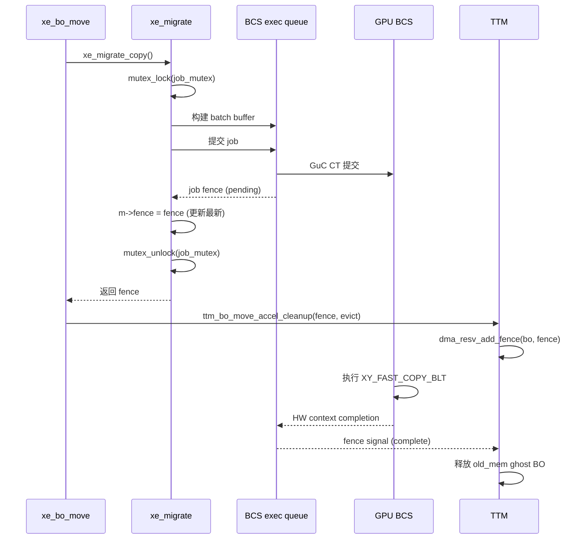
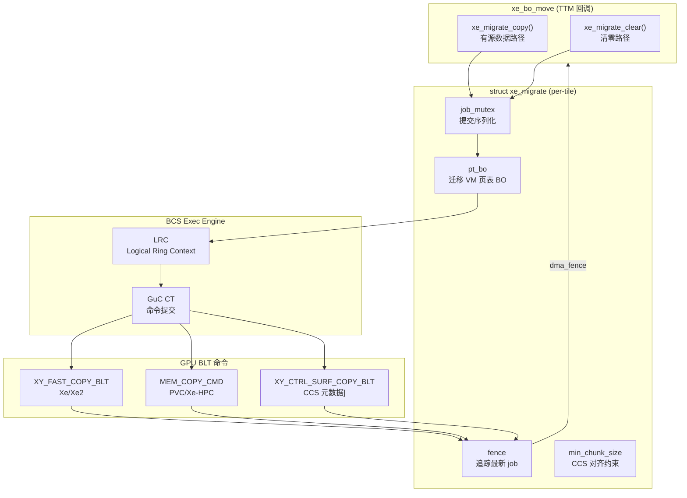

# Part 6: xe_migrate — GPU BLT 迁移引擎

> **Source file**: `drivers/gpu/drm/xe/xe_migrate.c`

---

## 6.1 架构概述

`xe_migrate` 是 Xe KMD 中负责 GPU 加速内存搬移的核心组件。它使用 **BCS（Blitter Copy Streamer）** 引擎异步执行 BO 的内存复制和清零操作，而不是使用 CPU memcpy，从而实现高带宽、低 CPU 占用的内存管理。

```
xe_migrate 在 Xe 架构中的位置:

┌─────────────────────────────────────────────┐
│  xe_bo_move()  (TTM move callback)          │
│     ↓ 调用                                  │
│  xe_migrate_copy() / xe_migrate_clear()     │
│     ↓ 提交                                  │
│  xe_exec_queue (BCS / Blitter Engine)       │
│     ↓ 执行                                  │
│  GPU BCS 硬件                               │
│     ↓ 完成信号                              │
│  dma_fence → ttm_bo_move_accel_cleanup()   │
└─────────────────────────────────────────────┘
```

---

## 6.2 `struct xe_migrate` 结构详解

```c
// xe_migrate.c:44
struct xe_migrate {
    // ─── GPU 执行资源 ────────────────────────────────
    struct xe_exec_queue *q;        // BCS exec queue（LRC + GuC submission）
    struct xe_tile       *tile;     // 所属 tile（每个 tile 有独立的 migrate 实例）

    // ─── 序列化 ──────────────────────────────────────
    struct mutex job_mutex;         // 序列化提交 job（防止并发 job 顺序错乱）

    // ─── 迁移 VM 页表 ─────────────────────────────────
    struct xe_bo *pt_bo;            // 迁移专属小 VM 的页表 BO
    u64 batch_base_ofs;             // batch buffer 在 migrate VM 中的 VA 偏移
    u64 usm_batch_base_ofs;         // USM (SVM) batch buffer VA 偏移
    u64 cleared_mem_ofs;            // 预清零 BO 的 VA
    u64 large_page_copy_ofs;        // 2MB 大页迁移 VA
    u64 large_page_copy_pdes;       // 2MB 大页 PDE 写入偏移

    // ─── Fence 管理 ────────────────────────────────────
    struct dma_fence *fence;        // 最后一个迁移 job 的 fence（job_mutex 保护）

    // ─── iGPU 特有：页表子分配 ────────────────────────
    struct drm_suballoc_manager vm_update_sa;
    // dGPU 不需要此字段（页表 BO 空间更大）

    // ─── dGPU 特有：分块大小 ─────────────────────────
    u64 min_chunk_size;
    // dGPU: 为使 CCS 元数据偏移对齐而设置的最小迁移块大小
    // 典型值: SZ_64K（HBM）或 SZ_4K * SZ_64K / SZ_4K = SZ_64K
};

// 关键常量
#define MAX_PREEMPTDISABLE_TRANSFER   SZ_8M    // ~1ms，单次不可抢占最大传输
#define MAX_CCS_LIMITED_TRANSFER      SZ_4M    // CCS 支持的单次最大传输
#define NUM_KERNEL_PDE                15       // 迁移 VM 保留的 kernel PDE 数
#define NUM_PT_SLOTS                  32       // 页表槽位数
```

### 每个 tile 的独立 migrate 实例

```
xe_device
├── tiles[0].migrate  ← 处理 tile-0 VRAM 的迁移
│        └─ q: tile-0 BCS exec queue
│        └─ pt_bo: tile-0 迁移 VM 页表
├── tiles[1].migrate  ← 处理 tile-1 VRAM 的迁移（多 tile dGPU）
│        └─ q: tile-1 BCS exec queue
└── ...
```

---

## 6.3 `xe_migrate_copy()` 实现原理

```c
// 函数签名
struct dma_fence *
xe_migrate_copy(struct xe_migrate *m,
                struct xe_bo *src_bo,   // 源 BO（VRAM 或 TT 系统内存）
                struct xe_bo *dst_bo,   // 目标 BO
                struct ttm_resource *src,
                struct ttm_resource *dst,
                bool copy_only_ccs);    // 是否仅复制 CCS 元数据
```

### 内部执行流程

```c
mutex_lock(&m->job_mutex);

// 1. 计算分块大小（防止 GPU 超时）
size_per_chunk = xe_migrate_res_sizes(m, &src_cur);
// dGPU: max MIN(chunk, MAX_PREEMPTDISABLE_TRANSFER)
// iGPU: MAX_CCS_LIMITED_TRANSFER（CCS 寄存器限制）

// 2. 分配 job（batch buffer 空间）
job = xe_migrate_job_alloc(m, num_chunks);

// 3. 对每个 chunk 执行:
while (有剩余数据) {
    emit_pte(m, ...);           // 更新迁移 VM 的页表指向 src/dst
    emit_copy(m, bb, src, dst); // 写入 BLT 命令
    src_cur advance; dst_cur advance;
}

// 4. 提交 job 到 GuC
fence = xe_migrate_job_submit(m, job);

// 5. 更新 m->fence（追踪最新 job）
dma_fence_put(m->fence);
m->fence = dma_fence_get(fence);

mutex_unlock(&m->job_mutex);
return fence;
```

---

## 6.4 平台差异化 GPU 命令

Xe KMD 根据硬件平台选择不同的 BLT 命令：

### 6.4.1 `XY_FAST_COPY_BLT` — Xe / Xe2 平台

```c
// 适用于: DG2, MTL, BMG, LNL (Xe-HPG, Xe2-HPG, Xe2-LPM)
// xe_migrate.c:690+

static void emit_copy_blt(struct xe_migrate *m, struct xe_bb *bb,
                           u64 src_addr, u64 dst_addr, u32 size,
                           bool is_vram_to_vram)
{
    u32 mocs = 0;
    u32 tile_y = 0;

    // Xe2: 使用 UC MOCS 索引（迁移路径跳过 LLC）
    if (GRAPHICS_VERx100(xe) >= 2000)
        mocs = FIELD_PREP(XE2_XY_FAST_COPY_BLT_MOCS_INDEX_MASK,
                          gt->mocs.uc_index);

    // Tile4 格式的 VRAM ↔ VRAM 复制
    if (is_vram_to_vram)
        tile_y = XY_FAST_COPY_BLT_D1_SRC_TILE4 | XY_FAST_COPY_BLT_D1_DST_TILE4;

    // 10 DWords 命令
    bb->cs[bb->len++] = XY_FAST_COPY_BLT_CMD | (10 - 2);
    bb->cs[bb->len++] = BLT_DEPTH_32 | tile_y | mocs | pitch;
    bb->cs[bb->len++] = 0;                           // src Y, X start
    bb->cs[bb->len++] = (height << 16) | width;      // src height, width
    bb->cs[bb->len++] = lower_32_bits(dst_addr);     // dst 低 32 位
    bb->cs[bb->len++] = upper_32_bits(dst_addr);     // dst 高 32 位
    bb->cs[bb->len++] = 0;                           // dst Y, X start
    bb->cs[bb->len++] = (height << 16) | width;      // dst height, width
    bb->cs[bb->len++] = lower_32_bits(src_addr);     // src 低 32 位
    bb->cs[bb->len++] = upper_32_bits(src_addr);     // src 高 32 位
}
```

### 6.4.2 `MEM_COPY_CMD` — PVC/Ponte Vecchio (Xe-HPC)

```c
// 适用于: PVC (Xe-HPC) — 使用 HPC 专用内存复制命令
// 支持更大的传输粒度和更高的带宽

bb->cs[bb->len++] = MEM_COPY_CMD | mode | copy_type;
bb->cs[bb->len++] = size - 1;
bb->cs[bb->len++] = lower_32_bits(src_addr);
bb->cs[bb->len++] = upper_32_bits(src_addr);
bb->cs[bb->len++] = lower_32_bits(dst_addr);
bb->cs[bb->len++] = upper_32_bits(dst_addr);
```

### 6.4.3 `XY_CTRL_SURF_COPY_BLT` — CCS 元数据复制

```c
// 当迁移压缩 BO 时，同时复制 CCS（Compressed Color Surface）元数据
// CCS 存储在 VRAM 特定偏移处

bb->cs[bb->len++] = XY_CTRL_SURF_COPY_BLT |
                    (src_access << XY_CTRL_SURF_COPY_BLT_SRC_ACCESS_SHIFT) |
                    (dst_access << XY_CTRL_SURF_COPY_BLT_DST_ACCESS_SHIFT) |
                    (pages_per_ccs_block << XY_CTRL_SURF_COPY_BLT_SIZE_SHIFT);
bb->cs[bb->len++] = lower_32_bits(src_ccs_addr);
bb->cs[bb->len++] = upper_32_bits(src_ccs_addr);
bb->cs[bb->len++] = lower_32_bits(dst_ccs_addr);
bb->cs[bb->len++] = upper_32_bits(dst_ccs_addr);
```

### 平台命令选择矩阵

| 平台 | 内存复制命令 | CCS 支持 | 最大传输块 |
|------|------------|---------|----------|
| DG2 (Xe-HPG) | `XY_FAST_COPY_BLT` | `XY_CTRL_SURF_COPY_BLT` | 8MB |
| PVC (Xe-HPC) | `MEM_COPY_CMD` | 硬件管理 | 无限制（分块） |
| MTL (Xe-LPM+) | `XY_FAST_COPY_BLT` | in-TT CCS pages | 4MB |
| BMG (Xe2-HPG) | `XY_FAST_COPY_BLT` (Xe2 variant) | `XY_CTRL_SURF_COPY_BLT` | 8MB |
| LNL (Xe2-LPM) | `XY_FAST_COPY_BLT` (Xe2 variant) | in-TT CCS pages | 4MB |

---

## 6.5 `xe_migrate_clear()` — GPU 内存清零

```c
struct dma_fence *
xe_migrate_clear(struct xe_migrate *m,
                 struct xe_bo *bo,
                 struct ttm_resource *dst,
                 u32 clear_flags)  // XE_MIGRATE_CLEAR_FLAG_FULL / CCS_ONLY
{
    // 使用已清零的预分配 BO 作为"零源"
    // 或使用 XY_FAST_COLOR_BLT 命令填充零值

    // 对每个 chunk:
    //   emit_pte(dst region)
    //   emit_clear_cmd(dst, size, 0)
    
    // 返回 fence
}
```

需要清零的场景：
- **新分配的 device BO**（`ttm_bo_type_device`）：防止信息泄露
- **`TTM_TT_FLAG_ZERO_ALLOC`**：用户请求清零分配（`PROT_READ` 初始化场景）
- **VRAM↔VRAM 移动后的目标区**：残留数据清理

---

## 6.6 `min_chunk_size` — 分块策略

```c
// xe_migrate.c:498
// dGPU 的最小分块大小（确保 CCS 元数据对齐）
if (xe_gt_has_hbm(gt)) {
    // HBM: 4K 数据 → 64B CCS，最小分块 = 4K * (64K / 4K) = 64K
    m->min_chunk_size = SZ_4K * SZ_64K / CCS_BYTES_PER_BLOCK;
} else {
    m->min_chunk_size = SZ_64K;
}
m->min_chunk_size = roundup_pow_of_two(m->min_chunk_size);
```

```c
// 分块大小计算（xe_migrate_res_sizes）
static u64 xe_migrate_res_sizes(struct xe_migrate *m, struct xe_res_cursor *cur)
{
    u64 size = cur->size;

    if (mem_type_is_vram(cur->mem_type)) {
        // VRAM: 强制按 min_chunk_size 对齐，以保证 CCS 偏移正确
        u64 chunk = max_t(u64, cur->size, m->min_chunk_size);
        if (size > m->min_chunk_size)
            size = round_down(size, m->min_chunk_size);
    }
    // 限制单次传输不超过 MAX_PREEMPTDISABLE_TRANSFER (~1ms)
    return min_t(u64, size, MAX_PREEMPTDISABLE_TRANSFER);
}
```

---

## 6.7 迁移 VM 页表机制

迁移操作通过一个专属的小 VM 来管理 src/dst 的 GPU 虚拟地址：

```
migrate VM 布局（pt_bo 管理）:

VA 空间 (2MB):
┌────────────────────┐ 0
│ NUM_PT_SLOTS (32)  │ ← 动态更新 PTE 指向 src/dst 物理页
│ 每次迁移前临时更新  │
├────────────────────┤ NUM_PT_SLOTS * PAGE_SIZE
│ batch_base_ofs     │ ← batch buffer （BLT 命令序列）
├────────────────────┤
│ usm_batch_base_ofs │ ← USM/SVM 专用 batch
├────────────────────┤
│ cleared_mem_ofs    │ ← 预清零的内存区域
└────────────────────┘ 2MB

iGPU: 使用 drm_suballoc 从 pt_bo 子分配页表
dGPU: 直接使用固定偏移的 64 位 PTE
```

---

## 6.8 dma_fence 异步链管理

```c
// xe_migrate 追踪最新 fence 的模式:

mutex_lock(&m->job_mutex); // 序列化 job 提交

// 提交 job
fence = xe_exec_queue_last_fence(m->q, m->tile->xe);

// 释放旧 fence，持有新 fence
dma_fence_put(m->fence);
m->fence = dma_fence_get(fence);  // m->fence 始终是最新的

mutex_unlock(&m->job_mutex);

// 调用方（xe_bo_move）返回 fence：
return fence;
// TTM 通过 ttm_bo_move_accel_cleanup 等待此 fence
```

### fence 生命周期



---

## 6.9 xe_migrate 初始化流程

```c
// xe_migrate.c:435
int xe_migrate_init(struct xe_migrate *m)
{
    struct xe_tile *tile = m->tile;
    struct xe_device *xe = tile_to_xe(tile);
    struct xe_vm *migrate_vm;

    // 1. 创建专属小 VM（仅 2MB VA 空间）
    migrate_vm = xe_migrate_create_vm(tile);

    // 2. 分配页表 BO（pt_bo）
    m->pt_bo = xe_bo_create_locked(xe, tile, migrate_vm,
                                    SZ_2M, ttm_bo_type_kernel,
                                    XE_BO_FLAG_VRAM_IF_DGFX(tile) |
                                    XE_BO_FLAG_PINNED);

    // 3. 准备迁移 VM 的页表内容（batch buffer、cleared mem 等）
    xe_migrate_prepare_vm(tile, m, migrate_vm);

    // 4. 创建 BCS exec queue
    m->q = xe_exec_queue_create(xe, migrate_vm,
                                 BIT(tile->primary_gt->info.engine_mask...),
                                 0, NULL, ...);

    // 5. 初始化 mutex 和 min_chunk_size
    mutex_init(&m->job_mutex);
    // dGPU: 设置 min_chunk_size based on HBM/GDDR
}
```

---

## 6.10 架构图


