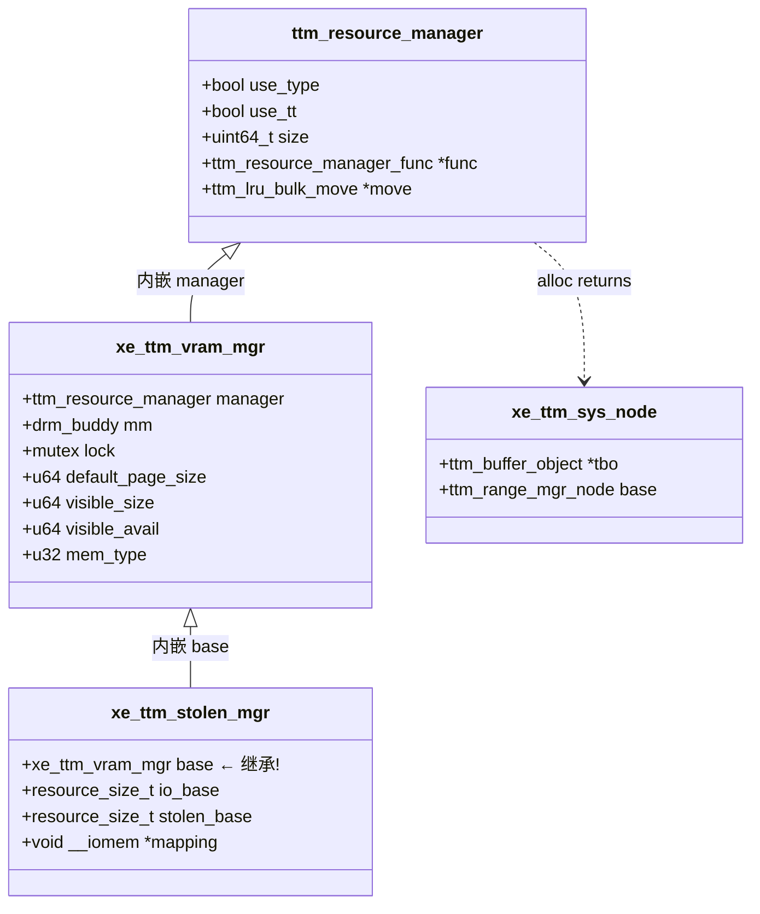
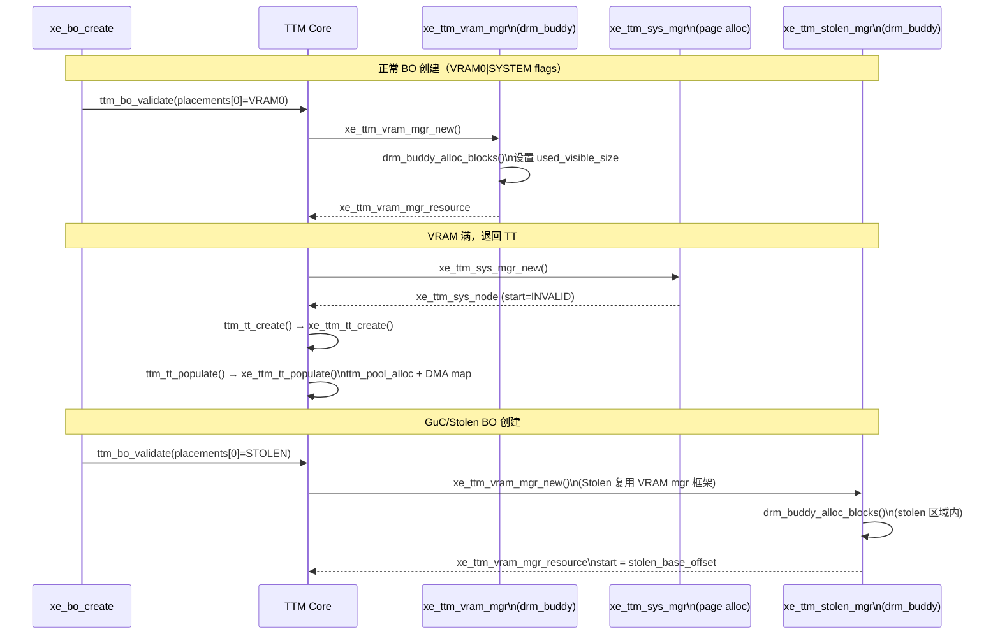
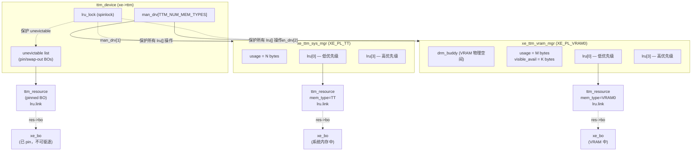

# Part 7: 内存管理器实现详解

> **Source files**:  
> - `drivers/gpu/drm/xe/xe_ttm_vram_mgr.c`  
> - `drivers/gpu/drm/xe/xe_ttm_vram_mgr.h`  
> - `drivers/gpu/drm/xe/xe_ttm_sys_mgr.c`  
> - `drivers/gpu/drm/xe/xe_ttm_stolen_mgr.c`

---

## 7.1 总体管理器架构

Xe 注册了四种内存类型管理器，每种对应不同的物理内存区域：

```
ttm_device (xe->ttm)
    └── man_drv[] 数组
          [0] = XE_PL_SYSTEM → (内置于 bdev, TTM 默认)
          [1] = XE_PL_TT     → xe_ttm_sys_mgr   ← xe_ttm_sys_mgr_init()
          [2] = XE_PL_VRAM0  → xe_ttm_vram_mgr  ← xe_ttm_vram_mgr_init(tile0)
          [3] = XE_PL_VRAM1  → xe_ttm_vram_mgr  ← xe_ttm_vram_mgr_init(tile1)
         ...
          [8] = XE_PL_STOLEN → xe_ttm_stolen_mgr ← xe_ttm_stolen_mgr_init()
```

### 管理器继承关系



---

## 7.2 xe_ttm_vram_mgr — VRAM 分配器详解

### 7.2.1 结构定义

```c
// xe_ttm_vram_mgr.h
struct xe_ttm_vram_mgr {
    struct ttm_resource_manager manager;   // TTM 基类（必须第一个）

    struct drm_buddy mm;       // buddy 分配器（管理 VRAM 物理空间）
    struct mutex     lock;     // 保护 mm 和 visible_avail

    u64  default_page_size;    // 默认最小分配单位（SZ_64K 或 SZ_4K）
    u64  visible_size;         // CPU 可见(BAR)区域大小
    u64  visible_avail;        // 当前剩余可见 VRAM（可供 NEEDS_CPU_ACCESS 使用）
    u32  mem_type;             // XE_PL_VRAM0 / VRAM1 / STOLEN
};

// 分配结果资源描述符
struct xe_ttm_vram_mgr_resource {
    struct ttm_resource base;      // TTM 基类（含 start, size, mem_type）
    struct list_head blocks;       // drm_buddy_block 链表（可能多个非连续块）
    u64 used_visible_size;         // 此 BO 使用的 BAR 可见区大小
    unsigned long flags;           // DRM_BUDDY_* 分配标志
};
```

### 7.2.2 `xe_ttm_vram_mgr_new()` 完整分配流程

```c
// xe_ttm_vram_mgr.c:52
static int xe_ttm_vram_mgr_new(struct ttm_resource_manager *man,
                                struct ttm_buffer_object *tbo,
                                const struct ttm_place *place,
                                struct ttm_resource **res)
{
    struct xe_ttm_vram_mgr *mgr = to_xe_ttm_vram_mgr(man);
    struct xe_ttm_vram_mgr_resource *vres;
    struct drm_buddy *mm = &mgr->mm;
    u64 size, min_page_size;
    unsigned long lpfn;

    // 1. 确定范围上界
    lpfn = place->lpfn;
    if (!lpfn || lpfn > man->size >> PAGE_SHIFT)
        lpfn = man->size >> PAGE_SHIFT;

    // 不可能满足的请求直接拒绝（避免触发不必要的驱逐）
    if (tbo->base.size >> PAGE_SHIFT > (lpfn - place->fpfn))
        return -E2BIG;

    vres = kzalloc(sizeof(*vres), GFP_KERNEL);
    ttm_resource_init(tbo, place, &vres->base);

    // 2. 快速检查容量
    if (ttm_resource_manager_usage(man) > man->size) {
        err = -ENOSPC;
        goto error_fini;
    }

    // 3. 设置 drm_buddy 分配标志
    if (place->flags & TTM_PL_FLAG_TOPDOWN)
        vres->flags |= DRM_BUDDY_TOPDOWN_ALLOCATION;
    if (place->fpfn || lpfn != man->size >> PAGE_SHIFT)
        vres->flags |= DRM_BUDDY_RANGE_ALLOCATION;

    // 4. 对齐要求
    min_page_size = mgr->default_page_size;
    if (tbo->page_alignment)
        min_page_size = (u64)tbo->page_alignment << PAGE_SHIFT;

    // 5. 连续分配需要 round up 到 2 的幂次
    if (place->fpfn + (size >> PAGE_SHIFT) != lpfn &&
        place->flags & TTM_PL_FLAG_CONTIGUOUS) {
        size = roundup_pow_of_two(size);
        min_page_size = size;
    }

    // 6. 检查可见 VRAM 可用量（BAR 约束）
    mutex_lock(&mgr->lock);
    if (lpfn <= mgr->visible_size >> PAGE_SHIFT && size > mgr->visible_avail) {
        err = -ENOSPC;
        goto error_unlock;
    }

    // 7. 调用 drm_buddy 分配（核心！）
    err = drm_buddy_alloc_blocks(mm,
                                  (u64)place->fpfn << PAGE_SHIFT,  // 起始限制
                                  (u64)lpfn << PAGE_SHIFT,          // 结束限制
                                  size,                             // 请求大小
                                  min_page_size,                    // 最小块大小
                                  &vres->blocks,                    // 输出: block 链表
                                  vres->flags);                     // TOPDOWN/RANGE 等

    // 8. 连续分配后裁剪（释放 round-up 的多余部分）
    if (place->flags & TTM_PL_FLAG_CONTIGUOUS) {
        if (!drm_buddy_block_trim(mm, NULL, vres->base.size, &vres->blocks))
            size = vres->base.size;
    }

    // 9. 计算并统计可见 VRAM 使用量
    if (lpfn <= mgr->visible_size >> PAGE_SHIFT) {
        vres->used_visible_size = size;  // 全部在可见区
    } else {
        // 部分在 BAR 外，逐块计算
        list_for_each_entry(block, &vres->blocks, link) {
            u64 start = drm_buddy_block_offset(block);
            if (start < mgr->visible_size) {
                u64 end = start + drm_buddy_block_size(mm, block);
                vres->used_visible_size += min(end, mgr->visible_size) - start;
            }
        }
    }
    mgr->visible_avail -= vres->used_visible_size;
    mutex_unlock(&mgr->lock);

    // 10. 设置 start（仅连续时有效）
    if (vres->base.placement & TTM_PL_FLAG_CONTIGUOUS) {
        struct drm_buddy_block *block = list_first_entry(&vres->blocks, ...);
        vres->base.start = drm_buddy_block_offset(block) >> PAGE_SHIFT;
    } else {
        vres->base.start = XE_BO_INVALID_OFFSET;  // 非连续，无法用单一偏移表示
    }

    *res = &vres->base;
    return 0;
}
```

### 7.2.3 `drm_buddy` 分配器简介

`drm_buddy` 是 DRM 通用的 buddy 分配器（类似内核 buddy allocator），专为 GPU 显存设计：

```
VRAM 布局（buddy 树抽象）:

┌─────────────────────────────────────────────────────────┐
│                    VRAM (8 GB)                           │
├──────────────┬──────────────────────────────────────────┤
│   Block A    │              Block B                      │  Top level
│   (4 GB)     │              (4 GB)                       │
├──────┬───────┴───────┬──────────────────────────────────┤
│  A1  │      A2       │              B                    │  Split
│(2GB) │    (2GB)      │                                   │
├──┬───┴──┬────────────┴──────────────────────────────────┤
│a1│  a2  │ A2(已分配)                                    │  Split
│1G│ (1G) │                                               │
└──┴──────┴───────────────────────────────────────────────┘

优点: 合并相邻块消除碎片
缺点: 必须是 2^n 大小（Xe 通过 trim 优化）
```

### 7.2.4 `intersects` 和 `compatible` 回调

```c
// intersects: 判断现有分配是否与请求的 place 范围重叠
// 用于驱逐候选选择 — 只驱逐与目标范围重叠的 BO
static bool xe_ttm_vram_mgr_intersects(struct ttm_resource_manager *man,
                                        struct ttm_resource *res,
                                        const struct ttm_place *place, size_t size)
{
    // ...逐块检查是否与 [fpfn, lpfn) 相交
}

// compatible: 判断现有分配是否完全满足新 place 要求
// 若 compatible 则无需重新分配（避免不必要迁移）
static bool xe_ttm_vram_mgr_compatible(struct ttm_resource_manager *man,
                                        struct ttm_resource *res,
                                        const struct ttm_place *place, size_t size)
{
    // ...所有块都在 [fpfn, lpfn) 范围内 → compatible
}
```

---

## 7.3 xe_ttm_sys_mgr — GTT/系统内存管理器

### 7.3.1 初始化

```c
// xe_ttm_sys_mgr.c:104
int xe_ttm_sys_mgr_init(struct xe_device *xe)
{
    struct ttm_resource_manager *man = &xe->mem.sys_mgr;
    struct sysinfo si;
    u64 gtt_size;

    // 系统 RAM 总量作为 TT 管理器大小上限
    si_meminfo(&si);
    gtt_size = (u64)si.totalram * si.mem_unit;

    man->use_tt = true;      // ← 关键！告知 TTM 此类型使用 TT 页面后备
    man->func = &xe_ttm_sys_mgr_func;
    ttm_resource_manager_init(man, &xe->ttm, gtt_size >> PAGE_SHIFT);
    ttm_set_driver_manager(&xe->ttm, XE_PL_TT, man);
    ttm_resource_manager_set_used(man, true);
    return drmm_add_action_or_reset(&xe->drm, xe_ttm_sys_mgr_fini, xe);
}
```

### 7.3.2 `xe_ttm_sys_node` 结构

```c
// xe_ttm_sys_mgr.c:18
struct xe_ttm_sys_node {
    struct ttm_buffer_object *tbo;  // 所属 BO
    struct ttm_range_mgr_node base; // 含 ttm_resource + mm_nodes
    //   base.base.start = XE_BO_INVALID_OFFSET（系统内存无固定起始地址）
    //   base.mm_nodes[0].size = page count
};
```

### 7.3.3 `xe_ttm_sys_mgr_new` — 系统内存分配

```c
static int xe_ttm_sys_mgr_new(struct ttm_resource_manager *man,
                               struct ttm_buffer_object *tbo,
                               const struct ttm_place *place,
                               struct ttm_resource **res)
{
    struct xe_ttm_sys_node *node;

    node = kzalloc(struct_size(node, base.mm_nodes, 1), GFP_KERNEL);
    ttm_resource_init(tbo, place, &node->base.base);

    // 检查总量
    if (!(place->flags & TTM_PL_FLAG_TEMPORARY) &&
        ttm_resource_manager_usage(man) > (man->size << PAGE_SHIFT)) {
        err = -ENOSPC;
    }

    // 系统内存无固定物理地址
    node->base.mm_nodes[0].start = 0;
    node->base.mm_nodes[0].size = PFN_UP(node->base.base.size);
    node->base.base.start = XE_BO_INVALID_OFFSET;  // 不需要 PFN

    *res = &node->base.base;
    return 0;
}
```

**注意**：系统内存分配**仅分配管理结构**，物理页面由 `ttm_tt_populate`（`xe_ttm_tt_populate`）时分配！这是 `use_tt = true` 的意义：TTM core 负责在 `xe_ttm_sys_mgr_new` 后自动调用 populate。

### TTM_PL_TT vs TTM_PL_SYSTEM 的本质区别

```
TTM_PL_SYSTEM:
  - ttm_tt 结构存在，但 pages[] 可能未填充（unpopulated/swapped）
  - 无 DMA 映射（GPU 无法访问）
  - 用于不活跃的 BO（可被 swap 到磁盘）

TTM_PL_TT（XE_PL_TT）:
  - ttm_tt 结构存在，pages[] 已填充（populated）
  - 有 DMA scatter-gather 映射（xe_tt->sg 有效）
  - GPU 可通过 GTT（GGTT 或 PPGTT）访问
  - CPU 直接访问（普通 kernel 虚地址）
```

---

## 7.4 xe_ttm_stolen_mgr — Stolen 内存管理器

### 7.4.1 什么是 Stolen 内存

Stolen 内存是 BIOS 在系统启动时从系统 RAM 中预留给 GPU 的区域。它与 VRAM（独显板载显存）不同：

```
dGPU (独显):
┌────────────────────────────────────────┐ VRAM BAR 基地址
│  VRAM (如 8GB GDDR6/HBM)              │
│  ┌──────────────────────────────────┐ │
│  │ DSM (Display Stolen Memory)      │ │ ← Stolen 在 VRAM 顶部
│  │ = VRAM 顶部的保留区             │ │
│  └──────────────────────────────────┘ │
└────────────────────────────────────────┘

iGPU (集显):
┌────────────────────────────────────────┐ 系统 RAM
│  普通系统内存                           │
│  ┌──────────────────────────────────┐ │
│  │ BIOS Stolen（GGC 寄存器配置）    │ │ ← BIOS 保留的固定区域
│  │ 默认从低地址预留，如 256MB       │ │
│  └──────────────────────────────────┘ │
└────────────────────────────────────────┘
```

### 7.4.2 结构定义

```c
// xe_ttm_stolen_mgr.c:31
struct xe_ttm_stolen_mgr {
    struct xe_ttm_vram_mgr base;  // 复用 VRAM 管理器（drm_buddy）

    resource_size_t io_base;      // PCI BAR 物理基地址（CPU 访问用）
    resource_size_t stolen_base;  // GPU 视角的 Stolen 起始偏移
    void __iomem *mapping;        // ioremap 的 CPU 映射（部分平台）
};
```

**设计选择**：Stolen 复用 `xe_ttm_vram_mgr`（drm_buddy），因为两者的内存管理模型相同（连续物理区域）。唯一区别是 CPU 访问路径不同。

### 7.4.3 Stolen 大小探测 — dGPU vs iGPU

#### dGPU 路径（`detect_bar2_dgfx`）

```c
// xe_ttm_stolen_mgr.c:84
static u64 detect_bar2_dgfx(struct xe_device *xe, struct xe_ttm_stolen_mgr *mgr)
{
    // 读取 DSMBASE 寄存器获取 Stolen 起始地址
    mgr->stolen_base = (xe_mmio_read64_2x32(mmio, DSMBASE) & BDSM_MASK) - tile_offset;

    stolen_size = tile_size - mgr->stolen_base;

    // 裁减 WOPCM（GPU 微控制器预留区域）
    wopcm_size = get_wopcm_size(xe);
    stolen_size -= wopcm_size;

    // 设置 CPU 访问的 IO 基址（VRAM BAR 内的偏移）
    if (mgr->stolen_base + stolen_size <= pci_resource_len(pdev, LMEM_BAR))
        mgr->io_base = tile_io_start + mgr->stolen_base;

    return ALIGN_DOWN(stolen_size, SZ_1M);
}
```

#### iGPU 路径（`detect_bar2_integrated`）

```c
// xe_ttm_stolen_mgr.c:124
static u32 detect_bar2_integrated(struct xe_device *xe, struct xe_ttm_stolen_mgr *mgr)
{
    // 读取 GGC（Graphics and Memory Controller Config）寄存器
    ggc = xe_mmio_read32(xe_root_tile_mmio(xe), GGC);

    // 确认 GGMS = 0x3（8MB GTT 大小）
    if ((ggc & GGMS_MASK) != GGMS_MASK) return 0;

    // Xe_LPG+（verx100 >= 1270）使用 GSMBASE 偏移
    mgr->stolen_base = SZ_8M;  // DSMBASE = GSMBASE + 8MB
    mgr->io_base = pci_resource_start(pdev, 2) + mgr->stolen_base;

    // 读取 GMS（Graphics Mode Select）字段得到 Stolen 大小
    gms = REG_FIELD_GET(GMS_MASK, ggc);
    switch (gms) {
    case 0x0 ... 0x04:
        stolen_size = gms * 32 * SZ_1M;   // 0~128MB，32MB 步进
        break;
    case 0xf0 ... 0xfe:
        stolen_size = (gms - 0xf0 + 1) * 4 * SZ_1M;  // 4~60MB，4MB 步进
        break;
    }

    // 减去 WOPCM + 可能的 Wa_14019821291 预留
    stolen_size -= get_wopcm_size(xe);
    // Wa_14019821291: GSCPSMI_BASE 可能占用 DSM 末尾部分

    return stolen_size;
}
```

### 7.4.4 CPU 访问 Stolen 内存的两种方式

```c
// xe_ttm_stolen_cpu_access_needs_ggtt():
bool xe_ttm_stolen_cpu_access_needs_ggtt(struct xe_device *xe)
{
    // 旧 iGPU (verx100 < 1270): 必须通过 GGTT aperture 访问
    // 新 iGPU (verx100 >= 1270) 和 dGPU: 可以直接通过 BAR2 访问
    return GRAPHICS_VERx100(xe) < 1270 && !IS_DGFX(xe);
}

// 方式 1: 旧 iGPU — 通过 GGTT 访问
//    BO 必须有 GGTT 映射
//    通过 aperture BAR（BAR1）读写

// 方式 2: 新 iGPU / dGPU — 通过 BAR2 直接访问
//    mgr->io_base 有效
//    ioremap 后直接 memcpy_fromio/toio
```

---

## 7.5 回调函数表

### VRAM 管理器回调表

```c
// xe_ttm_vram_mgr.c:279
static const struct ttm_resource_manager_func xe_ttm_vram_mgr_func = {
    .alloc      = xe_ttm_vram_mgr_new,         // drm_buddy_alloc_blocks
    .free       = xe_ttm_vram_mgr_del,         // drm_buddy_free_list
    .intersects = xe_ttm_vram_mgr_intersects,  // 驱逐候选范围筛选
    .compatible = xe_ttm_vram_mgr_compatible,  // 判断是否需要重新分配
    .debug      = xe_ttm_vram_mgr_debug,       // debugfs: buddy 状态
};
```

### 系统内存管理器回调表

```c
// xe_ttm_sys_mgr.c:83
static const struct ttm_resource_manager_func xe_ttm_sys_mgr_func = {
    .alloc = xe_ttm_sys_mgr_new,    // kzalloc node（物理页由 populate 分配）
    .free  = xe_ttm_sys_mgr_del,    // kfree node
    .debug = xe_ttm_sys_mgr_debug,  // (暂空，需 pm_runtime 保护)
};
```

---

## 7.6 内存管理器完整流程图



---

## 7.7 TTM 如何统一追踪所有 BO

这是 TTM 内存管理的**控制平面核心**——不论 BO 在系统内存还是 VRAM，TTM 用同一套基础设施追踪它们的位置、驱逐顺序和空间使用量。

### 7.7.1 两个核心索引结构

#### ① `bdev->man_drv[]`：mem_type → manager 的全局路由表

```c
// include/drm/ttm/ttm_device.h
struct ttm_device {
    struct ttm_resource_manager *man_drv[TTM_NUM_MEM_TYPES];  // 9 个槽
    spinlock_t lru_lock;          // 保护所有 manager 的 LRU 列表
    struct list_head unevictable; // 已 pin 或 swap-out 的 BO 专用链表
    struct ttm_pool pool;         // 系统内存页面池（WB/WC/UC 分类缓存）
    ...
};
```

`man_drv[]` 是一个固定大小数组，下标即 `mem_type`，值是指向对应管理器的指针。查找某 mem_type 的管理器是 O(1)：

```c
static inline struct ttm_resource_manager *
ttm_manager_type(struct ttm_device *bdev, int mem_type)
{
    return bdev->man_drv[mem_type];   // 直接数组下标，无锁
}
```

Xe 的注册关系：

```
man_drv[XE_PL_SYSTEM(0)] → (bdev 内置 sysman，TTM 默认处理)
man_drv[XE_PL_TT(1)]     → xe_ttm_sys_mgr   (xe_ttm_sys_mgr_init)
man_drv[XE_PL_VRAM0(2)]  → xe_ttm_vram_mgr  (tile 0)
man_drv[XE_PL_VRAM1(3)]  → xe_ttm_vram_mgr  (tile 1)
man_drv[XE_PL_STOLEN(8)] → xe_ttm_stolen_mgr
```

#### ② `man->lru[]`：每个 manager 维护 4 条按优先级分级的 LRU 链表

```c
// include/drm/ttm/ttm_resource.h
struct ttm_resource_manager {
    struct list_head lru[TTM_MAX_BO_PRIORITY];  // 4 条链表（优先级 0-3）
    uint64_t usage;                              // 已分配字节数（受 lru_lock 保护）
    ...
};

#define TTM_MAX_BO_PRIORITY  4U
```

每个 `ttm_resource`（每个 BO 的 per-placement 资源描述符）内嵌一个 `ttm_lru_item`：

```c
// include/drm/ttm/ttm_resource.h
struct ttm_resource {
    unsigned long start;       // VRAM 内偏移（PFN 单位）或 INVALID_OFFSET
    size_t size;               // 字节数
    uint32_t mem_type;         // XE_PL_SYSTEM / XE_PL_TT / XE_PL_VRAM0 ...
    uint32_t placement;        // TTM_PL_FLAG_* 标志
    struct ttm_bus_placement bus; // CPU mmap 用（BAR offset 等）
    struct ttm_buffer_object *bo; // 反向指针（受 lru_lock 保护）
    struct ttm_lru_item lru;   // ← 链入 man->lru[priority] 的节点
};
```

### 7.7.2 LRU 链表的完整拓扑

```
ttm_device (xe->ttm)
│
├── lru_lock (spinlock)  ← 保护下面所有 LRU 相关操作
│
├── unevictable (list_head)
│     ├── res[pinned BO A].lru.link
│     └── res[swapped BO B].lru.link
│
└── man_drv[]
      │
      ├── [XE_PL_TT] = xe_ttm_sys_mgr
      │     ├── usage = 3 GiB（当前 TT 已分配量）
      │     ├── lru[0] (priority 0 - 最低优先级，最先被驱逐)
      │     │     ├── res[普通用户 BO 1].lru.link
      │     │     ├── res[普通用户 BO 2].lru.link
      │     │     └── ...
      │     ├── lru[1]
      │     │     └── res[内核内部 BO].lru.link
      │     ├── lru[2]
      │     └── lru[3] (priority 3 - 最高优先级，最后被驱逐)
      │           └── res[关键 BO].lru.link
      │
      └── [XE_PL_VRAM0] = xe_ttm_vram_mgr
            ├── mm (drm_buddy，管理 VRAM 物理地址空间)
            ├── usage = 5 GiB
            ├── lru[0]
            │     ├── res[用户纹理 BO 1].lru.link
            │     ├── res[用户纹理 BO 2].lru.link
            │     └── ...
            ├── lru[1]
            ├── lru[2]
            └── lru[3]
                  └── res[显存中的 GuC BO].lru.link
```

**关键设计**：`ttm_resource` 是所有路径（VRAM、系统内存、stolen）的统一抽象。不论底层物理内存来自 `drm_buddy` 还是页面分配器，它们都通过同一个 `lru.link` 节点链入各自 manager 的 LRU 链表，受同一把 `bdev->lru_lock` 保护。

### 7.7.3 BO 在 LRU 中的生命周期

```
BO 创建，ttm_resource_alloc():
  → man->func->alloc() 分配物理空间（buddy/page pool）
  → ttm_resource_init() 初始化 ttm_resource 基类
  → spin_lock(bdev->lru_lock)
      list_add_tail(&res->lru.link, &man->lru[bo->priority])  ← 入队 LRU 尾部
      man->usage += res->size                                   ← 更新使用量统计
  → spin_unlock(bdev->lru_lock)

BO 被使用（VM_BIND / exec queue 提交后）:
  → [可选] ttm_resource_move_to_lru_tail()
      spin_lock → list_move_tail(&res->lru.link, ...) → 移到队尾（最近最用）

BO 被 pin（xe_bo_pin）:
  → spin_lock(bdev->lru_lock)
      list_move(&res->lru.link, &bdev->unevictable)  ← 移出 manager LRU
  → spin_unlock

驱逐扫描（内存压力）:
  → ttm_resource_manager_for_each_res(cursor, res):
      从 man->lru[0] 头部开始扫描（最近最少用 = 驱逐首选）
      → ttm_bo_eviction_valuable() 检查是否值得驱逐
      → 预留（ww_mutex_trylock）
      → xe_bo_move() 搬移数据 → 更新 res->mem_type → 更新 LRU 链表

BO 销毁，ttm_resource_free():
  → spin_lock(bdev->lru_lock)
      list_del_init(&res->lru.link)  ← 从 LRU 移除
      man->usage -= res->size         ← 释放使用量
  → spin_unlock
  → man->func->free() 释放物理空间（drm_buddy_free / 页面返池）
```

### 7.7.4 `usage` 字段：每个 manager 的空间使用量追踪

`man->usage` 是驱逐决策的快速路径检查依据：

```c
// TTM core 在 bo_validate 中:
if (ttm_resource_manager_usage(man) > man->size) {
    // 空间不足，触发驱逐
    ret = ttm_mem_evict_first(bdev, man, place, ctx, bulk);
}

uint64_t ttm_resource_manager_usage(struct ttm_resource_manager *man)
{
    // 受 lru_lock 保护，原子读
    return man->usage;
}
```

对于 VRAM（`xe_ttm_vram_mgr`），除了 `man->usage` 之外还额外跟踪 `visible_avail`（CPU 可见 VRAM 剩余量），用于 small-BAR 下决定 BO 是否能放入 BAR 可见区域。

### 7.7.5 多 BO 批量 LRU 操作：`ttm_lru_bulk_move`

相关联的 BO 组（如一个 VM 的所有页表 BO）应该作为一个整体被驱逐，而不是单独被扫描到。`ttm_lru_bulk_move` 实现了这个分组机制：

```c
// include/drm/ttm/ttm_resource.h
struct ttm_lru_bulk_move {
    // pos[mem_type][priority]: 当前组在各 LRU 链表中的 [first, last] 范围
    struct ttm_lru_bulk_move_pos pos[TTM_NUM_MEM_TYPES][TTM_MAX_BO_PRIORITY];
    struct list_head cursor_list;  // 正在遍历此组的 cursor 链表
};
```

使用方式（Xe 页表 BO 场景）：

```c
// xe_vm.c 中，批量管理 VM 所有页表 BO 的 LRU 位置
struct ttm_lru_bulk_move bulk;
ttm_lru_bulk_move_init(&bulk);

xe_bo_set_bulk_move(bo, &bulk);   // 加入批量组

// 操作完成后，将所有相关 BO 一起移到 LRU 尾部
ttm_lru_bulk_move_tail(&bulk);    // 原子地把整个组移到队尾

// 清理
ttm_lru_bulk_move_fini(&xe->ttm, &bulk);
```

驱逐时，TTM 遇到批量组中的任何一个 BO，都会尝试锁定整个 `dma_resv`（所有组内 BO 共享同一个 resv），从而实现组级别的原子驱逐。

### 7.7.6 `ttm_resource_manager_for_each_res`：驱逐扫描迭代器

```c
// include/drm/ttm/ttm_resource.h
#define ttm_resource_manager_for_each_res(cursor, res)   \
    for (res = ttm_resource_manager_first(cursor); res;  \
         res = ttm_resource_manager_next(cursor))

// 使用示例（TTM 内部驱逐路径）:
struct ttm_resource_cursor cursor;
struct ttm_resource *res;

ttm_resource_cursor_init(&cursor, man);
ttm_resource_manager_for_each_res(&cursor, res) {
    struct ttm_buffer_object *bo = res->bo;
    // 从 LRU 头部开始，遍历所有可驱逐的 resource
    // 注意：cursor 本身插入链表（作为 hitch），防止遍历时链表变化导致指针失效
    if (!ttm_bo_eviction_valuable(bo, place))
        continue;
    // 预留 + 驱逐
}
ttm_resource_cursor_fini(&cursor);
```

`cursor` 是一个 **hitch 节点**：它自身作为 `TTM_LRU_HITCH` 类型的节点插入 LRU 链表，始终在"下一个待检查 resource"之前。即使在遍历过程中其他线程修改了链表，`cursor.hitch` 作为稳定锚点不会失效。

### 7.7.7 完整追踪架构图



### 7.7.8 SMEM vs VRAM BO 的追踪方式对比

| 维度 | 系统内存 BO（XE_PL_TT） | VRAM BO（XE_PL_VRAM） |
|------|------------------------|----------------------|
| LRU 注册位置 | `xe_ttm_sys_mgr.lru[priority]` | `xe_ttm_vram_mgr.lru[priority]` |
| 空间使用量统计 | `sys_mgr.usage += size` | `vram_mgr.usage += size`，另有 `visible_avail` |
| 物理空间管理 | TTM 页面池（`pool`），与 LRU 无关 | `drm_buddy`，`vres->blocks` 链表 |
| 驱逐扫描路径 | `ttm_resource_manager_for_each_res(sys_mgr)` | `ttm_resource_manager_for_each_res(vram_mgr)` |
| 驱逐后去向 | → XE_PL_SYSTEM（空 move）或 swap-out | → XE_PL_TT（GPU blit 搬移数据） |
| pin 后位置 | `bdev->unevictable`（两者相同机制） | `bdev->unevictable`（两者相同机制） |
| `man->usage` 何时更新 | `ttm_resource_init / fini` 时，受 `lru_lock` | 同左，另 `visible_avail` 在 `mgr->lock`（mutex）下更新 |

## 7.8 内存区域物理布局总图

```
系统物理地址空间:

0x0000_0000_0000 ─────────────────────────────┐
│  System RAM (CPU DRAM)                        │
│  ┌─────────────────────────────────────────┐ │
│  │  XE_PL_SYSTEM (TTM_PL_SYSTEM)           │ │
│  │  无 DMA 映射，TTM 页面池管理             │ │
│  │                                         │ │
│  │  XE_PL_TT (TTM_PL_TT)                  │ │
│  │  xe_ttm_sys_mgr                         │ │
│  │  populate → DMA 映射表 (sg_table)       │ │
│  └─────────────────────────────────────────┘ │
│  ┌─────────────────────────────────────────┐ │
│  │  XE_PL_STOLEN (iGPU)                   │ │
│  │  xe_ttm_stolen_mgr                      │ │
│  │  io_base = PCI BAR2 + stolen_base       │ │
│  └─────────────────────────────────────────┘ │
└──────────────────────────────────────────────┘

PCI LMEM BAR (如 0x0004_0000_0000):
┌──────────────────────────────────────────────┐
│  Kernel VRAM 分区                             │
│  ┌─────────────────────────────────────────┐ │
│  │  XE_PL_VRAM0 (BAR 可见区)               │ │
│  │  xe_ttm_vram_mgr (drm_buddy)            │ │
│  │  visible_size = io_size (e.g. 256 MB)   │ │
│  └─────────────────────────────────────────┘ │
│  User VRAM 分区（BAR 区 + BAR 外区）          │
│  ┌─────────────────────────────────────────┐ │
│  │  XE_PL_VRAM0 (TOPDOWN 分配)             │ │
│  │  NEEDS_CPU_ACCESS → 限制在 BAR 内       │ │
│  │  普通 BO → 可在 BAR 外（GPU only）      │ │
│  └─────────────────────────────────────────┘ │
│  ┌─────────────────────────────────────────┐ │
│  │  XE_PL_STOLEN (dGPU)                   │ │
│  │  xe_ttm_stolen_mgr                      │ │
│  │  stolen_base = DSMBASE offset           │ │
│  │  wopcm_size 已排除                      │ │
│  └─────────────────────────────────────────┘ │
└──────────────────────────────────────────────┘
```
