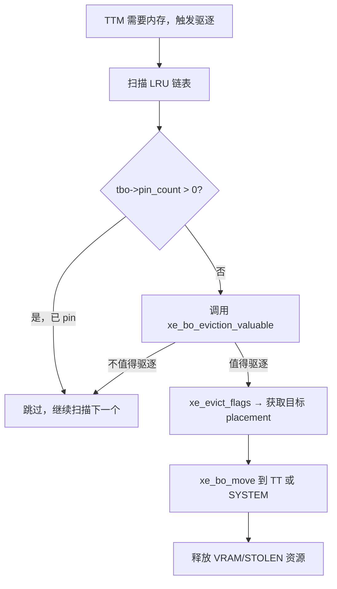
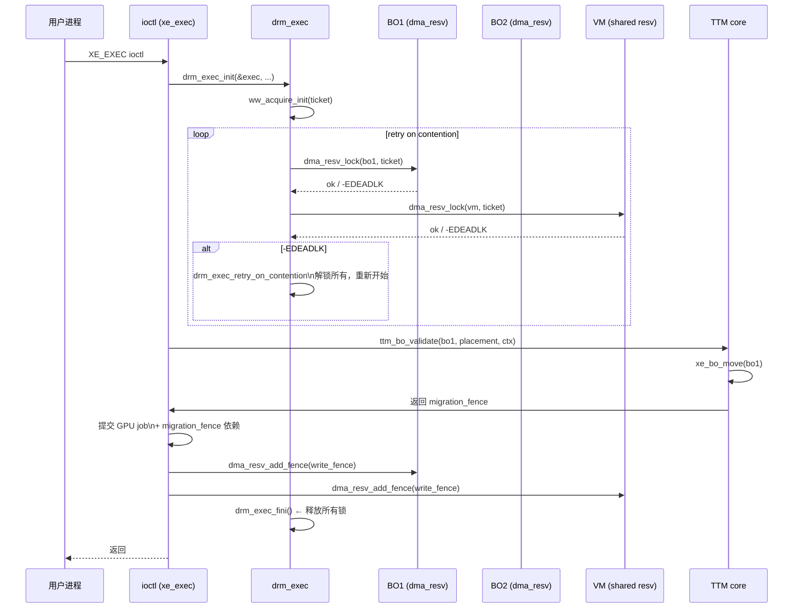

# Part 8: 并发控制与保留机制

> **Source files**:  
> - `drivers/gpu/drm/xe/xe_bo.c`  
> - `drivers/gpu/drm/xe/xe_bo.h`  
> - `include/drm/drm_exec.h`  
> - `include/drm/ttm/ttm_bo.h`

---

## 8.1 核心并发问题

GPU 内存管理面临的并发挑战：

```
多线程并发场景:

Thread A (GPU submit)          Thread B (eviction)          Thread C (migration)
    │                               │                               │
    ▼                               ▼                               ▼
xe_bo_validate()             ttm_bo_evict()              xe_migrate_copy()
    │                               │                               │
    └── 需要 BO resv lock ──────────┘                               │
                                    └── 需要 BO resv lock ──────────┘
                                                     ↓
                                         若用普通 mutex → 死锁风险！
```

**解决方案**：Linux 使用 `ww_mutex`（wound-wait mutex）解决多 BO 按序加锁问题。

---

## 8.2 `dma_resv` — BO 的保留/锁机制

每个 `xe_bo` 通过其 `ttm_buffer_object.base.resv`（`dma_resv`）提供并发控制：

```c
// include/linux/dma-resv.h
struct dma_resv {
    struct ww_mutex   lock;      // wound-wait 互斥锁（支持多 BO 无死锁加锁）
    struct dma_resv_list __rcu *fences; // 所有相关 dma_fence（shared + exclusive）
};

// 加锁（独占写访问）
int  dma_resv_lock(struct dma_resv *obj, struct ww_acquire_ctx *ctx);
int  dma_resv_lock_interruptible(struct dma_resv *obj, struct ww_acquire_ctx *ctx);
void dma_resv_unlock(struct dma_resv *obj);

// 非阻塞尝试
bool dma_resv_trylock(struct dma_resv *obj);

// 等待 fence（不需要加锁）
long dma_resv_wait_timeout(struct dma_resv *obj,
                            enum dma_resv_usage usage,
                            bool interruptible,
                            unsigned long timeout);
```

### ww_mutex 工作原理（深度解析）

#### 核心数据结构

```c
/* include/linux/ww_mutex.h */

struct ww_class {
    atomic_long_t stamp;        // 全局单调递增时间戳（每次 ww_acquire_init 递增）
    unsigned int  is_wait_die;  // 0 = Wound-Wait, 1 = Wait-Die 算法选择
};

struct ww_acquire_ctx {
    struct task_struct *task;   // 持有该上下文的任务
    unsigned long       stamp;  // 事务时间戳（值越小 = 越老 = 优先级越高）
    unsigned int        acquired;  // 已通过此 ctx 加锁的 ww_mutex 数量
    unsigned short      wounded;   // 被标记为 wound 后置 1，触发自杀
    unsigned short      is_wait_die; // 继承自 ww_class
};

struct ww_mutex {
    struct mutex          base;  // 底层普通 mutex（非 RT）或 rt_mutex（RT 内核）
    struct ww_acquire_ctx *ctx;  // 当前持有者的 ww_acquire_ctx，NULL 表示无上下文加锁
};
```

**时间戳赋值**（`ww_acquire_init()`，`include/linux/ww_mutex.h:145`）：

```c
ctx->stamp = atomic_long_inc_return_relaxed(&ww_class->stamp);
// ww_class->stamp 是全局原子计数器：stamp 越大 = 越年轻 = 优先级越低
// stamp 越小 = 越老 = 越优先，不会被 wound
```

---

#### Wound-Wait vs Wait-Die：两种算法的区别

内核同时支持两种无死锁算法，通过 `ww_class.is_wait_die` 选择：

| 属性 | **Wound-Wait**（默认，DRM/TTM 使用）| **Wait-Die** |
|------|--------------------------------------|--------------|
| 谁被牺牲？ | **较年轻的持有者**被 wound | **较年轻的等待者**主动 die |
| 牺牲时机 | 老者加锁时发现持有者更年轻 → 立即 wound 持有者 | 年轻者请求已被老者持有的锁 → 立即 die |
| 定义宏 | `DEFINE_WW_CLASS(name)` | `DEFINE_WD_CLASS(name)` |
| DRM 用途 | `reservation_ww_class`（BO 保留） | 某些 GPU 调度场景 |

---

#### 优先级比较：`__ww_ctx_less()`（`kernel/locking/ww_mutex.h:224`）

```c
static inline bool
__ww_ctx_less(struct ww_acquire_ctx *a, struct ww_acquire_ctx *b)
{
    // 若使用 RT mutex，优先考虑实时优先级
#ifdef WW_RT
    int a_prio = a->task->prio;
    int b_prio = b->task->prio;
    if (rt_or_dl_prio(a_prio) || rt_or_dl_prio(b_prio)) {
        if (a_prio > b_prio) return true;   // a 优先级数字更大 = 更低 RT 优先级 = "less"
        if (a_prio < b_prio) return false;
        // SCHED_DEADLINE: 截止时间更晚者更 "less"
        if (dl_prio(a_prio))
            return dl_time_before(b->task->dl.deadline, a->task->dl.deadline);
    }
#endif
    // 普通情况：stamp 更大 = 更年轻 = "less"（优先级更低）
    return (signed long)(a->stamp - b->stamp) > 0;
}
// 结论：a < b  等价于  a 更年轻（stamp 更大）= a 在竞争中应该让步
```

---

#### Wound-Wait 核心：`__ww_mutex_wound()`（`kernel/locking/ww_mutex.h:306`）

```c
static bool __ww_mutex_wound(struct MUTEX *lock,
                             struct ww_acquire_ctx *ww_ctx,   // 等待者上下文（较老）
                             struct ww_acquire_ctx *hold_ctx, // 持有者上下文（较年轻）
                             struct wake_q_head *wake_q)
{
    struct task_struct *owner = __ww_mutex_owner(lock);

    if (!hold_ctx || !owner)
        return false;

    // 等待者 ww_ctx 已拥有锁（acquired > 0）且比持有者更老 → wound 持有者
    if (ww_ctx->acquired > 0 && __ww_ctx_less(hold_ctx, ww_ctx)) {
        hold_ctx->wounded = 1;   // 标记持有者：你被 wound 了

        if (owner != current)
            wake_q_add(wake_q, owner);  // 唤醒持有者任务，让其检查 wounded 标志
        return true;
    }
    return false;
}
```

**触发时机**：在 `__ww_mutex_add_waiter()` 中，新等待者入队时检查当前锁持有者：

```c
// kernel/locking/ww_mutex.h:555（Wound-Wait 分支）
if (!is_wait_die) {
    smp_mb();  // 保证 MUTEX_FLAG_WAITERS 对持有者可见
    __ww_mutex_wound(lock, ww_ctx, ww->ctx, wake_q);
    //                      ↑老等待者    ↑年轻持有者 → 被 wound
}
```

---

#### 受害者检查：`__ww_mutex_check_kill()`（`kernel/locking/ww_mutex.h:456`）

被 wound 的持有者在每次从等待队列被唤醒时调用此函数，检查是否需要自杀：

```c
static inline int
__ww_mutex_check_kill(struct MUTEX *lock, struct MUTEX_WAITER *waiter,
                      struct ww_acquire_ctx *ctx)
{
    if (ctx->acquired == 0)
        return 0;       // 还没拿到任何锁，不需要 die

    if (!ctx->is_wait_die) {
        // Wound-Wait 模式：检查 wounded 标志
        if (ctx->wounded)
            return __ww_mutex_kill(lock, ctx);  // 返回 -EDEADLK
        return 0;
    }

    // Wait-Die 模式：检查持有者是否比自己老
    if (hold_ctx && __ww_ctx_less(ctx, hold_ctx))
        return __ww_mutex_kill(lock, ctx);      // 自己更年轻 → die
    ...
}

static __always_inline int
__ww_mutex_kill(struct MUTEX *lock, struct ww_acquire_ctx *ww_ctx)
{
    if (ww_ctx->acquired > 0) {
        ww_ctx->contending_lock = ww;  // 记录冲突的锁（调试用）
        return -EDEADLK;               // ← 这就是调用方看到的错误码
    }
    return 0;
}
```

---

#### 完整生命周期与慢路径重试

```
┌─────────────────── 正常快路径 ──────────────────────────────┐
│                                                              │
│  ww_acquire_init(&ctx, &reservation_ww_class)                │
│    ctx.stamp = atomic_inc(&class->stamp)  // 获得时间戳      │
│                                                              │
│  for each bo in list:                                        │
│    ret = dma_resv_lock(bo->resv, &ctx)                       │
│      └─► ww_mutex_lock(&resv->lock, &ctx)                    │
│            ├── 快路径: cmpxchg 直接获锁 → 成功               │
│            └── 慢路径: 进等待队列                             │
│                  ├── __ww_mutex_add_waiter() 插入有序等待链  │
│                  │     └── 若持有者更年轻 →                   │
│                  │           __ww_mutex_wound(hold_ctx)       │
│                  │               hold_ctx->wounded = 1        │
│                  │               wake_up(owner_task)          │
│                  └── 等待被唤醒 (schedule())                  │
│                        每次唤醒 → __ww_mutex_check_kill()     │
│                              if (ctx->wounded) return -EDEADLK│
├─────────────────── -EDEADLK 慢路径 ─────────────────────────┤
│                                                              │
│  ret == -EDEADLK:                                            │
│    // 1. 解锁全部已持有的 ww_mutex                           │
│    for each locked bo:                                       │
│        dma_resv_unlock(bo->resv)   // ctx->acquired--        │
│                                                              │
│    // 2. 在冲突锁上慢等 (阻塞直到可用，不再 wound)           │
│    ww_mutex_lock_slow(&contending_lock, &ctx)                │
│      ctx->wounded = 0              // reset wound 标志       │
│      ctx->acquired = 0                                       │
│      // 普通阻塞等待（不再参与 wound 竞争）                   │
│                                                              │
│    // 3. 重头开始加锁序列                                    │
│    goto retry;                                               │
│                                                              │
│  ww_acquire_done(&ctx)   // 标记加锁阶段结束                 │
│    (可选，仅用于文档/lockdep 标注)                           │
│                                                              │
│  ... 使用所有 BO ...                                         │
│                                                              │
│  for each bo: dma_resv_unlock(bo->resv)                      │
│  ww_acquire_fini(&ctx)   // 释放上下文                       │
└──────────────────────────────────────────────────────────────┘
```

**慢路径的关键细节**：

| 步骤 | 原因 |
|------|------|
| 先解锁全部已持有锁 | 若不解锁就等待，持有者可能也在等我们持有的锁 → 形成真死锁 |
| 在冲突锁上 `lock_slow` | 等到冲突锁释放后再开始，避免立刻又被 wound |
| `wounded = 0` reset | 新一轮加锁时不再带着旧的 wound 标记 |
| 老 stamp 不变 | 重试时仍保持相同时间戳，优先级不变 |

---

#### 等待链表的有序性保障（`__ww_mutex_add_waiter()`）

```
等待链表按 stamp 升序排列（最老的在最前面）：

  [stamp=1, A] → [stamp=3, C] → [stamp=7, D] → [stamp=9, B]
       ↑最老/最优先                                  ↑最年轻

新等待者插入时：
  ① 从链表尾部向前扫描，找到第一个 stamp < 自己 stamp 的位置
  ② 插在其后（保持升序）
  ③ Wound-Wait: 对链表中比自己更老的等待者，wound 当前持有者
  ④ Wait-Die:   发现链表中有比自己更老的等待者 → 立即 die（-EDEADLK）
```

---

#### 在 Xe/DRM 驱动中的完整使用模式（`drm_exec`）

`drm_exec` 封装了上述 ww_mutex 重试循环，Xe 的 VM_BIND / exec 路径均通过它操作多 BO：

```c
// 典型 Xe 驱动路径（xe_vm.c, xe_validation.c）
struct drm_exec exec;

// drm_exec 内部持有: struct ww_acquire_ctx ticket
drm_exec_init(&exec, DRM_EXEC_INTERRUPTIBLE_WAIT, 0);

drm_exec_until_all_locked(&exec) {           // 宏：自动处理 -EDEADLK 重试
    drm_exec_prepare_obj(&exec, &bo->ttm.base, 1);
    //  └─► dma_resv_lock(bo->resv, &exec->ticket)
    //        发生 -EDEADLK → drm_exec 自动:
    //          1. 解锁所有已锁定 BO
    //          2. ww_mutex_lock_slow(contending)
    //          3. 回到循环顶部重试
}

// 加锁成功，安全访问所有 BO
...

drm_exec_fini(&exec);  // 解锁全部 + ww_acquire_fini
```

---

#### 为何 Xe 不需要显式排序 BO 加锁顺序

传统无死锁方案要求所有线程按**全局固定顺序**加锁（如按地址排序），但这在 GPU 驱动中不可行：

- 用户态提交的 BO 列表顺序任意
- 多个 GPU 引擎并发提交不同 BO 集合
- BO 集合在运行时动态变化

`ww_mutex` 的 Wound-Wait 算法通过**时间戳全序**替代了对加锁顺序的依赖：无论以任何顺序加锁，系统保证**stamp 更大（更年轻）的事务总是让步**，从而消除死锁，同时不要求调用方维护任何顺序。

---

## 8.3 `xe_bo_lock()` / `xe_bo_unlock()`

```c
// xe_bo.h
static inline int xe_bo_lock(struct xe_bo *bo, bool intr)
{
    if (intr)
        return dma_resv_lock_interruptible(bo->ttm.base.resv, NULL);
    else
        return dma_resv_lock(bo->ttm.base.resv, NULL);
    // NULL ctx 表示不参与 ww_mutex 上下文（单 BO 加锁）
}

static inline void xe_bo_unlock(struct xe_bo *bo)
{
    dma_resv_unlock(bo->ttm.base.resv);
}
```

**典型调用点**（`xe_bo.c`）：

| 行号 | 函数 | 用途 |
|------|------|------|
| ~1251 | `xe_bo_create_locked()` 返回时 | BO 创建后持有锁供初始化 |
| ~1410 | `xe_bo_pin()` | Pin 前加锁检查 |
| ~1767 | `xe_ttm_bo_destroy()` | 销毁时尝试加锁 |

---

## 8.4 `drm_exec` — 多 BO 原子加锁

当一个操作需要**同时锁定多个 BO**（如 GPU exec submit），使用 `drm_exec` 框架：

```c
// include/drm/drm_exec.h
struct drm_exec {
    struct ww_acquire_ctx ticket;  // ww 上下文（所有加锁共享）
    struct drm_gem_object **objects; // 已锁定的 GEM 对象数组
    unsigned num_objects;
    unsigned max_objects;
    // ...
};
```

### 使用模式

```c
// xe_bo.c:1197 (xe_bo_validate_and_pin_exec 等场合的典型模式)
struct drm_exec exec;
struct xe_bo *bo;
int err;

drm_exec_init(&exec, DRM_EXEC_INTERRUPTIBLE_WAIT | DRM_EXEC_IGNORE_DUPLICATES,
               0 /* initial capacity */);

drm_exec_until_all_locked(&exec) {
    // 遍历需要锁定的所有 BO
    drm_exec_prepare_obj(&exec, &first_bo->ttm.base, 1);
    err = drm_exec_retry_on_contention(&exec);  // ① 如有竞争自动重试
    if (err) goto fail;

    drm_exec_prepare_obj(&exec, &second_bo->ttm.base, 1);
    err = drm_exec_retry_on_contention(&exec);
    if (err) goto fail;

    // ... 可继续锁更多 BO
}

// 此时所有 BO 都已原子锁定

// ... 执行需要互斥的操作（validate, map, submit）

fail:
    drm_exec_fini(&exec);  // ② 自动释放所有已锁定的 BO
```

**`drm_exec_retry_on_contention` 内部**：
```c
// 若加锁时触发 ww_mutex wound → 返回 -EDEADLK
// drm_exec 捕获后：
//   1. 解锁所有已锁 BO
//   2. ww_acquire_done() / ww_acquire_init() 重置
//   3. 重新从头开始锁定  ← 这就是 "until_all_locked" 循环的意义
```

### `drm_exec` 调用点

| 行号 | 函数 | 场景 |
|------|------|------|
| ~1197 | `xe_bo_move_into_vram` | 迁移时多 BO 原子操作 |
| ~1334 | `xe_bo_validate_bind` | VM bind 操作 |
| ~1940 | `xe_exec_ioctl` | GPU exec 命令提交 |

---

## 8.5 VM 共享 resv — VM 与 BO 的锁统一

当 BO 绑定到 VM 时，BO 的 `dma_resv` 可以与 VM 共享：

```c
// xe_bo_types.h
struct xe_bo {
    // ...
    struct xe_vm *vm;   // 若非 NULL，则 bo->ttm.base.resv == &vm->resv
};

// xe_vm.h
struct xe_vm {
    struct drm_gpuvm base;
    struct dma_resv resv;  // VM 级别的 resv（所有共享 BO 使用此锁）
    // ...
};
```

**共享 resv 的意义**：
```
无共享 resv（独立锁）:           共享 resv（VM 锁）:

lock(vm.resv)                    lock(vm.resv)
lock(bo1.resv)     ← 需要两锁   操作 bo1 ← bo1.resv == vm.resv
lock(bo2.resv)
操作 ...
unlock(bo2)
unlock(bo1)
unlock(vm)

→ 需要 ww_mutex 有序加锁        → 单锁覆盖所有共享 BO，简化操作
```

```c
// 判断 BO 使用哪个 resv
static inline struct dma_resv *xe_bo_resv(struct xe_bo *bo)
{
    if (bo->vm)
        return &bo->vm->resv;    // VM 级别 resv
    else
        return bo->ttm.base.resv; // BO 自身 resv（= &bo->ttm.base._resv）
}
```

---

## 8.6 Pin — 防止 TTM 驱逐

Pin 机制阻止 TTM 将 BO 驱逐到其他内存区域：

```c
// xe_bo.h
static inline void xe_bo_pin(struct xe_bo *bo)
{
    // 内部: 增加 pin 计数
    ttm_bo_pin(&bo->ttm);  // → 增加 tbo->pin_count
    // TTM eviction 路径检查 pin_count > 0 则跳过
}

static inline void xe_bo_unpin(struct xe_bo *bo)
{
    ttm_bo_unpin(&bo->ttm);  // → 减少 pin_count
}

static inline bool xe_bo_is_pinned(struct xe_bo *bo)
{
    return bo->ttm.pin_count > 0;
}
```

### Pin 使用场景

```
XE_BO_FLAG_PINNED → 固定在内存不驱逐：

BO 类型                  原因
─────────────────────────────────────────────
GuC 固件 BO              CPU/GPU 同时读取，不能移动
HuC 固件 BO              固件加载时需要确定地址
GGTT BO                  GGTT 映射依赖固定物理地址
HW Context BO            GPU context restore 需要固定地址
Display scanout BO       display engine 直接读取
迁移 VM 页表 pt_bo       迁移期间不能移动
```

### Pin 对 TTM 驱逐流程的影响



---

## 8.7 fence 与 resv 的交互

```c
// dma_resv 中存储的 fence 类型（按使用优先级）：
enum dma_resv_usage {
    DMA_RESV_USAGE_KERNEL = 0,    // 驱动内部（迁移、clear 等）
    DMA_RESV_USAGE_WRITE  = 1,    // GPU 写操作
    DMA_RESV_USAGE_READ   = 2,    // GPU 读操作
    DMA_RESV_USAGE_BOOKKEEP = 3,  // 仅用于追踪（不等待）
};
```

**xe_migrate_copy 后的 fence 插入**：

```c
// ttm_bo_move_accel_cleanup → 插入 KERNEL fence：
dma_resv_add_fence(bo->base.resv,
                    migration_fence,
                    DMA_RESV_USAGE_KERNEL);

// 后续 GPU exec 提交时，TTM 会等待 KERNEL fence 完成，
// 再插入 WRITE fence，保证迁移先于 GPU 使用
```

---

## 8.8 并发安全矩阵

| 操作 | 使用的锁 | 说明 |
|------|---------|------|
| TTM validate/move | `dma_resv_lock(bo)` | TTM core 内部加锁 |
| GPU exec submit | `drm_exec` (多 BO) | ww_mutex 有序加锁 |
| VM bind/unbind | `dma_resv_lock(&vm->resv)` | VM 级别锁覆盖所有共享 BO |
| xe_migrate_copy | `mutex_lock(&m->job_mutex)` | 仅序列化 migrate 提交 |
| VRAM alloc/free | `mutex_lock(&vram_mgr->lock)` | 保护 drm_buddy + visible_avail |
| BO pin/unpin | `dma_resv_lock(bo)` | 修改 pin_count 需要加锁 |
| Page fault (SVM) | `xe_vm` range lock | per-VMA 细粒度锁 |

---

## 8.9 完整加锁序列图


