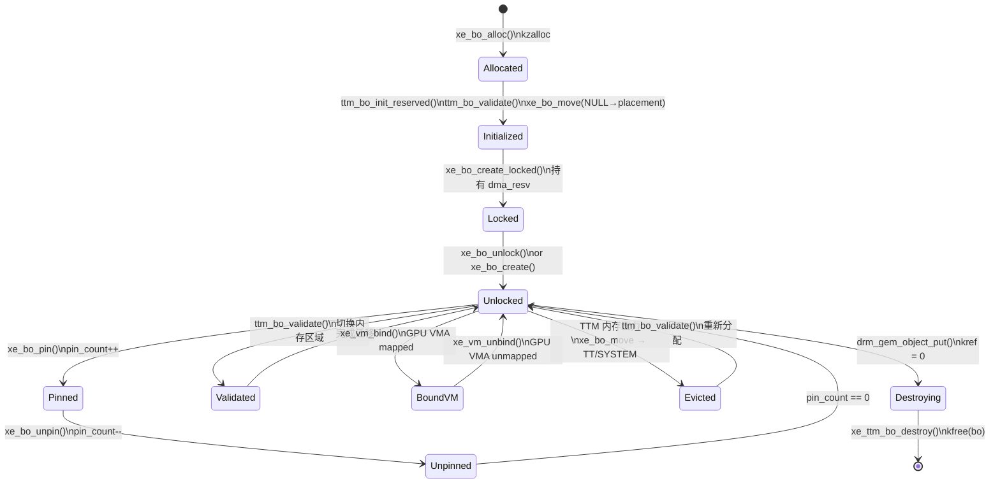

# Part 9: BO 生命周期

> **Source files**:  
> - `drivers/gpu/drm/xe/xe_bo.c`  
> - `drivers/gpu/drm/xe/xe_bo.h`  
> - `include/drm/ttm/ttm_bo.h`

---

## 9.1 生命周期总览

```
xe_bo 完整生命周期:

          xe_bo_alloc()
              │
              ▼
          xe_bo_init()
          └── xe_bo_init_locked()
              └── ttm_bo_init_reserved()   ← 进入 TTM 管理
                  └── xe_ttm_tt_create()   ← 创建 TT 结构
                  └── ttm_bo_validate()    ← 首次 placement
                      └── xe_bo_move(NULL → placement)
              │
              ▼
          [使用期间]
          xe_bo_pin()           ← 防止驱逐
          xe_vm_bind()          ← GPU 虚地址映射
          dma_resv_add_fence()  ← 追踪 GPU 操作
          ttm_bo_validate()     ← 迁移到不同内存类型
              │
              ▼
          xe_vm_unbind()        ← 解除 GPU 虚地址映射
          xe_bo_unpin()
              │
              ▼
          drm_gem_object_put()
          └── xe_gem_object_free()
              └── ttm_bo_put()
                  └── ttm_bo_release()
                      └── xe_ttm_bo_destroy()  ← 清理 xe 特定资源
                          └── ttm_bo_cleanup_refs()
                              └── ttm_bo_evict()  ← 移至 SYSTEM
                                  └── ttm_tt_unpopulate()
```

---

## 9.2 `xe_bo_create()` 调用链

`xe_bo_create()` / `xe_bo_create_locked()` 是创建 BO 的主要入口点：

```c
// xe_bo.c
struct xe_bo *xe_bo_create_locked(struct xe_device *xe,
                                   struct xe_tile *tile,
                                   struct xe_vm *vm,
                                   size_t size,
                                   enum ttm_bo_type type,
                                   u32 flags)
{
    struct xe_bo *bo;
    int err;

    bo = xe_bo_alloc();     // ← 步骤 1
    if (IS_ERR(bo)) return bo;

    bo->tile = tile;
    bo->flags = flags;
    bo->cpu_caching = ...; // 由 flags 及平台决定

    err = xe_bo_init_locked(xe, bo, size, type, flags, vm);
    if (err) {
        xe_bo_free(bo);
        return ERR_PTR(err);
    }
    return bo;
    // 返回时 BO 持有 dma_resv 锁（"_locked" 后缀含义）
}

struct xe_bo *xe_bo_create(struct xe_device *xe, ...)
{
    struct xe_bo *bo = xe_bo_create_locked(xe, ...);
    if (!IS_ERR(bo))
        xe_bo_unlock(bo);   // 非 locked 版本立即解锁
    return bo;
}
```

### 9.2.1 `xe_bo_alloc()`

```c
// xe_bo.c
static struct xe_bo *xe_bo_alloc(void)
{
    struct xe_bo *bo = kzalloc(sizeof(*bo), GFP_KERNEL);
    if (!bo) return ERR_PTR(-ENOMEM);

    // 初始化 GEM 对象引用计数
    // bo->ttm.base 是 drm_gem_object，引用计数 = 1
    return bo;
}
```

### 9.2.2 `xe_bo_init_locked()` — 核心初始化

```c
// xe_bo.c
static int xe_bo_init_locked(struct xe_device *xe, struct xe_bo *bo,
                              size_t size, enum ttm_bo_type type,
                              u32 flags, struct xe_vm *vm)
{
    struct ttm_operation_ctx ctx = { .interruptible = false };
    int err;

    // 1. 建立 placement（构建 bo->placements[]）
    err = __xe_bo_placement_for_flags(xe, bo, flags, type);

    // 2. 初始化 GGTT 节点数组（最多 4 个 tile）
    for (int i = 0; i < ARRAY_SIZE(bo->ggtt_node); i++)
        xe_ggtt_node_init(&bo->ggtt_node[i], ...);

    // 3. 设置 shared resv（若绑定到 VM）
    struct dma_resv *resv = vm ? &vm->resv : NULL;

    // 4. 调用 TTM 初始化
    err = ttm_bo_init_reserved(&xe->ttm,       // ttm_device
                                &bo->ttm,       // ttm_buffer_object
                                type,           // ttm_bo_type_device/kernel/sg
                                &bo->placement, // 构建好的 placement
                                page_align(size) >> PAGE_SHIFT, // size in pages
                                &ctx,           // 操作上下文
                                NULL,           // sg（仅 sg 类型用）
                                resv,           // 共享 resv
                                xe_ttm_bo_destroy); // destroy 回调

    // ttm_bo_init_reserved 内部:
    //   → dma_resv_init（若未共享）
    //   → ttm_bo_validate() → xe_bo_move(NULL → placement[0])
    //   → 返回时 BO 持有 resv 锁

    // 5. 绑定到 VM（若指定）
    if (vm && type == ttm_bo_type_device) {
        bo->vm = vm;
        // 页表 BO 等 kernel 类型不需要 VM 绑定
    }

    return err;
}
```

---

## 9.3 `ttm_bo_validate()` — placement 强制执行

每次需要确保 BO 在特定内存类型时调用：

```c
// drivers/gpu/drm/ttm/ttm_bo.c
int ttm_bo_validate(struct ttm_buffer_object *bo,
                    struct ttm_placement *placement,
                    struct ttm_operation_ctx *ctx)
{
    // 必须持有 bo->base.resv 锁！

    // 1. 检查当前 resource 是否已 compatible
    if (bo->resource && ttm_resource_compat(bo->resource, placement))
        return 0;  // 无需迁移

    // 2. 依次尝试每个 placement
    for (i = 0; i < placement->num_placement; i++) {
        place = &placement->placement[i];

        // 尝试在 place 分配 resource
        err = ttm_resource_alloc(bo, place, &res);
        if (err) continue;  // ENOSPC → 尝试下一个

        // 3. 先驱逐腾出空间（若有 eviction 触发）
        // 4. 移动 BO 到新 resource
        err = ttm_bo_handle_move_mem(bo, res, false, ctx, &hop);
        if (err == -EMULTIHOP) {
            // 两跳迁移（SYSTEM ↔ VRAM）
            err = ttm_bo_handle_move_mem(bo, hop_res, ...);  // 第一跳
            err = ttm_bo_handle_move_mem(bo, res, ...);      // 第二跳
        }
        return err;
    }
    return -ENOMEM;
}
```

### validate 触发时机

```
触发 ttm_bo_validate() 的场景:

1. BO 创建时（ttm_bo_init_reserved 内部）
   → placement 来自 __xe_bo_placement_for_flags()

2. 用户显式迁移（如将 SYSTEM BO 移到 VRAM）
   → placeholder: xe_bo_migrate() 调用

3. 驱动内部（如系统挂起恢复，将 VRAM BO 移到 TT）
   → xe_bo_evict_all() / xe_bo_restore_all()

4. TTM 驱逐回调（内存压力）
   → ttm_device_func.evict_flags → xe_evict_flags()
   → ttm_bo_evict() → ttm_bo_validate(evict placement)
```

---

## 9.4 `xe_ttm_bo_destroy()` — 销毁清理

```c
// xe_bo.c:~1703
static void xe_ttm_bo_destroy(struct ttm_buffer_object *ttm_bo)
{
    struct xe_bo *bo = ttm_to_xe_bo(ttm_bo);
    struct xe_device *xe = xe_bo_device(bo);

    // 1. 所有 GPU VMA 必须已解绑（BUG_ON 检查）
    if (bo->ggtt_node[0].base.size)
        xe_warn(xe, "GGTT node for tile 0 still alive!\n");

    // 2. 清理 GGTT 映射（每个 tile）
    for (int i = 0; i < ARRAY_SIZE(bo->ggtt_node); i++) {
        if (xe_ggtt_node_allocated(&bo->ggtt_node[i]))
            xe_ggtt_node_remove(bo->ggtt_node[i].ggtt, &bo->ggtt_node[i], false);
    }

    // 3. 移除 debugfs 引用
    // 4. 解除 TTM LRU 注册（已在 ttm_bo_release 中完成）

    // 5. 释放父对象引用（针对 SUB BO）
    if (bo->parent_obj)
        drm_gem_object_put(bo->parent_obj);

    // 6. 通知 GEM 系统
    drm_gem_object_release(&ttm_bo->base);

    // 7. 释放 xe_bo 结构本身
    kfree(bo);
}
```

---

## 9.5 Backup/Restore 机制（系统挂起恢复）

Xe 实现了精细的 BO 挂起/恢复策略，以支持系统挂起（S3，Xe link down 等）：

### 9.5.1 BO 类别与挂起策略

```c
// 挂起相关 flags:
XE_BO_FLAG_PINNED                // pin 住：不被驱逐
XE_BO_FLAG_PINNED_NORESTORE      // pin 住但挂起时不恢复内容（重新初始化）
XE_BO_FLAG_PINNED_LATE_RESTORE   // 延迟恢复（suspend 完成后恢复）
```

| BO 类型 | 挂起动作 | 恢复动作 |
|---------|---------|---------|
| 普通用户 BO | 驱逐到 TT/SYSTEM | 状态由 GPU VM 恢复 |
| GuC 固件 BO | PINNED_NORESTORE：不备份 | xe_uc_init_hw 重新加载固件 |
| HW Context BO | PINNED：移到 SYSTEM | 恢复时 GPU 重新 submit |
| 显存 scanout BO | 驱逐 + 内容备份 | `backup_obj` → 恢复 |
| 页表 BO | 深度保存整个 VM | VM rebuild |

### 9.5.2 `backup_obj` 流程

```c
// xe_bo 有一个 backup_obj 字段用于挂起恢复:
struct xe_bo {
    // ...
    struct xe_bo *backup_obj;  // 系统内存备份 BO（挂起时分配）
    // ...
};

// 挂起前（xe_bo_evict_pinned_user_bo 等）:
backup = xe_bo_create(xe, NULL, NULL, bo->size,
                       ttm_bo_type_kernel,
                       XE_BO_FLAG_SYSTEM | XE_BO_FLAG_PINNED);
// GPU copy: VRAM bo → SYSTEM backup
fence = xe_migrate_copy(tile->migrate, bo, backup, ...);
// 等待完成
bo->backup_obj = backup;

// 恢复后（xe_bo_restore_pinned_user_bo）:
// GPU copy: SYSTEM backup → VRAM bo
fence = xe_migrate_copy(tile->migrate, bo->backup_obj, bo, ...);
// 等待完成
xe_bo_put(bo->backup_obj);
bo->backup_obj = NULL;
```

---

## 9.6 引用计数与 GEM 集成

```c
// drm_gem_object 引用计数
drm_gem_object_get(&bo->ttm.base);  // 增加引用
drm_gem_object_put(&bo->ttm.base);  // 减少引用 → 引用降为 0 时销毁

// xe_bo 包装函数
struct xe_bo *xe_bo_get(struct xe_bo *bo)
{
    drm_gem_object_get(&bo->ttm.base);
    return bo;
}

void xe_bo_put(struct xe_bo *bo)
{
    drm_gem_object_put(&bo->ttm.base);
    // 内部: kref_put → 若为 0 → ttm_bo_release → xe_ttm_bo_destroy
}
```

### GEM 用户句柄

```c
// 用户通过 GEM handle 访问 BO
int xe_gem_create_ioctl(struct drm_device *dev, void *data,
                         struct drm_file *file_priv)
{
    // 创建 BO
    bo = xe_bo_create(xe, NULL, vm, args->size,
                       ttm_bo_type_device,
                       XE_BO_FLAG_USER | flags);

    // 分配 GEM handle（用户空间用于引用此 BO）
    ret = drm_gem_handle_create(file_priv, &bo->ttm.base, &args->handle);

    // handle 创建成功后 BO 引用计数 +1（file 持有）
    drm_gem_object_put(&bo->ttm.base);  // 释放创建时的引用
    return ret;
}
```

---

## 9.7 BO 生命周期状态机



---

## 9.8 BO 创建快速参考

```c
// 内核内部 BO（不暴露给用户）
bo = xe_bo_create(xe, tile, NULL, size,
                   ttm_bo_type_kernel,
                   XE_BO_FLAG_VRAM_IF_DGFX(tile) | XE_BO_FLAG_PINNED);

// 用户设备 BO（通过 GEM handle）
bo = xe_bo_create(xe, NULL, vm, size,
                   ttm_bo_type_device,
                   XE_BO_FLAG_USER | XE_BO_FLAG_VRAM0 | XE_BO_FLAG_SYSTEM);

// 系统内存专用 BO（如备份 BO）
bo = xe_bo_create(xe, NULL, NULL, size,
                   ttm_bo_type_kernel,
                   XE_BO_FLAG_SYSTEM | XE_BO_FLAG_PINNED);

// DMA-buf 导入 BO
bo = xe_bo_create(xe, NULL, NULL, size,
                   ttm_bo_type_sg,   // sg 类型
                   XE_BO_FLAG_SYSTEM);
```
