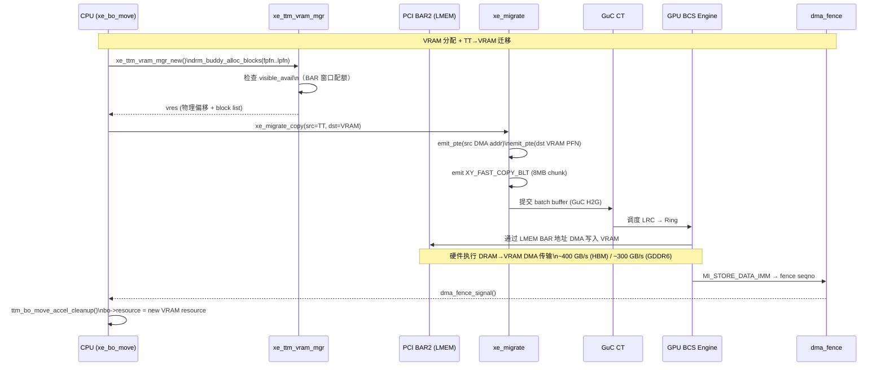

# Part 10: 硬件交互详解

> **Source files**:  
> - `drivers/gpu/drm/xe/xe_bo.c`  
> - `drivers/gpu/drm/xe/xe_migrate.c`  
> - `drivers/gpu/drm/xe/xe_ttm_vram_mgr.c`  
> - `drivers/gpu/drm/xe/xe_ggtt.c`  
> - `drivers/gpu/drm/xe/xe_ttm_stolen_mgr.c`

---

## 10.1 BAR（Base Address Register）约束

### 10.1.1 dGPU 的 BAR 大小限制

现代 dGPU 有两种 BAR 配置模式：

```
传统小 BAR（Legacy 256 MB BAR）:

系统地址空间:
┌──────────────────────────────────────────┐
│  PCI LMEM BAR（BAR2）                   │
│  ┌────────────────────────────────────┐ │  物理 VRAM
│  │  BAR 窗口（256 MB 可见）           │ │  ┌──────────────────┐
│  │  io_size = 256 MB                  │←──►│ VRAM 底部区域    │
│  │  CPU 可通过 ioremap/mmap 访问      │ │  │ (kernel VRAM分区)│
│  └────────────────────────────────────┘ │  ├──────────────────┤
│                                          │  │ VRAM 中上部      │
│  BAR 无法访问的 VRAM                     │  │ (GPU only)       │
│  CPU 不能直接读写                        │  │                  │
└──────────────────────────────────────────┘  └──────────────────┘

可重调整 BAR（Resizable BAR / rBAR / Smart Access Memory）:

┌──────────────────────────────────────────┐
│  PCI LMEM BAR（BAR2）                   │
│  ┌────────────────────────────────────┐ │  物理 VRAM
│  │  BAR 窗口 = 全部 VRAM（如 8 GB）  │←──►│ 整个 VRAM        │
│  │  io_size == usable_size            │ │  │ CPU 完全可见     │
│  └────────────────────────────────────┘ │  └──────────────────┘
└──────────────────────────────────────────┘
```

### 10.1.2 `visible_avail` 跟踪机制

```c
// 每次 VRAM 分配时更新 visible_avail（保护 BAR 可见区配额）:

// xe_ttm_vram_mgr.c: xe_ttm_vram_mgr_new()
mutex_lock(&mgr->lock);
if (is_visible_region && size > mgr->visible_avail) {
    err = -ENOSPC;  // BAR 可见区已满
    goto error_unlock;
}
mgr->visible_avail -= vres->used_visible_size;  // 分配时减少
mutex_unlock(&mgr->lock);

// xe_ttm_vram_mgr.c: xe_ttm_vram_mgr_del()
mgr->visible_avail += vres->used_visible_size;  // 释放时恢复
```

**关键约束**：
- `NEEDS_CPU_ACCESS` BO 必须在 `visible_size` 范围内（`lpfn = io_size >> PAGE_SHIFT`）
- 普通 BO 使用 `TOPDOWN` 分配（从 VRAM 顶部，远离 BAR）
- 若 `visible_avail` 不足，触发 BAR 可见 VRAM 中 BO 的驱逐

---

### 10.1.3 rBAR 全开时 BO 是否会超出 BAR2 范围？

#### 核心判断条件：`io_size < vram->usable_size`

在 `xe_bo.c: add_vram()` 中，所有 BAR 可见性约束都被一个条件门控：

```c
// drivers/gpu/drm/xe/xe_bo.c: add_vram()
io_size = vram->io_size;

if (io_size < vram->usable_size) {          // ← 关键判断
    if (bo_flags & XE_BO_FLAG_NEEDS_CPU_ACCESS) {
        place.fpfn = 0;
        place.lpfn = io_size >> PAGE_SHIFT; // 强制在 BAR 窗口内
    } else {
        place.flags |= TTM_PL_FLAG_TOPDOWN; // 推向 VRAM 顶部（BAR 窗口外）
    }
}
// 若条件为 false（rBAR），两个分支都不执行：
//   - lpfn 保持 0（后续被 xe_ttm_vram_mgr_new 规范为 man->size）
//   - 无 TOPDOWN 标志 → drm_buddy 从底部（低地址）向上分配
```

#### rBAR 全开场景（io_size == usable_size）

当 PCIe rBAR 将 BAR2 扩展至全 VRAM 大小时：

```
物理 VRAM 布局（rBAR 场景）：

 0                                          usable_size
 ┌──────────────────────────────────────────┐
 │       全部 VRAM（例如 8 GB）              │
 │   io_size == usable_size == 8 GB         │
 │   每一页都有对应的 BAR2 物理偏移          │
 └──────────────────────────────────────────┘
 │←────────────── BAR2 窗口覆盖 ────────────→│
 io_start                             io_start + io_size

结论：任何 PFN 均在 BAR2 范围内，不存在"超出 BAR"情况。
```

`io_size < vram->usable_size` 为 **false** → `add_vram()` 中的整个 if 块**不执行**：

| 条件 | rBAR（io_size == usable_size） | small-BAR（io_size < usable_size） |
|------|--------------------------------|------------------------------------|
| `NEEDS_CPU_ACCESS` BO 的 `lpfn` | 未设置（默认 0，规范为 man->size，即整个 VRAM） | 设为 `io_size >> PAGE_SHIFT`（限制在 BAR 内） |
| 普通 BO 的分配方向 | 无 TOPDOWN → 从底部向上分配 | TOPDOWN → 从顶部向下分配（超出 BAR 窗口） |
| 分配结果 | 所有 BO 均在 BAR2 范围内 | 非 CPU 访问 BO 可能超出 BAR2 范围 |
| `xe_ttm_resource_visible()` | 始终返回 true | 非 CPU 访问 BO 可能返回 false |

#### small-BAR 场景（io_size < usable_size）

```
物理 VRAM 布局（small-BAR 场景，以 16 GB VRAM 和 256 MB BAR 为例）：

 0          io_size                     usable_size
 ┌───────────┬───────────────────────────┐
 │  BAR 可见  │   BAR 不可见（GPU 私有）   │
 │  256 MB   │       约 15.75 GB          │
 └───────────┴───────────────────────────┘
 │← BAR2 │
     ↑                    ↑
 NEEDS_CPU_ACCESS BO    TOPDOWN BO（普通纹理/缓冲区）
 lpfn = io_size>>PAGE_SHIFT   可能落在此区域 → CPU 不可访问
```

- `NEEDS_CPU_ACCESS` BO（如 GTT 页表、状态缓冲区）：`lpfn = io_size >> PAGE_SHIFT`，**强制分配在 BAR 内**
- 普通 BO（纹理、顶点缓冲等）：`TTM_PL_FLAG_TOPDOWN`，从高地址向下分配，**可能完全超出 BAR2 范围**
- 若此类 BO 被驱逐至 VRAM 顶部，`xe_ttm_resource_visible()` 返回 false，CPU 无法通过 mmap 或 vmap 直接访问，必须通过 GPU BCS 复制或先驱逐到系统内存

#### `xe_ttm_vram_mgr_new()` 中的可见区配额检查

即便在 rBAR 场景下，`visible_avail` 跟踪仍然有效（只是意义变化）：

```c
// xe_ttm_vram_mgr.c: xe_ttm_vram_mgr_new()
// 条件：lpfn <= mgr->visible_size >> PAGE_SHIFT
// rBAR: visible_size == usable_size，lpfn 默认等于 man->size（== usable_size）
//   → 条件 true，但 visible_avail 从 usable_size 开始跟踪整个 VRAM
//   → 配额耗尽时返回 -ENOSPC，与普通 VRAM 耗尽等同，不是 BAR 约束问题

// small-BAR: visible_size < usable_size
//   → NEEDS_CPU_ACCESS BO 的 lpfn <= visible_size → 配额检查有实际约束意义
//   → TOPDOWN BO 的 lpfn == man->size > visible_size → 跳过配额检查
```

#### 总结

| 场景 | BO 是否会超出 BAR2 范围 | 根本原因 |
|------|-------------------------|----------|
| **rBAR（io_size == usable_size）** | **不会** | `io_size < usable_size` 为 false，无 `lpfn` 约束，无 TOPDOWN，所有 BO 均在 BAR 内 |
| **small-BAR（io_size < usable_size）** | **会**（普通 BO） | TOPDOWN 分配将非 CPU 访问 BO 推向 VRAM 高地址，超出 `io_size` |
| **small-BAR，NEEDS_CPU_ACCESS BO** | 不会 | `lpfn = io_size >> PAGE_SHIFT` 强制边界 |

> 换言之，"BO 超出 BAR2 范围"是 small-BAR 的**设计行为**，不是 bug。驱动刻意将不需要 CPU 直接访问的 BO 推到 BAR 窗口外，以把宝贵的 BAR-visible VRAM 留给 `NEEDS_CPU_ACCESS` BO。rBAR 全开时，此问题从根本上消失。

---

## 10.2 Flat CCS — VRAM 压缩色彩表面

### 10.2.1 什么是 Flat CCS

CCS（Color Compression Surface / Cache Color Subsurface）是 Intel GPU 的显存压缩元数据区域：

```
压缩 VRAM BO 物理布局:

VRAM 物理:
┌──────────────────────────────────────────┐ base_offset
│  Main Surface（主数据）                  │
│  PAGE 0  │ PAGE 1  │ PAGE 2 │ ...        │  N 页
├──────────────────────────────────────────┤
│                    ...                   │
├──────────────────────────────────────────┤ base_offset + N * PAGE_SIZE
│  [无效区域或间隙]                        │
├──────────────────────────────────────────┤
│  CCS 元数据区域（自动分配，GPU 管理）     │
│  每 64KB 主数据 → 256B CCS               │
│  压缩率: 1/256                           │
└──────────────────────────────────────────┘

iGPU 系统内存（Flat CCS 在 TT 页面）:

TT 页面布局（extra_pages 在 xe_ttm_tt_create 中分配）:
┌─────────────────────────────────┐
│  主数据页（0 .. N-1）            │ N 页
├─────────────────────────────────┤
│  CCS 元数据页（N .. N+M-1）      │ M = ceil(N / 256) 页
└─────────────────────────────────┘
```

### 10.2.2 CCS 相关代码

```c
// xe_bo.c: xe_ttm_tt_create 中的 extra_pages 计算
if (xe_bo_needs_ccs_pages(bo)) {
    u64 ccs_size = DIV_ROUND_UP(bo->ttm.base.size, 256);
    extra_pages = DIV_ROUND_UP(ccs_size, PAGE_SIZE);
}
// TTM 会为 tt->pages[] 数组额外分配 extra_pages 页

// 判断是否需要 CCS 页面
bool xe_bo_needs_ccs_pages(struct xe_bo *bo)
{
    struct xe_device *xe = xe_bo_device(bo);
    // iGPU: 系统内存 BO 若支持压缩
    return !IS_DGFX(xe) &&
           xe_device_has_flat_ccs(xe) &&
           bo->ttm.type != ttm_bo_type_sg;
}
```

### 10.2.3 CCS 迁移

```c
// 迁移压缩 BO 时需同步 CCS（xe_migrate.c）:

// VRAM ↔ VRAM 复制（保持压缩状态）:
// 使用 XY_CTRL_SURF_COPY_BLT 同步 CCS 区域

// VRAM → TT（解压缩）:
// 先执行数据复制 (XY_FAST_COPY_BLT)
// 再执行 CCS 清零（TT 上无物理 CCS 区域）

// TT → VRAM（重新压缩）:
// GPU 写入时自动启用压缩
// CCS 由硬件自动填充
```

---

## 10.3 GGTT 映射机制

### 10.3.1 GGTT 简介

GGTT（Global Graphics Translation Table）是 GPU 的全局线性翻译表，提供 GPU 对 VRAM/系统内存的统一地址空间访问：

```
GPU 地址空间视图（GGTT）:

┌─────────────────────────────────────────────┐  GGTT aperture start
│  GGTT 条目 0           → VRAM frame 0       │  每条目 = 8 字节 PTE
│  GGTT 条目 1           → VRAM frame 1       │  覆盖范围 = 总 VRAM
│  ...                                         │
│  GGTT 条目 N           → 系统内存 DMA addr  │  TT BO 也可 GGTT 映射
│  ...                                         │
└─────────────────────────────────────────────┘  GGTT aperture end

Aperture（CPU 视角，通过 BAR1）:
╔═════════════════════════════════════════════╗
║  可选: CPU 也可通过 PCI aperture 访问 GGTT  ║
║  映射的内存区域                              ║
╚═════════════════════════════════════════════╝
```

### 10.3.2 GGTT 节点管理

```c
// xe_bo 结构中的 GGTT 字段
struct xe_bo {
    // ...
    struct xe_ggtt_node ggtt_node[XE_MAX_TILES_PER_DEVICE];
    // 每个 tile 有独立的 GGTT 节点（多 tile dGPU）
    // ggtt_node[i].base.start = GGTT 中的起始偏移（GTT 地址）
    // ggtt_node[i].base.size  = 映射的大小
};

// FLAGS 触发 GGTT 映射
// XE_BO_FLAG_GGTT0 → 在 tile 0 建立 GGTT 映射
// XE_BO_FLAG_GGTT1 → 在 tile 1 建立 GGTT 映射
// etc.
```

### 10.3.3 iGPU Stolen 访问路径

```c
// 旧 iGPU（verx100 < 1270）Stolen 内存只能通过 GGTT 访问：

bool xe_ttm_stolen_cpu_access_needs_ggtt(struct xe_device *xe) {
    return GRAPHICS_VERx100(xe) < 1270 && !IS_DGFX(xe);
}

// 访问流程:
// 1. 分配 GGTT slot（xe_ggtt_node_insert）
// 2. 写入 GGTT PTE 指向 Stolen 物理地址
// 3. CPU 通过 PCI aperture (BAR1) 访问 GGTT aperture 对应地址
// 4. 操作完成后可选择卸载 GGTT 映射
```

---

## 10.3.4 内核 CPU 访问 VRAM — BAR2 直接窗口路径

### 两条 CPU 访问 VRAM 的路径

```
路径 A-1: 用户态 mmap（dGPU，**非连续 BO 亦可**，逐页映射）

  进程触发缺页: 访问 mmap 地址 = vma->vm_start + page_offset * PAGE_SIZE
    │
    ▼ ttm_bo_vm_fault_reserved()   ← TTM page-fault handler
    │
    ├─ for i in 0..NUM_PREFAULT:                         ← 每次缺页映射多页（预取）
    │    pfn = xe_ttm_io_mem_pfn(bo, page_offset + i)
    │            ├─ xe_res_first(resource, page_offset*PAGE_SIZE, ...)
    │            │    └─ 遍历 drm_buddy block 链表         ← 支持非连续块!
    │            │         找到包含该偏移的块
    │            └─ return (vram->io_start + cursor.start) >> PAGE_SHIFT
    │                        ↑ BAR2 物理基址   ↑ 该页在 VRAM 内的实际偏移
    │
    └─ vmf_insert_pfn_prot(vma, address, pfn, WC_prot)
           └─ 在进程页表写入一条 PTE:
              CPU VA [address] → PFN = (BAR2_PA + cursor.start) >> PAGE_SHIFT

  结果: 进程 VA → CPU MMU PTE → BAR2 物理页帧 → PCIe TLP → VRAM 物理地址
        每个 VRAM 页独立映射，BO 的各页可以在 VRAM 中任意散布（drm_buddy 碎片）

路径 A-2: 内核 vmap（仅限 contiguous BO，单指针访问）

  CPU 核心
    │ writecombining / WC memcpy
    ▼
  ┌──────────────────────────┐
  │ bo->vmap.vaddr_iomem     │  = vram->mapping + BO起始偏移（单个连续 iomem 指针）
  │ (void __iomem *)         │  要求: BO 物理上连续（TTM_PL_FLAG_CONTIGUOUS）
  └──────────┬───────────────┘
             │ memcpy_toio → WC Buffer → PCIe TLP
             ▼
  ┌──────────────────────────┐
  │ PCIe BAR2 (LMEM_BAR)     │  io_start = pci_resource_start(pdev, LMEM_BAR)
  │ io_size  = BAR 窗口大小  │  整个 BO 必须落在 BAR 窗口内（BAR 可见区）
  └──────────┬───────────────┘
             │ PCIe TLP
             ▼
  ┌──────────────────────────┐
  │ VRAM 物理内存（连续块）   │  dpa_base + BO偏移（连续）
  └──────────────────────────┘

路径 B: GGTT Aperture 访问（iGPU Stolen，旧平台 < Xe LPM）

  CPU 核心
    │
    ▼
  ┌──────────────────────────┐
  │ BAR0 aperture 区域       │  tile->mmio.regs + ggtt_node.start
  │ (mapped via BAR0/BAR1)   │  GGTT PTE 存于 BAR0[8M..16M]
  └──────────┬───────────────┘
             │ GGTT 翻译: GTT VA → Stolen PA
             ▼
  ┌──────────────────────────┐
  │ Stolen 内存（GSM）        │
  └──────────────────────────┘
```

---

### BAR2 路径建立过程（`xe_vram.c`）

```c
// 步骤 1: 探测 BAR2 物理地址和大小
static int determine_lmem_bar_size(struct xe_device *xe,
                                   struct xe_vram_region *lmem_bar)
{
    struct pci_dev *pdev = to_pci_dev(xe->drm.dev);

    // 从 PCI 配置空间读取 BAR2 资源
    lmem_bar->io_start = pci_resource_start(pdev, LMEM_BAR); // BAR2 物理基地址
    lmem_bar->io_size  = pci_resource_len(pdev, LMEM_BAR);   // BAR2 窗口大小
    //  io_size == VRAM 总大小  → rBAR（全可见）
    //  io_size <  VRAM 总大小  → small-BAR（只有底部可见）

    // 步骤 2: 建立 WC ioremap（内核可直接 memcpy 写入的 iomem 指针）
    lmem_bar->mapping = devm_ioremap_wc(&pdev->dev,
                                        lmem_bar->io_start,
                                        lmem_bar->io_size);
    // WC = Write-Combining: CPU 写合并缓冲积攒后批量发送 PCIe TLP
    // 不使用 WB: VRAM 无 CPU cache coherency 协议支持
    // 不使用 UC: UC 每次写都是单独 TLP，带宽极差

    return 0;
}
```

---

### `xe_ttm_io_mem_reserve()` — TTM 注册 BO 的总线地址 (`xe_bo.c`)

```c
// 每次 BO 被 TTM 放置到 VRAM 时调用，填写 mem->bus 结构
static int xe_ttm_io_mem_reserve(struct ttm_device *bdev,
                                  struct ttm_resource *mem)
{
    switch (mem->mem_type) {
    case XE_PL_VRAM0:
    case XE_PL_VRAM1: {
        struct xe_vram_region *vram = res_to_mem_region(mem);

        // BO 在 VRAM 内的页偏移 → 字节偏移
        mem->bus.offset = mem->start << PAGE_SHIFT;
        //                       ↑ drm_buddy 分配的块起始页号

        // mem->bus.addr 只在 contiguous BO 时填写（供内核 vmap/kmap 使用）
        // 非连续 BO 的 mmap 不走此字段，走 xe_ttm_io_mem_pfn 逐页查询
        if (vram->mapping && mem->placement & TTM_PL_FLAG_CONTIGUOUS)
            mem->bus.addr = (u8 __force *)vram->mapping +
                            mem->bus.offset;
        // mem->bus.addr = vram->mapping + offset
        //               = devm_ioremap_wc 基址 + BO 起始偏移
        //   仅用于: xe_bo_vmap() → ttm_bo_kmap() → 单个连续 iomem 指针
        //   mmap 缺页时不使用此字段，而是调用 xe_ttm_io_mem_pfn(bo, page_offset)

        // 总线地址 = BAR2 物理起始 + BO 偏移
        mem->bus.offset += vram->io_start;
        //  io_start = pci_resource_start(LMEM_BAR) = BAR2 的 CPU 物理地址
        //  用于 mmap pfn 计算: xe_ttm_io_mem_pfn() 返回此地址 >> PAGE_SHIFT

        mem->bus.is_iomem = true;         // 标记为 I/O 内存
        mem->bus.caching  = ttm_write_combined;  // non-x86 强制 WC
        return 0;
    }
    // ...
    }
}
```

---

### `xe_bo_vmap()` — 建立内核 CPU vmap (`xe_bo.c`)

```c
// 调用时机: xe_managed_bo_create_pin_map → xe_bo_vmap
//           xe_bo_evict_pinned_copy（suspend/resume 期间 memcpy 备份）
//           ce_map_memcpy_to/from 之前

int xe_bo_vmap(struct xe_bo *bo)
{
    bool is_iomem;
    void *virtual;

    // 前提①: bo->flags & XE_BO_FLAG_NEEDS_CPU_ACCESS  （BO 必须在 BAR 可见区，否则 io_start+offset 超出 BAR 窗口）
    // 前提②: force_contiguous(bo->flags)               （必须物理连续！）
    //         原因：ttm_bo_kmap 返回单个 void* 指针，无法表示不连续地址空间
    //         非连续 BO 请用 mmap（用户态）或 xe_ttm_access_memory（内核短暂访问）

    // 底层走 TTM kmap（利用已有的 mem->bus.addr）
    ret = ttm_bo_kmap(&bo->ttm, 0, xe_bo_size(bo) >> PAGE_SHIFT, &bo->kmap);

    virtual = ttm_kmap_obj_virtual(&bo->kmap, &is_iomem);

    if (is_iomem)
        iosys_map_set_vaddr_iomem(&bo->vmap,
                                   (void __iomem *)virtual);
        // bo->vmap.vaddr_iomem = BAR2 映射的 iomem 地址
        // bo->vmap.is_iomem    = true
    else
        iosys_map_set_vaddr(&bo->vmap, virtual);
        // 系统内存 BO: 普通虚拟地址
}
```

---

### `xe_map_*` 读写宏 — 统一访问接口 (`xe_map.h`)

```c
// 写入 VRAM BO（e.g. 写 GGTT scratch page、写 LRC、写 HuC 固件）:

xe_map_memcpy_to(xe, &bo->vmap, offset, src, len);
//  ↓ 展开为:
iosys_map_memcpy_to(&bo->vmap, offset, src, len);
//  ↓ 若 vmap.is_iomem == true:
memcpy_toio(vmap->vaddr_iomem + offset, src, len);
//  ↓ 底层: x86 rep movs 写入 WC 映射区 → CPU WC Buffer → 积攒 → PCIe TLP → VRAM

// 硬件读取 VRAM BO（读回 / 验证）:
xe_map_memcpy_from(xe, dst, &bo->vmap, offset, len);
//  ↓ 若 is_iomem: memcpy_fromio (UC 读策略，绕过 WC buffer)
```

---

### 完整调用链示例（写入 GuC/HuC 固件到 VRAM）

```
xe_huc_upload() / xe_guc_upload()
  └─► xe_managed_bo_create_pin_map(xe, tile, size,
                                    XE_BO_FLAG_VRAM_IF_DGFX |
                                    XE_BO_FLAG_NEEDS_CPU_ACCESS)
        ├── drm_buddy_alloc (连续, 在 BAR 可见区内 fpfn..lpfn)
        ├── xe_ttm_io_mem_reserve()
        │     mem->bus.addr   = vram->mapping + offset  ← iomem 指针
        │     mem->bus.offset = BAR2_PA + offset        ← PFN 来源
        └── xe_bo_vmap()
              ttm_bo_kmap → bo->kmap.virtual = mem->bus.addr
              iosys_map_set_vaddr_iomem(&bo->vmap, virtual)

  └─► xe_map_memcpy_to(xe, &bo->vmap, 0, fw->data, fw->size)
        memcpy_toio(vmap->vaddr_iomem, fw->data, fw->size)
        ↓
        [x86 WC Buffer 积攒 64B 行]
        ↓
        PCIe TLP Write (MWr, addr = BAR2_PA + offset)
        ↓
        VRAM 写入完成

  └─► GuC/HuC 硬件从 VRAM 加载固件（GPU 侧直接读 VRAM，不经过 BAR）
```

---

### Small-BAR 时 CPU 不可见 VRAM 的处理

```
当 io_size < usable_size（Small-BAR 模式）:

 VRAM 底部 [0 .. io_size):      CPU 可见，通过 BAR2 vmap 直访
 VRAM 上部 [io_size .. total):  CPU 不可见，需 GPU BCS 引擎搬运

xe_ttm_resource_visible():
  return (vram->io_size == vram->usable_size) ||
         (res->start + res->size <= (io_size >> PAGE_SHIFT));
  // 返回 false → xe_ttm_io_mem_reserve 返回 -EINVAL
  // TTM 标记 bus.addr = NULL，xe_bo_vmap 不可用
  // 但 mmap 仍可用: xe_ttm_io_mem_pfn 通过 xe_res_cursor 逐页计算 PFN，
  //    只要 BO 在 BAR 可见区内（cursor.start < io_size）即可

xe_ttm_access_memory():
  if (!xe_bo_is_visible_vram(bo) || len >= SZ_16K) {
      // 走 GPU 搬运路径: xe_migrate_access_memory
      xe_migrate_copy (GPU BCS: VRAM → staging TT → CPU 读)
  } else {
      // 在 BAR 可见范围内: 直接 iomem 访问
      iosys_map_set_vaddr_iomem(&vmap,
          (u8 __iomem *)vram->mapping + cursor.start);
      xe_map_memcpy_from(xe, buf, &vmap, page_offset, byte_count);
  }
```

---

### BAR2 访问地址推导一览

```
变量                     含义                        来源                          连续性要求
──────────────────────────────────────────────────────────────────────────────────────────────
vram->io_start           BAR2 物理基地址             pci_resource_start(LMEM_BAR)  无
vram->io_size            BAR2 窗口大小               pci_resource_len(LMEM_BAR)    无
vram->mapping            BAR2 WC iomem 内核虚址      devm_ioremap_wc(io_start, io_size) 无
cursor.start             某一逻辑偏移处的 VRAM 偏移  xe_res_cursor 遍历 drm_buddy 块链 无（支持碎片）
mem->bus.offset(起始)    BO 起始页的 PCIe 总线地址   io_start + res->start<<PAGE_SHIFT  无
mem->bus.addr            BO 的 iomem 单指针（可选）  vram->mapping + bus.offset        **必须连续**
xe_ttm_io_mem_pfn(off)   第 off 页的 BAR2 PFN        io_start + cursor.start(off)      无（逐页查询）
bo->vmap.vaddr_iomem     内核 vmap 指针              ttm_bo_kmap 后填充                **必须连续**

总结：mmap（用户态）→ 逐页缺页 → xe_ttm_io_mem_pfn → 无需连续
      vmap（内核）  → 单指针  → bus.addr/ttm_bo_kmap  → 必须连续
```

---

## 10.3.5 CPU 写入 BAR2 后，GPU 如何读取该数据？使用 GGTT 还是 PPGTT？

这是理解 GPU 内存访问模型的核心问题：**BAR2 是 CPU 侧的 PCIe 窗口，与 GPU 侧的 GTT 地址空间是完全正交的两个概念**。

### 两条访问路径的本质区别

```
CPU 访问（写入）路径：

  CPU core
    │
    ▼
  CPU MMU (VA → PA)
    │  透过 CPU 页表（PAT 属性：WC/WB/UC）
    ▼
  PCIe RC（Root Complex）
    │  BAR2 地址窗口（PCIe TLP）
    ▼
  物理 VRAM 某 page（例如 VRAM_PA = 0x0800_0000）
    ↑
    └─── io_start + BO 内偏移 = BAR2 物理地址

GPU 访问（读取）路径：

  GPU CS（Command Streamer）
    │
    ▼
  GPU MMU（GPU VA → VRAM PA）
    │  查 PPGTT PTE 或 GGTT PTE
    ▼
  同一物理 VRAM page（0x0800_0000）← 与 CPU 写入的是同一块物理内存！
```

BAR2 地址和 GGTT/PPGTT 地址都可以映射到同一块 VRAM 物理内存，它们只是从不同视角（CPU 视角 vs GPU 视角）访问相同的数据。

### 判断 GPU 用 GGTT 还是 PPGTT

在 xe 驱动中，使用哪种 GTT 取决于访问发起者：

| GPU 访问场景 | 使用的 GTT | 原因 |
|-------------|-----------|------|
| 用户态渲染/计算（via `VM_BIND` + `DRM_XE_EXEC`） | **PPGTT**（per-process VM） | 每个进程有独立 GPU VA 空间，通过 `xe_vm_bind` 将 BO 映射进 PPGTT |
| 显示扫描输出（display scanout） | **GGTT** | 显示引擎（pipe/plane）只理解 GGTT 地址，无独立 VM；设置 `XE_BO_FLAG_GGTT \| XE_BO_FLAG_SCANOUT` |
| migrate 引擎内部 VRAM 拷贝（`xe_migrate`） | **PPGTT**（专用迁移 VM） | `xe_migrate` 持有自己的 `XE_VM_FLAG_MIGRATION` VM，与 GGTT 无关；VRAM 地址通过 `xe_migrate_vram_ofs()` 映射到迁移 VM 的 PPGTT 恒等映射区 |
| GuC/HuC 固件加载 | **GGTT** | GuC 通过 GGTT 相对地址访问自己的环形缓冲区、CT buffer |
| 内核 BO（GEM内部，stolen）| **GGTT**（可选） | Kernel-mode 驱动对象（page table BOs 等）有时需要 GGTT 映射以供固定功能硬件访问 |

**结论：普通用户态 GPU 工作负载（渲染/计算/拷贝）使用 PPGTT；只有固定功能硬件（display、GuC、老旧固件路径）才依赖 GGTT。**

### PPGTT：以 VM_BIND 为例

CPU 通过 BAR2 写入 BO 后，GPU 要读取该 BO 的标准流程：

```c
// 1. 用户态创建 BO（分配在 VRAM）
//    注意：ioctl 返回的是 GEM handle（u32），不是 fd！
uint32_t bo_handle;
struct drm_xe_gem_create create = {
    .size      = SIZE,
    .flags     = DRM_XE_GEM_CREATE_FLAG_NEEDS_VISIBLE_VRAM,
    .placement = region_vram_id,  // 从 DRM_XE_DEVICE_QUERY_MEM_REGIONS 获得
};
ioctl(drm_fd, DRM_IOCTL_XE_GEM_CREATE, &create);
bo_handle = create.handle;  // u32 handle，不是 fd

// 2. CPU 通过 mmap（BAR2）写入数据
//    必须先从驱动获取 fake mmap offset，然后用 DRM fd（不是 bo handle）做 mmap
//    WC（写合并）无需用户显式指定：驱动在缺页中断时自动通过
//    ttm_io_prot() → ttm_prot_from_caching(ttm_write_combined)
//                  → pgprot_writecombine() 应用，用户只用普通 mmap 即可
struct drm_xe_gem_mmap_offset mmo = { .handle = bo_handle };
ioctl(drm_fd, DRM_IOCTL_XE_GEM_MMAP_OFFSET, &mmo);  // 获取 fake offset

void *cpu_ptr = mmap(NULL, SIZE, PROT_READ | PROT_WRITE,
                     MAP_SHARED, drm_fd, mmo.offset); // 用 drm_fd，非 bo_handle
// CPU 首次访问此地址 → 触发缺页 → ttm_bo_vm_fault_reserved():
//   prot = ttm_io_prot(bo, bo->resource, vma->vm_page_prot);
//   // 对 VRAM BO: bus.caching == ttm_write_combined
//   //   → ttm_prot_from_caching() → pgprot_writecombine(prot)
//   // 内核自动将 VMA 该页设为 WC，用户态无需指定 mmap_wc 或任何 WC 标志
memcpy(cpu_ptr, src_data, SIZE);   // CPU write via BAR2 → lands in VRAM (WC)
munmap(cpu_ptr, SIZE);

// 3. 用户态将 BO 映射进自己的 GPU VA 空间（PPGTT）
struct drm_xe_vm_bind bind = {
    .op        = DRM_XE_VM_BIND_OP_MAP,
    .bo_handle = bo_handle,
    .addr      = GPU_VA,   // GPU virtual address in user's PPGTT
    .range     = SIZE,
};
ioctl(drm_fd, DRM_IOCTL_XE_VM_BIND, &bind);

// 4. 提交 GPU 命令读取该 GPU_VA
ioctl(drm_fd, DRM_IOCTL_XE_EXEC, { .address = cmd_buf_gpu_va, ... });
// GPU CS 查 PPGTT PTE: GPU_VA → VRAM_PA（与 CPU 写入的 BAR2 目标相同物理页）
```

#### 为什么不需要 `mmap_wc`？

Linux 没有 `mmap_wc()` 系统调用。WC 属性由 TTM 驱动在**缺页中断时**自动应用，路径如下：

```
mmap(drm_fd, mmo.offset) → ttm_bo_mmap_obj()
  仅设置 vm_ops = &ttm_bo_vm_ops，不修改 vm_page_prot

首次访问 CPU 虚拟地址 → 缺页中断 → ttm_bo_vm_fault()
  → ttm_bo_vm_fault_reserved(vmf, vma->vm_page_prot, NUM_PREFAULT)
      prot = ttm_io_prot(bo, bo->resource, prot)
              // man->use_tt == false（VRAM 不是系统 TT）
              // → caching = res->bus.caching     （ttm_write_combined）
              // → ttm_prot_from_caching()
              //   → pgprot_writecombine(prot)     ← WC 在此处生效
      vmf_insert_pfn_prot(vma, address, pfn, prot)  ← 写入 WC 的 PTE
```

`xe_ttm_io_mem_reserve()` 中设置的 `mem->bus.caching = ttm_write_combined` 是整个 WC 链路的起点。用户态的 `mmap()` 调用本身不需要任何特殊标志。

> **注意**：代码中 `PROT_READ | PROT_WRITE` 是标准写法；部分场景只写不读可以只用 `PROT_WRITE`，但建议始终包含 `PROT_READ` 以兼容非 WC 路径（如 BO 被驱逐到系统内存后映射为普通页）。

驱动侧（`xe_vm_bind`）将 PPGTT PTE 写成：

```c
// xe_pt.c: xe_pt_stage_bind_entry
entry = vm->pt_ops->pte_encode_bo(bo, page_offset, pat_index, level);
// PTE 字段:
//   VRAM PA = drm_buddy_block 物理地址（与 BAR2 窗口对应同一物理页）
//   PAT index = xe->pat.idx[XE_CACHE_WB/WC]（影响 GPU 侧 cache 行为）
```

### GGTT：display 扫描的例外

```c
// xe_plane_initial.c（display 初始化）：
flags = XE_BO_FLAG_SCANOUT | XE_BO_FLAG_GGTT;
bo = xe_bo_create_pin_map(xe, tile, NULL, fb_size, ttm_bo_type_kernel, flags, exec);
// 设置 XE_BO_FLAG_GGTT → xe_ggtt_insert_bo() → 在 GGTT 中分配虚拟地址
// display 引擎寄存器（SURF_ADDR 等）写入 GGTT 地址
```

Display 引擎只理解 GGTT 地址——它没有自己的 PPGTT 进程上下文，因此必须走 GGTT。

### xe_migrate 的 PPGTT 恒等映射

```
migrate VM 的 PPGTT 布局（xe_migrate_prepare_vm）:

  GPU VA 0 .. NUM_PT_SLOTS*4K          ← 自身 page table BO 的映射
  GPU VA IDENTITY_OFFSET << 30 ..      ← 整个 VRAM 的恒等映射（1GB pages）
      entry = DPA_base + pos (物理地址直接作为 PTE)
```

当 `xe_migrate_copy()` 或 `xe_migrate_clear()` 访问 VRAM 中某个 BO 时，不通过 GGTT，而是通过 `xe_migrate_vram_ofs(xe, dpa_addr)` 计算出该地址在迁移 VM 的 PPGTT 恒等映射区的 GPU VA：

```c
// xe_migrate.c
static u64 xe_migrate_vram_ofs(struct xe_device *xe, u64 addr, bool is_comp_pte)
{
    addr -= xe_vram_region_dpa_base(xe->mem.vram);  // 去掉 DPA 基地址偏移
    return addr + (IDENTITY_OFFSET << xe_pt_shift(2)); // 映射到恒等区 GPU VA
}
```

### 总结：BAR2 vs GGTT vs PPGTT 三者关系

```
同一块 VRAM 物理内存的三个窗口：

  ┌─────────────────────────────────────────────────────────────────┐
  │             物理 VRAM page（VRAM_PA = 0x0800_0000）              │
  └─────────────────────────────────────────────────────────────────┘
         ▲                    ▲                         ▲
         │                    │                         │
  BAR2 窗口             GGTT 虚拟地址              PPGTT 虚拟地址
  (CPU 访问)            (display/GuC)           (render/compute,
                                                 xe_migrate 迁移VM)
  PCIe 物理地址:         GGTT PTE:               PPGTT PTE:
  io_start + offset      GPU GTT offset           用户 GPU_VA
  CPU MMU → PCIe RC      display 引擎寄存器        CS/EU 地址翻译

  写操作：CPU via BAR2   ← 数据在物理 VRAM，GPU 读它不需要"知道"BAR2
  读操作（GPU）：查 PPGTT（用户态）或 GGTT（display/GuC），解析出同一物理页
```

> **一句话结论**：CPU 写入 BAR2 只是通过 PCIe 把数据写进物理 VRAM；GPU 读取时使用 PPGTT（普通 compute/render 工作）或 GGTT（display、GuC）——两者访问的是同一块物理内存，BAR2 地址与 GPU GTT 地址并无直接联系，均独立映射到 VRAM 物理地址。

---

## 10.4 CPU Caching 模式

### 10.4.1 xe_ttm_tt 的 CPU 缓存选择

```c
// xe_bo.c: xe_ttm_tt_create
static struct ttm_tt *xe_ttm_tt_create(struct ttm_buffer_object *ttm_bo,
                                        uint32_t page_flags)
{
    enum ttm_caching caching;
    u32 cpu_caching = bo->cpu_caching;

    if (resource_is_stolen(tbo->resource)) {
        // Stolen 内存: 特定情况需要 WC 或 UC
        caching = xe_ttm_stolen_cpu_access_needs_ggtt(xe) ?
                  ttm_write_combined :  // 旧 iGPU 通过 aperture 访问 → WC
                  ttm_cached;           // 新平台直接访问 → 可以 WB
    } else if (mem_type_is_vram(tbo->resource->mem_type)) {
        // VRAM: 根据 BO 用途决定
        caching = (cpu_caching == XE_BO_CPU_CACHING_WC) ?
                  ttm_write_combined :  // GL texture 读回 → WC 较好
                  ttm_cached;           // 普通访问 → WB
    } else {
        // 系统内存（TT/SYSTEM）: 普通 WB
        caching = ttm_cached;
    }
```

### 10.4.2 各缓存模式的硬件含义

| 缓存模式 | PAT 设置 | CPU 行为 | 适用场景 |
|---------|---------|---------|---------|
| `ttm_cached` (WB) | PAT_WB | CPU cache 完全有效 | 普通 CPU 读写 BO（系统内存） |
| `ttm_write_combined` (WC) | PAT_WC | 写合并，无 cache 一致性 | 大块写入 VRAM（scanout, streaming） |
| `ttm_uncached` (UC) | PAT_UC | 不缓存，一致性最强 | MMIO-like 寄存器访问 |

```
VRAM CPU 访问（mmap）的典型 caching 策略:

display scanout BO:    WC（大块写入，无需读回）
GPU compute buffer:    WC（GPU 读，CPU 偶尔写）
GL readback buffer:    WB（CPU 频繁读）
GTT 页表 BO (kernel):  WB（kernel 频繁读写）
```

---

## 10.5 GPU 命令与硬件状态机

### 10.5.1 BCS（Blitter Copy Streamer）工作原理

```
GPU BCS 引擎状态（迁移操作）:

1. [CPU] 构建 batch buffer（BLT 命令序列）
   ┌──────────────────────────────────┐
   │ MI_BATCH_BUFFER_START            │
   │ XY_FAST_COPY_BLT (chunk 1/4)   │ ← 每个命令最大 8MB
   │ XY_FAST_COPY_BLT (chunk 2/4)   │
   │ XY_FAST_COPY_BLT (chunk 3/4)   │
   │ MI_STORE_DATA_IMM → fence_addr  │ ← 写入 fence seqno
   │ MI_USER_INTERRUPT                │ ← 触发中断 → GuC 通知
   └──────────────────────────────────┘

2. [CPU] 通过 GuC CT 提交 batch
   └── xe_exec_queue_submit() → H2G_EXEC_QUEUE_MSG

3. [GuC] 调度 BCS LRC 到 GPU Ring
   └── LRC (Logical Ring Context): 保存/恢复 BCS 状态

4. [BCS HW] 执行 XY_FAST_COPY_BLT
   ├── 读取源地址（TT DMA 地址或 VRAM BAR PFN）
   └── 写入目标地址

5. [BCS HW] MI_STORE_DATA_IMM
   └── 写入 fence_page[seqno]（内存写）

6. [CPU/中断] 检测 fence seqno
   └── dma_fence_signal() → 唤醒等待的 TTM
```

### 10.5.2 MMIO 强制唤醒模式（Forcewake）

访问 GPU 寄存器前必须保证 GPU 未休眠：

```c
// 典型 MMIO 访问模式（非迁移路径，如寄存器调试）:

xe_force_wake_get(gt, XE_FW_GT);  // 阻止 GPU GT 进入 RC6
    xe_mmio_write32(gt_mmio, REG_ADDR, value);
xe_force_wake_put(gt, XE_FW_GT);  // 允许 RC6

// 迁移路径不需要 forcewake（BCS 有自己的唤醒机制通过 exec queue）
```

### 10.5.3 PVC vs Xe 的迁移命令差异

```
Xe 平台（DG2, MTL, BMG, LNL）:
  XY_FAST_COPY_BLT:
  ┌──────────────────────────────────────────────┐
  │ DWord 0: CMD(10) | DEPTH_32 | tile_mode      │
  │ DWord 1: pitch                                │
  │ DWord 2: src Y<<16 | src X                   │
  │ DWord 3: height<<16 | width                  │
  │ DWord 4: dst addr low                         │
  │ DWord 5: dst addr high                        │
  │ DWord 6: dst Y<<16 | dst X                   │
  │ DWord 7: height<<16 | width                  │
  │ DWord 8: src addr low                         │
  │ DWord 9: src addr high                        │
  └──────────────────────────────────────────────┘
  最大单次 = MAX_PREEMPTDISABLE_TRANSFER = 8MB
  支持 Tile4 格式（Xe2 NV12 等格式）

PVC 平台（Ponte Vecchio, Xe-HPC）:
  MEM_COPY_CMD:
  ┌──────────────────────────────────────────────┐
  │ DWord 0: MEM_COPY_CMD | mode | copy_type     │
  │ DWord 1: size - 1（线性大小）                │
  │ DWord 2: src addr low                         │
  │ DWord 3: src addr high                        │
  │ DWord 4: dst addr low                         │
  │ DWord 5: dst addr high                        │
  └──────────────────────────────────────────────┘
  优势: 更简单的线性 blitter，HBM 带宽更高
  支持 CXL 互联（多 tile 之间）
```

---

## 10.6 多 Tile 内存访问

```
双 Tile dGPU（如某些 PVC 配置）的内存拓扑:

Tile 0:
  ├── VRAM0（本地 HBM）  ← 高带宽本地访问
  ├── VRAM0 BAR（tile-0 视角）
  └── migrate[0]（BCS0）

Tile 1:
  ├── VRAM1（本地 HBM）  ← 高带宽本地访问
  ├── VRAM1 BAR（tile-1 视角）
  └── migrate[1]（BCS1）

跨 Tile 访问（通过 CXL / xe-link）:
  Tile 0 BCS → 读取 VRAM1 ← 较低带宽（跨 tile 链路）
  Tile 1 BCS → 读取 VRAM0 ← 较低带宽

优先策略:
  bo->tile != NULL → 使用 bo->tile->migrate（本地复制，最优）
  bo->tile == NULL → 按 new_mem/old_mem 的 tile 选择 migrate 实例
```

---

## 10.7 硬件交互序列图


