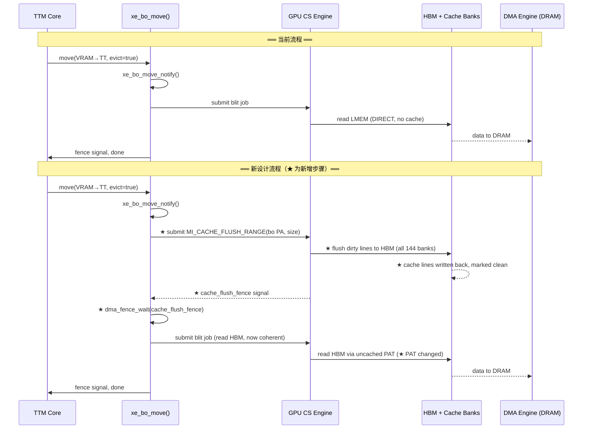
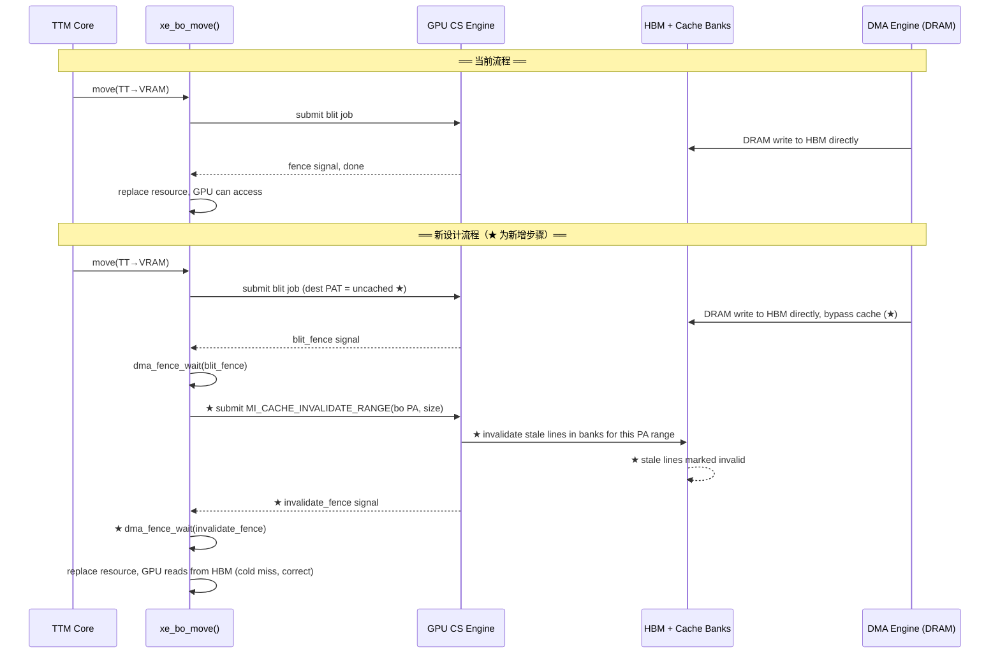
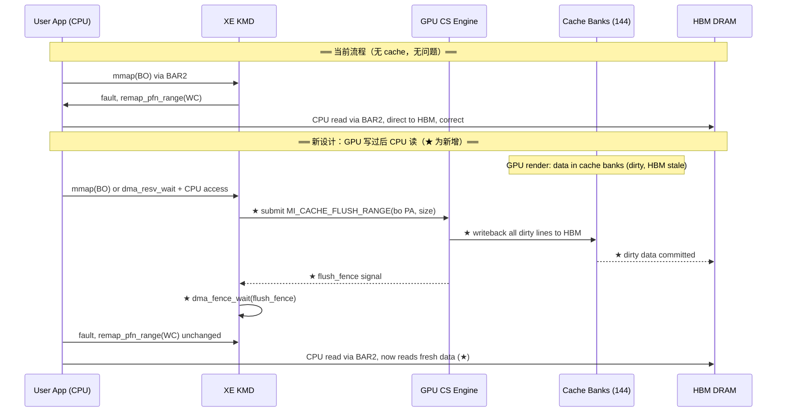
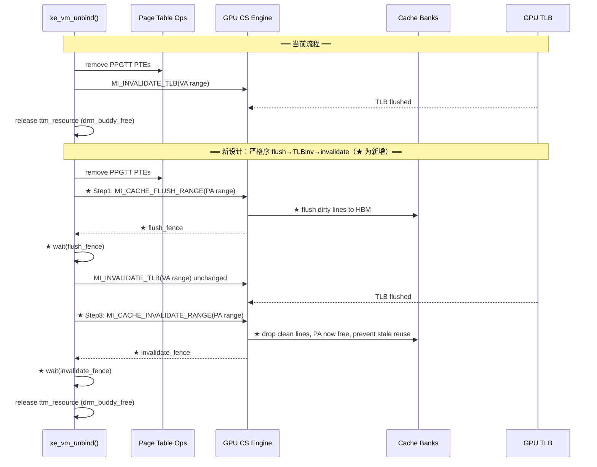
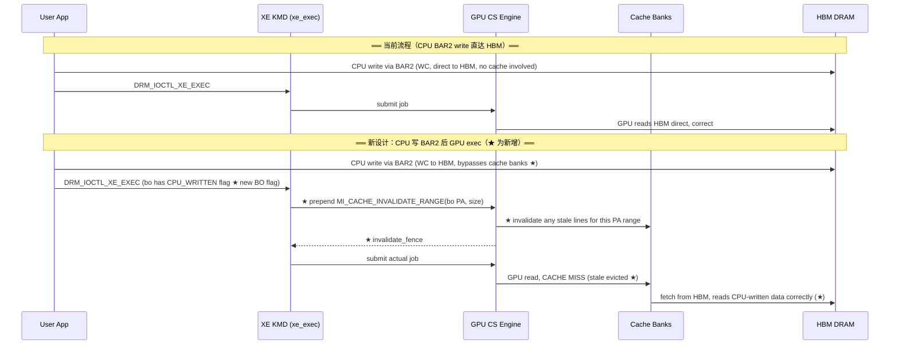

# Part 12: 新型 HBM Cache 架构下 XE KMD 的适配设计

---

## 12.1 新 GPU Cache 设计描述

假设一个新的 GPU HBM cache 架构，具有以下特性：

1. **HBM 分片**：HBM 按哈希分为 **144 个 bank**，每个 cache line 的数据通过哈希均匀分布到各 bank；每个 bank 有独立的 Memory Controller 和 Cache Bank。
2. **无 MESI 协议**：所有 cache bank 中同一 HBM 物理地址**只有一份副本**。请求方（任何 agent）对 HBM 物理地址的访问通过哈希路由到对应的专属 MC/Cache Bank。
3. **软件负责 cache maintenance**：flush（脏数据写回 HBM）和 invalidate（无效化 cache line）均为**软件职责**，硬件不提供自动一致性保证。
4. **每个 Cache Bank 的结构**：128 sets × 8 ways。

### Cache 规模估算

- 每个 bank：128 sets × 8 ways × 128B cache line = **128 KB/bank**
- 总容量：144 × 128 KB = **~18 MB** 等效 L2 cache
- 任意 PA 只映射到一个 bank 的一个 set（8-way associativity），无跨 bank 副本

**本质**：这是一个 **software-managed, physically-indexed, hash-distributed, write-back cache**，类似 Intel PVC 的 HBM L2 cache，但去掉了硬件一致性协议。

---

## 12.2 XE KMD 需要适配的核心问题

### 12.2.1 最大变化：软件 Cache Maintenance Primitives

**当前 XE** 对 VRAM 访问无缓存假设（GPU 直达 LMEM 控制器）。新设计在 HBM 前加了 cache，但没有 MESI，驱动必须显式管理：

| 操作 | 时机 | 影响路径 |
|------|------|---------|
| **Cache Flush（dirty → HBM）** | VRAM BO 被驱逐到 sysmem 之前 | `xe_bo_move()` eviction 路径 |
| **Cache Invalidate（stale → drop）** | BO 迁入 VRAM 后 GPU 首次访问前 | `xe_bo_move()` migration 路径 |
| **Flush + Invalidate** | CPU 需通过 BAR2 读 GPU 写过的 VRAM | `xe_ttm_bo_swap_notify`、CPU readback 路径 |
| **Invalidate on VM unmap** | `xe_vm_unbind()` 解绑 VRAM range 时 | 防止 stale line 被后续 BO 误读 |

驱动需要新的 **MI 命令或 MMIO 寄存器**实现 PA-range 级别的 flush/invalidate。对比当前 `MI_FLUSH_DW` 处理 TLB，新设计需要类似的 `MI_CACHE_FLUSH_RANGE` 命令，插入 CS ringbuffer。

### 12.2.2 `xe_bo_move()` 的前后 Hook 必须加

```
当前: VRAM → TT 驱逐路径
  [xe_bo_move_notify] → GPU blit: LMEM → DRAM → [resource 替换]

新设计必须:
  [xe_bo_move_notify]
    → 提交 MI_CACHE_FLUSH_RANGE(bo PA range)   ← 新增！确保脏 line 写回 HBM
    → dma_fence_wait(flush_fence)               ← 等 flush 完成才能 DMA
    → GPU blit / CPU DMA: HBM → DRAM
    → [resource 替换]

  TT → VRAM 迁入路径:
    → DMA: DRAM → HBM
    → 提交 MI_CACHE_INVALIDATE_RANGE(bo PA range)  ← 新增！清除可能的 stale line
    → dma_fence_wait(invalidate_fence)
    → [resource 替换，GPU 首次读到 HBM 新数据]
```

### 12.2.3 CPU BAR2 读 VRAM 数据的一致性问题

这是最棘手的场景：

```
GPU 写 VRAM → 数据在 cache bank（dirty，HBM 是旧数据）
CPU 通过 BAR2 读同一地址 → BAR2 绕过 GPU cache → 读到 HBM 旧数据 ✗
```

**根本原因**：CPU BAR2 访问直达 HBM，不经过 GPU cache bank。

**KMD 解法**：
- 在 `xe_ttm_io_mem_reserve()` 或 `dma_resv` wait 路径中，CPU map 前必须触发 GPU cache flush
- 类似 `xe_bo_wait_ctx()` 等 fence，但还需加一个 cache-flush fence
- **影响 uAPI**：`DRM_IOCTL_XE_GEM_MMAP_OFFSET` 之后的首次 fault，或 `DRM_IOCTL_SYNC_FENCE` 需要隐式包含 cache flush

### 12.2.4 PAT / coh_mode 修改

现有 `coh_mode` 在新架构下需新增语义：

```c
// 当前 xe_pat.c 的 coh_mode 假设 GPU 直访 LMEM（无 cache）
// 新设计 VRAM PAT 需区分:

coh_mode = 0  → GPU 访问 VRAM: cached，no CPU snoop（普通 GPU workload）
coh_mode = 1  → GPU 访问 VRAM: uncached，bypass cache（DMA 搬移目的端，避免污染）
// 系统内存 PAT 保持不变（PCIe snoop 机制不变）
```

`xe_migrate` 引擎执行 blit 时，**目标 VRAM 的 PTE 应使用 uncached 模式**（避免 blit 数据进 cache 后立刻被 invalidate 浪费带宽），source VRAM 在 flush 后再用 uncached 读。

### 12.2.5 `xe_vm` TLB Invalidation 与 Cache Invalidation 的顺序耦合

当前：
```
unmap VA → TLB invalidation → GPU 停止访问 → 释放 resource
```

新设计：
```
unmap VA → cache flush(PA range) → TLB invalidation → cache invalidate(PA range) → 释放 resource
```

- flush **必须在 TLB invalidation 之前**（否则 GPU 可能在 flush 期间继续写入 cache）
- invalidate **必须在 TLB invalidation 之后**（确保 GPU 已停止访问，不再产生新脏线）

### 12.2.6 `xe_exec` 提交边界的隐式 Cache 操作

对于普通 GPU workload（非迁移），**输入 BO 不需要 invalidate**（GPU 自己产生的缓存命中是正确的）。但以下情况需要：

- **CPU 写过的 VRAM BO**（通过 BAR2 写，数据在 HBM，cache 中无副本）→ 提交前需 invalidate 对应 VRAM range，强制 GPU 从 HBM 重读
- **Multi-engine 同一 BO**：compute engine 和 copy engine 并发访问同一 BO，hash routing 保证同一 PA 只在一个 bank，但需要 engine 间的 cache flush fence 协调

这意味着 `xe_exec` 的 `dma_resv` read/write fences 还不够，需要额外的 **cache coherency fence** 类型。

### 12.2.7 Memory Shrinker / Purgeable 路径

`xe_ttm_tt_unpopulate` 路径中，如果 VRAM BO 被 shrinker 标记为 purgeable（内容可丢弃），当前是直接 `drm_buddy_free_list`。新设计必须先做 cache invalidate：

```c
// 新增: 释放 purgeable VRAM BO 之前
if (xe_tt->purgeable) {
    xe_gpu_cache_invalidate_range(xe, vram_pa, size);  // 不需要 flush，内容丢弃
    dma_fence_wait(...);
}
drm_buddy_free_list(mm, &vres->blocks, 0);
```

否则被释放的 VRAM 地址重新被 buddy 分配后，新 BO 的 GPU 首次读可能命中旧 bank 中的 stale line。

### 12.2.8 KMD 改动优先级汇总

| 优先级 | 改动 | 影响范围 |
|--------|------|---------|
| P0 | PA-range flush/invalidate MI 命令封装 | 新增 `xe_cache_ops.c` |
| P0 | `xe_bo_move()` 前后插入 flush/invalidate fence | 驱逐、迁移正确性 |
| P0 | CPU BAR2 读前隐式 cache flush | mmap 路径、用户可见 bug |
| P1 | PAT coh_mode 新增 VRAM uncached 模式 | blit 性能 |
| P1 | `xe_vm` unmap 的 flush→TLBinv→invalidate 严格序 | VM 管理正确性 |
| P1 | CPU 写 VRAM 后 exec 前的 invalidate | CPU→GPU 数据传递 |
| P2 | purgeable BO 释放时 invalidate | 安全性（旧数据泄漏防护） |
| P2 | `ttm_lru_bulk_move` 级别的批量 cache 操作 | 驱逐性能优化 |

**核心设计原则**：把所有 cache 维护操作表达为 GPU CS 中的 fence-able 命令（`MI_CACHE_*`），而不是 MMIO polling，这样才能与现有的 `dma_resv` / `dma_fence` 流水线无缝集成，保持异步执行效率。

---

## 12.3 新增操作的流程图（对比当前与新设计）

> 红色/高亮框为新增步骤。

### 12.3.1 VRAM → TT 驱逐流程



### 12.3.2 TT → VRAM 迁入流程



### 12.3.3 CPU BAR2 读 GPU 写过的 VRAM



### 12.3.4 VM Unmap（PPGTT 解绑）流程



### 12.3.5 CPU 写 VRAM 后提交 GPU Exec



### 12.3.6 新增 Cache 操作在 `dma_fence` 链中的位置

```mermaid
flowchart TD
    subgraph EVICT["VRAM→TT 驱逐"]
        E1["xe_bo_move_notify()"] --> E2
        E2["★ cache_flush_fence\nMI_CACHE_FLUSH_RANGE"]:::newop --> E3
        E3["blit_fence\nDMA: HBM→DRAM"] --> E4
        E4["release vram resource"]
    end

    subgraph MIGR["TT→VRAM 迁入"]
        M1["blit_fence\nDMA: DRAM→HBM\n★ uncached PAT"]:::changed --> M2
        M2["★ cache_invalidate_fence\nMI_CACHE_INVALIDATE_RANGE"]:::newop --> M3
        M3["replace resource\nGPU 可访问"]
    end

    subgraph UNMAP["VM Unmap"]
        U1["remove PTEs"] --> U2
        U2["★ flush_fence\nMI_CACHE_FLUSH_RANGE"]:::newop --> U3
        U3["TLB invalidate fence\nunchanged"] --> U4
        U4["★ invalidate_fence\nMI_CACHE_INVALIDATE_RANGE"]:::newop --> U5
        U5["drm_buddy_free"]
    end

    subgraph CPUREAD["CPU BAR2 Read"]
        C1["dma_resv_wait\nGPU render done"] --> C2
        C2["★ flush_fence\nhidden in mmap fault path"]:::newop --> C3
        C3["remap_pfn_range WC\nunchanged"]
    end

    subgraph EXEC["CPU→GPU Exec"]
        X1["CPU write via BAR2\nto HBM directly"] --> X2
        X2["★ invalidate_fence\nprepended in xe_exec"]:::newop --> X3
        X3["submit actual GPU job"]
    end

    classDef newop fill:#ffcccc,stroke:#cc0000,color:#000
    classDef changed fill:#fff0cc,stroke:#cc8800,color:#000
```



---

## 12.4 各场景 Cache 操作快速参考

| 场景 | GPU 写前 | GPU 首次读前 | CPU BAR2 读前 |
|------|---------|-------------|--------------|
| VRAM → TT 驱逐 | ★ **FLUSH** | — | — |
| TT → VRAM 迁入 | — | ★ **INVALIDATE** | — |
| CPU BAR2 读（GPU 写后） | ★ **FLUSH** | — | — |
| CPU 写 BAR2 后 GPU exec | — | ★ **INVALIDATE** | — |
| VM unmap (PPGTT 解绑) | ★ **FLUSH** → TLBinv → ★ **INVALIDATE** | — | — |
| Purgeable BO 释放 | — （丢弃，无需 flush） | ★ **INVALIDATE** | — |
| Multi-engine 同 BO 切换 | ★ **FLUSH** | ★ **INVALIDATE** | — |

> **所有 ★ 操作必须以 fence-able GPU CS 命令实现**，不能使用同步 MMIO polling，以保持与现有 `dma_resv`/`dma_fence` 异步 pipeline 的兼容。
