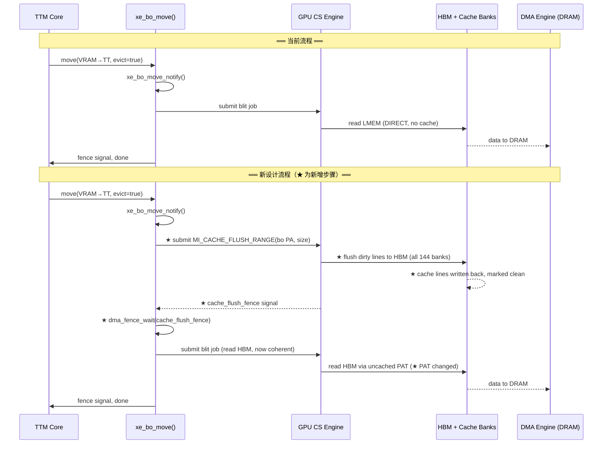
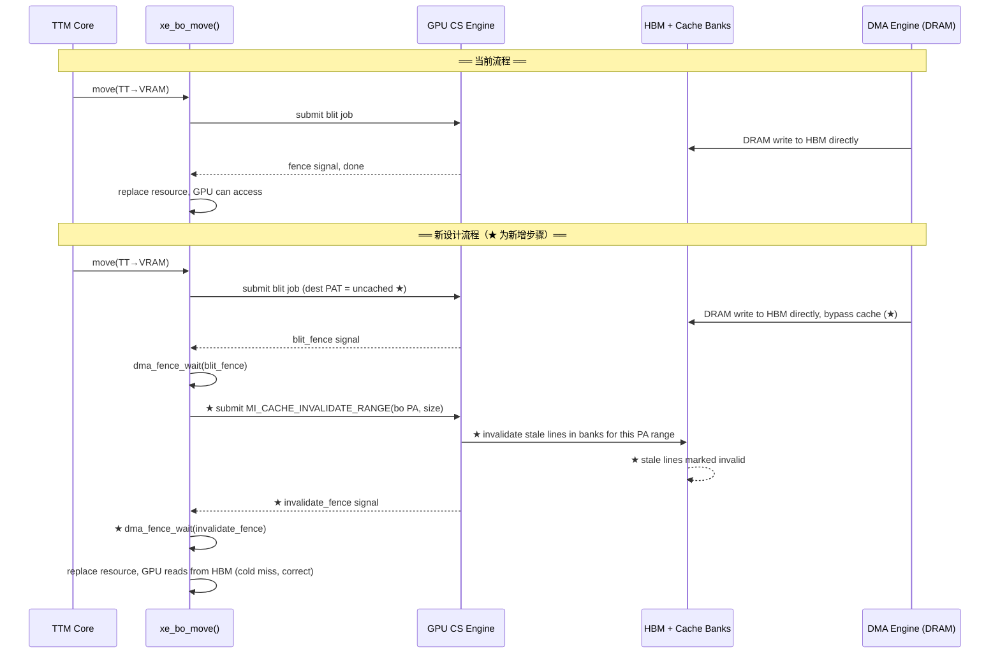
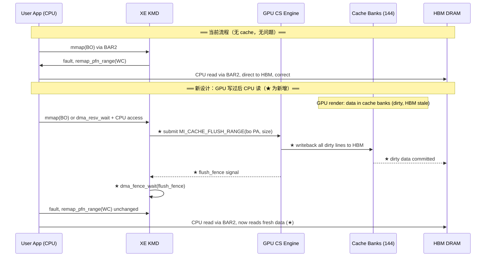
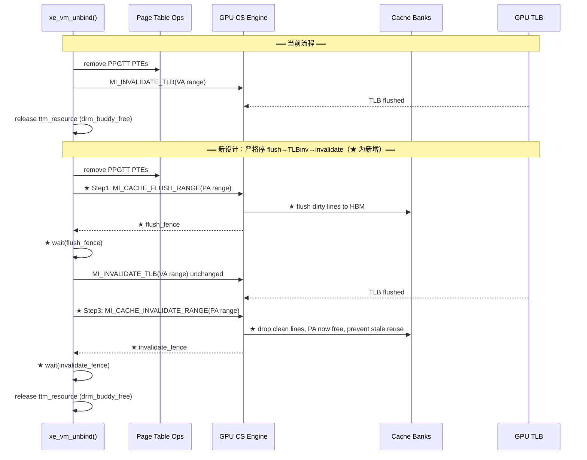
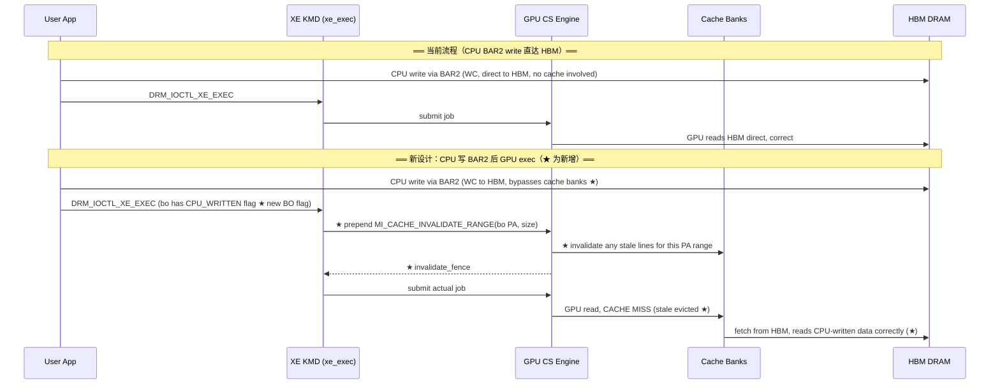
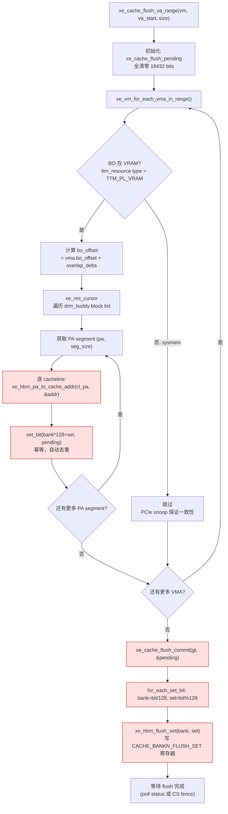
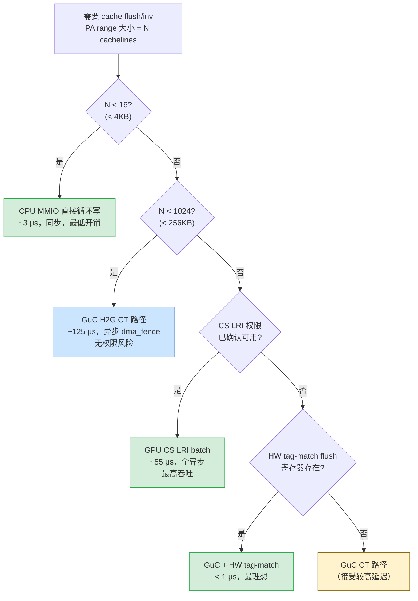
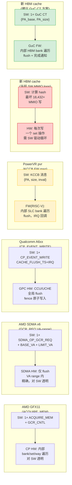

# Part 12: 新型 HBM Cache 架构下 XE KMD 的适配设计

---

## 12.1 新 GPU Cache 设计描述

假设一个新的 GPU HBM cache 架构，具有以下特性：

1. **HBM 分片**：HBM 按哈希分为 **144 个 bank**，每个 cache line 的数据通过哈希均匀分布到各 bank；每个 bank 有独立的 Memory Controller 和 Cache Bank。
2. **无 MESI 协议**：所有 cache bank 中同一 HBM 物理地址**只有一份副本**。请求方（任何 agent）对 HBM 物理地址的访问通过哈希路由到对应的专属 MC/Cache Bank。
3. **软件负责 cache maintenance**：flush（脏数据写回 HBM）和 invalidate（无效化 cache line）均为**软件职责**，硬件不提供自动一致性保证。
4. **每个 Cache Bank 的结构**：128 sets × 8 ways。

### Cache 规模估算

- 每个 bank：128 sets × 8 ways × 128B cache line = **128 KB/bank**
- 总容量：144 × 128 KB = **~18 MB** 等效 L2 cache
- 任意 PA 只映射到一个 bank 的一个 set（8-way associativity），无跨 bank 副本

**本质**：这是一个 **software-managed, physically-indexed, hash-distributed, write-back cache**，类似 Intel PVC 的 HBM L2 cache，但去掉了硬件一致性协议。

---

## 12.2 XE KMD 需要适配的核心问题

### 12.2.1 最大变化：软件 Cache Maintenance Primitives

**当前 XE** 对 VRAM 访问无缓存假设（GPU 直达 LMEM 控制器）。新设计在 HBM 前加了 cache，但没有 MESI，驱动必须显式管理：

| 操作 | 时机 | 影响路径 |
|------|------|---------|
| **Cache Flush（dirty → HBM）** | VRAM BO 被驱逐到 sysmem 之前 | `xe_bo_move()` eviction 路径 |
| **Cache Invalidate（stale → drop）** | BO 迁入 VRAM 后 GPU 首次访问前 | `xe_bo_move()` migration 路径 |
| **Flush + Invalidate** | CPU 需通过 BAR2 读 GPU 写过的 VRAM | `xe_ttm_bo_swap_notify`、CPU readback 路径 |
| **Invalidate on VM unmap** | `xe_vm_unbind()` 解绑 VRAM range 时 | 防止 stale line 被后续 BO 误读 |

驱动需要新的 **MI 命令或 MMIO 寄存器**实现 PA-range 级别的 flush/invalidate。对比当前 `MI_FLUSH_DW` 处理 TLB，新设计需要类似的 `MI_CACHE_FLUSH_RANGE` 命令，插入 CS ringbuffer。

### 12.2.2 `xe_bo_move()` 的前后 Hook 必须加

```
当前: VRAM → TT 驱逐路径
  [xe_bo_move_notify] → GPU blit: LMEM → DRAM → [resource 替换]

新设计必须:
  [xe_bo_move_notify]
    → 提交 MI_CACHE_FLUSH_RANGE(bo PA range)   ← 新增！确保脏 line 写回 HBM
    → dma_fence_wait(flush_fence)               ← 等 flush 完成才能 DMA
    → GPU blit / CPU DMA: HBM → DRAM
    → [resource 替换]

  TT → VRAM 迁入路径:
    → DMA: DRAM → HBM
    → 提交 MI_CACHE_INVALIDATE_RANGE(bo PA range)  ← 新增！清除可能的 stale line
    → dma_fence_wait(invalidate_fence)
    → [resource 替换，GPU 首次读到 HBM 新数据]
```

### 12.2.3 CPU BAR2 读 VRAM 数据的一致性问题

这是最棘手的场景：

```
GPU 写 VRAM → 数据在 cache bank（dirty，HBM 是旧数据）
CPU 通过 BAR2 读同一地址 → BAR2 绕过 GPU cache → 读到 HBM 旧数据 ✗
```

**根本原因**：CPU BAR2 访问直达 HBM，不经过 GPU cache bank。

**KMD 解法**：
- 在 `xe_ttm_io_mem_reserve()` 或 `dma_resv` wait 路径中，CPU map 前必须触发 GPU cache flush
- 类似 `xe_bo_wait_ctx()` 等 fence，但还需加一个 cache-flush fence
- **影响 uAPI**：`DRM_IOCTL_XE_GEM_MMAP_OFFSET` 之后的首次 fault，或 `DRM_IOCTL_SYNC_FENCE` 需要隐式包含 cache flush

### 12.2.4 PAT / coh_mode 修改

现有 `coh_mode` 在新架构下需新增语义：

```c
// 当前 xe_pat.c 的 coh_mode 假设 GPU 直访 LMEM（无 cache）
// 新设计 VRAM PAT 需区分:

coh_mode = 0  → GPU 访问 VRAM: cached，no CPU snoop（普通 GPU workload）
coh_mode = 1  → GPU 访问 VRAM: uncached，bypass cache（DMA 搬移目的端，避免污染）
// 系统内存 PAT 保持不变（PCIe snoop 机制不变）
```

`xe_migrate` 引擎执行 blit 时，**目标 VRAM 的 PTE 应使用 uncached 模式**（避免 blit 数据进 cache 后立刻被 invalidate 浪费带宽），source VRAM 在 flush 后再用 uncached 读。

### 12.2.5 `xe_vm` TLB Invalidation 与 Cache Invalidation 的顺序耦合

当前：
```
unmap VA → TLB invalidation → GPU 停止访问 → 释放 resource
```

新设计：
```
unmap VA → cache flush(PA range) → TLB invalidation → cache invalidate(PA range) → 释放 resource
```

- flush **必须在 TLB invalidation 之前**（否则 GPU 可能在 flush 期间继续写入 cache）
- invalidate **必须在 TLB invalidation 之后**（确保 GPU 已停止访问，不再产生新脏线）

### 12.2.6 `xe_exec` 提交边界的隐式 Cache 操作

对于普通 GPU workload（非迁移），**输入 BO 不需要 invalidate**（GPU 自己产生的缓存命中是正确的）。但以下情况需要：

- **CPU 写过的 VRAM BO**（通过 BAR2 写，数据在 HBM，cache 中无副本）→ 提交前需 invalidate 对应 VRAM range，强制 GPU 从 HBM 重读
- **Multi-engine 同一 BO**：compute engine 和 copy engine 并发访问同一 BO，hash routing 保证同一 PA 只在一个 bank，但需要 engine 间的 cache flush fence 协调

这意味着 `xe_exec` 的 `dma_resv` read/write fences 还不够，需要额外的 **cache coherency fence** 类型。

### 12.2.7 Memory Shrinker / Purgeable 路径

`xe_ttm_tt_unpopulate` 路径中，如果 VRAM BO 被 shrinker 标记为 purgeable（内容可丢弃），当前是直接 `drm_buddy_free_list`。新设计必须先做 cache invalidate：

```c
// 新增: 释放 purgeable VRAM BO 之前
if (xe_tt->purgeable) {
    xe_gpu_cache_invalidate_range(xe, vram_pa, size);  // 不需要 flush，内容丢弃
    dma_fence_wait(...);
}
drm_buddy_free_list(mm, &vres->blocks, 0);
```

否则被释放的 VRAM 地址重新被 buddy 分配后，新 BO 的 GPU 首次读可能命中旧 bank 中的 stale line。

### 12.2.8 KMD 改动优先级汇总

| 优先级 | 改动 | 影响范围 |
|--------|------|---------|
| P0 | PA-range flush/invalidate MI 命令封装 | 新增 `xe_cache_ops.c` |
| P0 | `xe_bo_move()` 前后插入 flush/invalidate fence | 驱逐、迁移正确性 |
| P0 | CPU BAR2 读前隐式 cache flush | mmap 路径、用户可见 bug |
| P1 | PAT coh_mode 新增 VRAM uncached 模式 | blit 性能 |
| P1 | `xe_vm` unmap 的 flush→TLBinv→invalidate 严格序 | VM 管理正确性 |
| P1 | CPU 写 VRAM 后 exec 前的 invalidate | CPU→GPU 数据传递 |
| P2 | purgeable BO 释放时 invalidate | 安全性（旧数据泄漏防护） |
| P2 | `ttm_lru_bulk_move` 级别的批量 cache 操作 | 驱逐性能优化 |

**核心设计原则**：把所有 cache 维护操作表达为 GPU CS 中的 fence-able 命令（`MI_CACHE_*`），而不是 MMIO polling，这样才能与现有的 `dma_resv` / `dma_fence` 流水线无缝集成，保持异步执行效率。

---

## 12.3 新增操作的流程图（对比当前与新设计）

> 红色/高亮框为新增步骤。

### 12.3.1 VRAM → TT 驱逐流程



### 12.3.2 TT → VRAM 迁入流程



### 12.3.3 CPU BAR2 读 GPU 写过的 VRAM



### 12.3.4 VM Unmap（PPGTT 解绑）流程



### 12.3.5 CPU 写 VRAM 后提交 GPU Exec



### 12.3.6 新增 Cache 操作在 `dma_fence` 链中的位置


---

## 12.4 各场景 Cache 操作快速参考

| 场景 | GPU 写前 | GPU 首次读前 | CPU BAR2 读前 |
|------|---------|-------------|--------------|
| VRAM → TT 驱逐 | ★ **FLUSH** | — | — |
| TT → VRAM 迁入 | — | ★ **INVALIDATE** | — |
| CPU BAR2 读（GPU 写后） | ★ **FLUSH** | — | — |
| CPU 写 BAR2 后 GPU exec | — | ★ **INVALIDATE** | — |
| VM unmap (PPGTT 解绑) | ★ **FLUSH** → TLBinv → ★ **INVALIDATE** | — | — |
| Purgeable BO 释放 | — （丢弃，无需 flush） | ★ **INVALIDATE** | — |
| Multi-engine 同 BO 切换 | ★ **FLUSH** | ★ **INVALIDATE** | — |

> **所有 ★ 操作必须以 fence-able GPU CS 命令实现**，不能使用同步 MMIO polling，以保持与现有 `dma_resv`/`dma_fence` 异步 pipeline 的兼容。

---

## 12.5 Q&A：Cacheline 级 Bank 寻址与精确 Flush 实现

### Q: Cache 按 cacheline 粒度 hash 分 bank，一个 4KB page 会涉及多少个 bank？

**A：恰好 16 个 bank（每条 cacheline 对应一个不同的 bank）。**

```
4KB page，cacheline size = 256B:
  4096 / 256 = 16 cachelines

  Cacheline 0:  PA = page_base + 0x000  → hash(PA) → bank_id_0
  Cacheline 1:  PA = page_base + 0x100  → hash(PA) → bank_id_1
  ...
  Cacheline 15: PA = page_base + 0xF00  → hash(PA) → bank_id_15
```

如果 hash 函数使用了 `PA[11:8]`（4 bits → 16 个取值），则一个 4KB page 内的 16 条 cacheline
**精确地分散到 16 个不同的 bank**。这是 hash 设计的刻意行为：最大化多 bank 并发带宽。

因此，对任意 VA range 的 flush，KMD **不能只操作一个 bank**，必须精确计算每条
cacheline 落在的 (bank, set)，逐一触发寄存器写。

---

### Q: PA → (Bank, Set) 的地址分解如何实现？144 不是 2 的幂次怎么处理？

**A：hash 函数必须由 BSpec 给出精确公式，KMD 硬编码实现——任何近似都会导致 flush 打错 bank，造成 silent data corruption。**

```
144 = 16 × 9 = 2^4 × 3^2
```

由于 144 不是 2 的幂次，bank 的 hash 函数**不能是简单的 bit-select/mask**，可能方案：

| 方案 | 公式 | 说明 |
|------|------|------|
| **XOR fold** | `bank = XOR_fold(PA[47:CL_SHIFT]) % 144` | 最常见，需 BSpec 确认折叠宽度 |
| **两级分解** | `bank = (PA_high % 9) * 16 + PA[CL_SHIFT+3:CL_SHIFT]` | 利用 144=9×16 的可分解性 |
| **多项式 hash** | `bank = poly_hash(PA_bits) % 144` | 最均匀，但 SW 计算开销最高 |

**Set index** 通常来自 cacheline index 的低位：

```
cl_idx = PA >> CL_SHIFT              // 去掉 cacheline 内 offset bits (256B → shift 8)
set    = cl_idx & (SETS_PER_BANK-1)  // 取低 7 bits：128 sets → bits[6:0]
```

若 set 也经过了 hash（fully-associative-style routing），则 SW 无法预计算 set，需要
HW 提供 tag-match flush 接口（见下文"关键未解问题"）。

```c
struct xe_cache_addr {
    u32 bank;   /* 0 – 143 */
    u32 set;    /* 0 – 127 */
};

/*
 * xe_hbm_pa_to_cache_addr - 将 VRAM PA 转换为 (bank, set) 坐标
 *
 * !! 此函数的 hash 公式必须与 BSpec 中 cache bank routing 章节完全一致 !!
 * !! 任何偏差会导致 flush 打到错误 bank，造成 silent data corruption     !!
 *
 * @pa:  VRAM DPA（device physical address），cacheline 对齐
 * @out: 输出 (bank, set) 对
 */
static void xe_hbm_pa_to_cache_addr(u64 pa, struct xe_cache_addr *out)
{
    u32 cl_idx = pa >> XE_HBM_CACHELINE_SHIFT;

    /*
     * TODO: 替换为 BSpec 给出的精确公式，以下为占位符示意：
     *   fold  = cl_idx[31:16] ^ cl_idx[15:0]    // 16-bit XOR fold
     *   bank  = xe_hbm_bank_hash(fold)           // % 144，BSpec-defined
     *   set   = cl_idx & (SETS_PER_BANK - 1)     // bits[6:0]
     */
    out->bank = xe_hbm_bank_hash(cl_idx);                      /* BSpec-defined */
    out->set  = cl_idx & (XE_HBM_CACHE_SETS_PER_BANK - 1);
}
```

---

### Q: HW 只提供 set/way 级别的 flush 寄存器，SW 如何知道该用哪个 way？

**A：SW 无法得知 way（tag 只有 HW 知道）。策略：flush 整个 set 的全部 8 ways，对 clean ways HW 自动跳过。**

HW 寄存器接口（per-bank）：

```
CACHE_BANKN_FLUSH_SET_WAY:
  [6:0]  = set_index      (0–127)
  [9:7]  = way_index      (0–7)
  [10]   = flush_all_ways (1 = 忽略 way 字段，flush 整个 set 的所有 ways)
  [31]   = trigger        (写 1 触发，HW auto-clear)
```

**SW 策略：始终置 `flush_all_ways = 1`**：
- 对 **clean ways**：HW 内部 tag 扫描后跳过（no writeback，no penalty）
- 对 **dirty ways**：HW 执行 writeback 到 HBM
- **正确且安全**，最多多扫描 7 个 clean ways，HW 内部开销极小

```c
static void xe_hbm_flush_set(struct xe_gt *gt, u32 bank, u32 set)
{
    u32 val = FIELD_PREP(CACHE_SET_INDEX, set) |
              CACHE_FLUSH_ALL_WAYS |
              CACHE_FLUSH_TRIGGER;
    xe_mmio_write32(gt, CACHE_BANKN_FLUSH_SET(bank), val);
    /* 若需 CPU 同步等待完成：poll CACHE_BANKN_STATUS(bank) until FLUSH_DONE bit set */
}
```

---

### Q: SW 需要什么数据结构来高效管理待 flush 的 (bank, set) 集合并避免重复操作？

**A：使用扁平 bitmap 对 (bank, set) 对进行去重，每对最多触发一次 MMIO 写。**

```
144 banks × 128 sets = 18,432 bits = 2,304 bytes ≈ 2.25 KB（栈分配可接受）
```

```c
/*
 * 每次 VA-range flush 的 pending (bank,set) 集合
 * bit[bank * XE_HBM_SETS_PER_BANK + set] = 1 表示该对需要 flush
 */
struct xe_cache_flush_pending {
    DECLARE_BITMAP(pending,
                   XE_HBM_CACHE_BANKS * XE_HBM_CACHE_SETS_PER_BANK); /* 18432 bits */
};

/* 将 PA range 内的所有 cacheline 对应的 (bank,set) 标入 bitmap */
static void xe_cache_flush_mark_pa_range(struct xe_cache_flush_pending *p,
                                          u64 pa, u64 size)
{
    u64 cl_pa;
    for (cl_pa = ALIGN_DOWN(pa, XE_HBM_CACHELINE_SIZE);
         cl_pa < pa + size;
         cl_pa += XE_HBM_CACHELINE_SIZE) {
        struct xe_cache_addr addr;
        xe_hbm_pa_to_cache_addr(cl_pa, &addr);
        /* set_bit 是幂等的：同一 (bank,set) 被多个 PA aliases 标记，只写一次 MMIO */
        set_bit((u32)addr.bank * XE_HBM_CACHE_SETS_PER_BANK + addr.set,
                p->pending);
    }
}

/* 遍历 bitmap，对每个置位的 (bank,set) 发射一次 MMIO flush */
static void xe_cache_flush_commit(struct xe_gt *gt,
                                   struct xe_cache_flush_pending *p)
{
    unsigned long bit;
    for_each_set_bit(bit, p->pending,
                     XE_HBM_CACHE_BANKS * XE_HBM_CACHE_SETS_PER_BANK) {
        u32 bank = bit / XE_HBM_CACHE_SETS_PER_BANK;
        u32 set  = bit % XE_HBM_CACHE_SETS_PER_BANK;
        xe_hbm_flush_set(gt, bank, set);
    }
}
```

**去重效益**：同一 BO 被多个 VA 映射（DMA-buf 共享，PA aliasing）时，相同 PA 的
cacheline 在 bitmap 中只置位一次，**保证每个 (bank, set) 最多触发一次 MMIO 写**。

---

### Q: 从 VA range 到实际 MMIO flush 的完整流程是什么？

**A：三层转换——VA→VMA→PA segments→(bank,set) bitmap→MMIO。**

```
Layer 1: VA range → xe_vma 列表
  xe_vm_for_each_vma_in_range(vm, va_start, va_end, vma)
  ├─ 跳过非 VRAM BO（sysmem 走 PCIe snoop，无需 SW flush）
  └─ bo_offset = xe_vma_bo_offset(vma) + (overlap_start - xe_vma_start(vma))

Layer 2: (bo, bo_offset, flush_len) → PA segment 列表
  xe_res_first(bo->ttm.resource, bo_offset, flush_len, &cursor)
  while (xe_res_cursor_remaining(&cursor)):
      pa   = cursor.start
      size = min(cursor.size, remaining)
      xe_cache_flush_mark_pa_range(&pending, pa, size)
      xe_res_cursor_advance(&cursor)

Layer 3: bitmap → MMIO
  xe_cache_flush_commit(gt, &pending)
```



---

### Q: 最坏情况需要多少次 MMIO 写？是否对 CPU 可接受？

**A：最坏情况 18,432 次，耗时约 2–6ms（CPU 侧），超过阈值必须走 GPU CS 路径。**

| 场景 | Cachelines | 涉及 (bank,set) 对 | MMIO 次数 | CPU 耗时估算 |
|------|-----------|-------------------|----------|------------|
| 单个 4KB page | 16 | 最多 16 | 16 | ~1.6 μs |
| 256KB BO（典型纹理） | 1,024 | 最多 1,024 | ≤ 1,024 | ~100 μs |
| 1MB BO | 4,096 | 最多 4,096 | ≤ 4,096 | ~400 μs |
| 全量 VRAM flush | 巨大 | **18,432（满 bitmap）** | **18,432** | **~2–6 ms** |
| 局部性好（同 set 被多个 cacheline 复用） | N | << N | 远小于 N | 可忽略 |

- 每次 uncached MMIO write ≈ **100–300 ns**（PCIe MMIO latency）
- 18,432 次 × 200 ns ≈ **3.7 ms**：对于驱逐/迁移路径完全不可接受，**必须走 GPU CS 路径**

---

### Q: 应该用 CPU MMIO 还是 GPU CS 命令来发射 flush 寄存器写？

**A：生产路径优先 GPU CS（异步、快速、与 dma_fence 原生集成），CPU MMIO 仅用于小范围同步调试场景。**

| 维度 | CPU MMIO 路径 | GPU CS 路径（推荐） |
|------|-------------|-------------------|
| 实现复杂度 | 低（直接循环 `xe_mmio_write32`） | 高（构造 LRI batch buffer） |
| 速度（小 flush < 4KB） | 快（无提交调度开销） | 慢（submit latency） |
| 速度（大 flush > 256KB） | 慢（大量 PCIe uncached writes） | 快（GPU 内部总线并发写多 bank） |
| 异步性 | 阻塞 CPU | 完全异步，返回 `dma_fence` |
| 与 `dma_resv` 集成 | 不兼容（需手动 fence 封装） | 原生兼容 |
| 流水线并发 | 阻塞等待 | flush 与下一 job 可流水 |
| 适用场景 | 调试、< 4KB 的同步 flush | 生产路径、大 BO、eviction |

**GPU CS 方案**（构造 `MI_LOAD_REGISTER_IMM` 序列的 batch buffer）：

```c
/*
 * 构造 CS flush batch：为 pending bitmap 中每个 (bank,set) 发一条 LRI
 * 最坏情况 batch size: 18432 × 3 DWORDs = ~221 KB
 *
 * 前提：CACHE_BANKN_FLUSH_SET 寄存器必须位于 GT MMIO 地址空间
 *       且 CS ring 的特权级允许 LRI 写该地址范围（需 BSpec 确认）
 */
static int xe_cache_flush_build_cs_batch(struct xe_cache_flush_pending *p,
                                          struct xe_bb *bb)
{
    unsigned long bit;
    for_each_set_bit(bit, p->pending,
                     XE_HBM_CACHE_BANKS * XE_HBM_CACHE_SETS_PER_BANK) {
        u32 bank = bit / XE_HBM_CACHE_SETS_PER_BANK;
        u32 set  = bit % XE_HBM_CACHE_SETS_PER_BANK;
        u32 val  = FIELD_PREP(CACHE_SET_INDEX, set) |
                   CACHE_FLUSH_ALL_WAYS | CACHE_FLUSH_TRIGGER;
        bb_emit_lri(bb, CACHE_BANKN_FLUSH_SET(bank).addr, val);
    }
    return 0;
}
```

---

### 12.5 关键未解问题汇总

| # | 问题 | 影响范围 | 需要确认来源 |
|---|------|---------|------------|
| 1 | **Bank hash 函数的精确公式**（`xe_hbm_bank_hash` 实现） | 错误 hash → silent data corruption | BSpec cache routing 章节 |
| 2 | **Set index 来自 PA 哪些 bits**（直接 bit-select 还是也经过 hash） | 决定 `xe_hbm_pa_to_cache_addr` 能否纯 SW 预计算 set | BSpec |
| 3 | **是否支持 tag-match flush（by PA，HW 内部做 CAM 查找 set/way）** | 若支持，SW 无需预计算 (bank,set)，大幅简化实现 | BSpec / HW team |
| 4 | **Flush 完成的同步机制**（poll status bit 还是 CS completion signal） | 影响 CPU MMIO 路径的轮询方式与 CS 路径的 fence 插入点 | BSpec |
| 5 | **CS LRI 能否写 HBM bank flush 寄存器**（CS 特权级 vs HBM controller 地址范围） | 决定是否能走 GPU CS 异步路径；若不能，生产路径只能 CPU MMIO | BSpec + CS privilege model |
| 6 | **Cacheline size 是 128B 还是 256B** | 直接影响 4KB page 涉及 bank 数量（32 vs 16），以及 bitmap 大小计算 | BSpec |

---

## 12.6 Q&A：由 GuC FW 执行 Cache Flush/Inv 的性能可行性分析

### Q: 如果把 cache flush/invalidate 交给 GuC FW 执行，性能是否可以接受？

**A：GuC FW 方案比 CPU MMIO 快约 8×，整体可接受，但有 CT 往返开销和单线程串行的局限。**

### 核心优势：绕开 PCIe，换成 on-die GT 内部 fabric

GuC 是 GT 片上的微控制器（~400 MHz），它写 MMIO 寄存器走的是 **GT 内部总线**，
而不是 CPU 侧的 PCIe MMIO 路径：

```
CPU MMIO write:   CPU → PCIe Root Complex → PCIe link → GT MMIO
                  latency ≈ 100–300 ns per write

GuC MMIO write:   GuC uC → GT internal fabric → cache bank register
                  latency ≈ 10–25 ns per write (on-die)
```

**全量 18,432 次写的耗时估算**：

| 执行者 | 单次 MMIO 延迟 | 18,432 次总耗时 | 可接受性 |
|--------|--------------|----------------|---------|
| CPU（PCIe MMIO） | ~200 ns | **~3.7 ms** | ✗ 不可接受 |
| **GuC uC（on-die）** | ~25 ns | **~460 μs** | △ 勉强可接受 |
| GPU CS LRI（~1 GHz ring） | ~3 ns | **~55 μs** | ✓ 最快（存在权限不确定性） |
| GuC + HW tag-match flush（若 BSpec 支持） | N/A | **< 1 μs** | ✓✓ 最理想 |

### GuC 方案的执行流程

```
KMD 侧:
  1. 将 xe_cache_flush_pending bitmap 放入 GGTT-mapped buffer（GuC 可访问）
  2. xe_guc_ct_send(H2G: XE_GUC_ACTION_CACHE_FLUSH,
                    bitmap_ggtt_addr, bitmap_size_bits)
  3. 挂起等待 G2H 回复（映射为 dma_fence）

GuC FW 侧:
  1. 收到 H2G，读取 bitmap buffer
  2. for_each_set_bit(bit, bitmap):
       bank = bit / SETS_PER_BANK
       set  = bit % SETS_PER_BANK
       MMIO_WRITE(CACHE_BANKN_FLUSH_SET(bank),
                  set | FLUSH_ALL_WAYS | TRIGGER)  ← on-die, ~25ns/write
  3. xe_guc_ct_send(G2H: XE_GUC_RESPONSE_CACHE_FLUSH_DONE, seqno)

KMD 侧:
  4. 收到 G2H → dma_fence_signal(flush_fence)
  5. 返回 fence 给调用者（完全异步）
```

与 CS LRI 方案不同，GuC 写 GT MMIO 不存在权限问题（GuC 本身就有完整的
GT MMIO 访问权，`xe_guc_mmio_write` 路径已有先例）。

### GuC 方案的主要局限

| 问题 | 影响 |
|------|------|
| **CT 往返开销约 50–200 μs** | 对小 flush（≤ 16 cachelines），CT 调度开销大于实际 MMIO 时间，不如 CPU 直接写 |
| **GuC 单线程串行** | GuC ~400 MHz 且串行写寄存器，无法并发利用 144 bank 的物理并行能力 |
| **GuC 与调度竞争** | GuC 同时负责 context scheduling、GuC-PC 功耗管理、reset handling；大量 flush 会增加调度 latency |
| **FW 复杂度增加** | GuC FW 中加入 bitmap 迭代逻辑，增加验证难度，影响 FW 发布节奏 |

### 最优分级策略

根据 flush 规模选择最合适的执行路径：

```
flush size < 4KB (≤ 16 cachelines):
    → CPU MMIO 直接写
      16 × ~200ns = ~3.2 μs，无 CT 往返开销
      适用：调试路径、同步 readback、小 BO

4KB ≤ flush size < 256KB (16 – 1024 cachelines):
    → GuC H2G CT 路径
      1024 × 25ns = ~25 μs（GuC 执行）+ CT ~100 μs = ~125 μs
      CT 开销可被摊薄，GuC 权限无风险

flush size ≥ 256KB 或 eviction/migration 主路径:
    → GPU CS LRI batch（若 BSpec 确认 CS 有 MMIO 写权限）
      18432 × 3ns = ~55 μs，全异步，原生 dma_fence
    → 或 GuC + HW tag-match flush（若 BSpec 提供 PA 级 flush 接口，最理想）
```



### 结论

**GuC FW 方案在性能上是可行的**（比 CPU MMIO 快 8×，且规避了 CS LRI 的权限不确定性），
适合作为中等规模 flush 的标准路径。其主要制约是 CT 往返开销（对小 flush 不划算）和 GuC
单线程串行的固有上限。

**最理想组合**：GuC FW 执行 + HW 提供 **PA 级 tag-match flush 接口**（HW 内部自动
做 set/way CAM 查找）→ GuC 只需写一个 PA range 命令，HW 完成 ~μs 级精确 flush，同时
彻底解决 SW 无法预知 way 的问题。这也是 §12.5 关键未解问题 #3 的最优解。
---

## 12.7 Q&A：SW 无法知道 Way——`flush_all_ways` 的设计意义

### Q: Bank 和 Set 可以从 PA 推导，但 Way 无法推导。SW 如何知道一个 PA 是否被缓存？如果被缓存，在哪个 Way？

**A：SW 永远无法知道 Way，也无法知道 PA 是否被缓存。这两个问题都由 `flush_all_ways=1`
寄存器位在 HW 内部解决——SW 无需知道。**

### 三个地址分量的可知性分析

```
PA → bank:  hash(PA)            ✓  SW 可计算（须与 BSpec hash 公式完全一致）
PA → set:   PA[set_high:set_low] ✓  SW 可计算（直接取 PA 的固定 bit 段）
PA → way:                       ✗  SW 永远不可知
PA → "是否被缓存":               ✗  SW 同样不可知
```

**Way 不可知的根本原因**：Way 是在 cacheline 被**加载进 cache 时**，由 HW 替换策略
（LRU / pseudo-LRU / random）在 8 个 way 中选择一个空闲或最老的 slot 填入的。这个决策
完全发生在 HW 内部，KMD 不参与，也没有任何接口事后查询。同理，"PA 是否被缓存"等价于
"某个 way 的 tag 是否等于该 PA 的 tag bits"——仍然只有 HW tag array 知道。

### `flush_all_ways=1` 的本质：set 级别的 HW tag-match 操作

SW 写寄存器时只提供 **(bank, set)**，剩下的 tag 比较和 way 选择完全由 HW 完成：

```
SW 提供: bank (from hash), set (from PA bits), flush_all_ways=1, trigger=1

HW 内部执行（并行扫描全部 8 ways）:
  for way in 0..7:
      tag_stored  = cache_bank[bank].set[set].way[way].tag_bits
      tag_from_pa = PA[63 : set_high+1]            ← PA 的高位 tag 段
      if tag_stored == tag_from_pa:                 ← CAM tag 比较
          if op == FLUSH and dirty_bit[way]:
              writeback cacheline to HBM            ← 脏数据写回
          if op == INVALIDATE:
              mark way[way] as INVALID              ← 清除有效位（不管 dirty）
          if op == FLUSH_AND_INVALIDATE:
              writeback if dirty, then mark INVALID
      else:
          no-op                                     ← tag 不匹配，跳过
```

**关键结论**：
1. **PA 没有被缓存**（8 个 way 全部 tag miss）→ 全部 no-op → **自动正确，零副作用**
2. **PA 被缓存在某个 way**（恰好一个 way tag match）→ 精确 flush/invalidate 该 way
3. **SW 完全不需要知道 way**，`flush_all_ways` 本质上是把"查 way"这一步下推到 HW

这正是 `flush_all_ways=1` 的设计意义：**在 set 粒度上做正确的 tag-match，代价仅是
HW 并行扫描 8 ways**（在 cache 硬件里是极低延迟的并行 CAM 操作，无额外性能开销）。

### 两种 flush 接口的对比

| 接口 | SW 提供 | HW 责任 | Way 可知性要求 |
|------|---------|---------|--------------|
| `flush_set_way(bank, set, way)` | (bank, set, **way**) | 直接操作指定 way | SW 必须知道 way ✗ |
| **`flush_all_ways(bank, set)`** | (bank, set) | **内部 tag-match，选正确 way** | SW 无需知道 way ✓ |
| `flush_by_pa(PA)` （理想接口） | **完整 PA** | 内部做 hash→bank，取 set bits，tag-match | SW 连 bank/set 都不需要计算 ✓✓ |

`flush_all_ways` 是现有寄存器接口下的最优方案。`flush_by_pa` 是 §12.5 未解问题 #3
（tag-match flush）的理想形态——如果 BSpec 提供此接口，SW 只需传 PA，HW 完全自主。

### 对正确性的影响：多余的 way 扫描是否有问题？

```
一个 set 有 8 ways，PA 只在其中一个 way（或根本不在）：
  - 匹配的 way（0或1个）: 执行 flush/invalidate → 正确
  - 不匹配的 7 ways: tag 比较失败 → no-op → 正确
  - 脏的不匹配 way: tag 不同 → 跳过 → 正确（属于其他 PA，不能动）
```

**`flush_all_ways` 是幂等且无副作用的**：它只操作 tag 精确匹配的 way，
其他 way 的数据完全不受影响。反复调用同一 (bank, set) 的结果与调用一次相同。

### 实现简化

这一分析的重要推论：§12.5 中的 `xe_hbm_flush_set()` 实现**不需要任何 way 参数**，
始终使用 `flush_all_ways=1`，这是正确且唯一可行的 SW 接口：

```c
/*
 * xe_hbm_flush_set - flush/invalidate a cache set across all ways
 *
 * SW cannot determine which way a PA occupies (way is assigned by HW
 * replacement policy at load time, not derivable from PA).
 * Setting CACHE_FLUSH_ALL_WAYS delegates tag comparison to HW:
 *   - HW scans all 8 ways in parallel
 *   - Only the way whose tag matches PA[tag_bits] is flushed/invalidated
 *   - Non-matching ways are silently skipped (no side effects)
 *   - If PA is not cached (all ways miss), the operation is a no-op
 *
 * This is correct, safe, and the only viable approach for SW-managed flush.
 *
 * @gt:   GT instance
 * @bank: cache bank index (0–143), derived from xe_hbm_bank_hash(PA)
 * @set:  set index (0–127), derived from PA[set_high:set_low]
 * @op:   XE_HBM_FLUSH, XE_HBM_INVALIDATE, or XE_HBM_FLUSH_AND_INVALIDATE
 */
static void xe_hbm_flush_set(struct xe_gt *gt, u32 bank, u32 set,
                              enum xe_hbm_cache_op op)
{
    u32 val = FIELD_PREP(CACHE_SET_INDEX, set) |
              CACHE_FLUSH_ALL_WAYS;   /* always: SW cannot know the way */

    if (op == XE_HBM_FLUSH || op == XE_HBM_FLUSH_AND_INVALIDATE)
        val |= CACHE_OP_FLUSH;
    if (op == XE_HBM_INVALIDATE || op == XE_HBM_FLUSH_AND_INVALIDATE)
        val |= CACHE_OP_INVALIDATE;

    val |= CACHE_FLUSH_TRIGGER;
    xe_mmio_write32(gt, CACHE_BANKN_FLUSH_SET(bank), val);
}

---

## 12.8 Q&A：其他 GPU 厂商如何处理类似的 Cache 维护问题？（详细版）

> 本节**完全基于 Linux 内核 `drivers/gpu/drm/` 下各厂商驱动源码的逐行分析**，
> 涵盖 AMD GFX9/GFX11、AMD SDMA v6、Qualcomm Adreno A6xx、NVIDIA Nouveau、
> ARM Mali (Panfrost)、Imagination PowerVR (pvr) 六家厂商。所有代码引用均标注
> 实际文件路径和行号，可在内核树中直接验证。

**核心结论（先读结论）**：
> 所有主流 GPU 厂商均通过**单条/少量 CS 数据包**发出全局或 PA-range cache 操作，
> **SW 从不直接感知 bank/set/way 结构**。唯一与新 HBM cache 设计在架构上最接近的
> 先例是 **Imagination PowerVR 的 `KCCB_CMD_SLCFLUSHINVAL` FW 接口**——它也通过
> FW（MIPS/RISC-V 微控制器）代理执行 SLC PA-range flush，KMD 只提供 `address +
> size`，FW 内部完成 bank/set 遍历，与本设计中 GuC 代理 HBM flush 的思路完全一致。

---

### 12.8.1 AMD GFX9（Vega/CDNA）——`ACQUIRE_MEM` + 旧式 `CP_COHER_CNTL`

**驱动来源**：`drivers/gpu/drm/amd/amdgpu/gfx_v9_0.c`，`gfx_v9_0_emit_mem_sync()`（第 7083 行）

```c
/* gfx_v9_0.c:7083 — GFX9/Vega 时代的全局 cache flush */
static void gfx_v9_0_emit_mem_sync(struct amdgpu_ring *ring)
{
    const unsigned int cp_coher_cntl =
        PACKET3_ACQUIRE_MEM_CP_COHER_CNTL_SH_ICACHE_ACTION_ENA(1) | /* 指令 cache  */
        PACKET3_ACQUIRE_MEM_CP_COHER_CNTL_SH_KCACHE_ACTION_ENA(1) | /* 标量 K$     */
        PACKET3_ACQUIRE_MEM_CP_COHER_CNTL_TC_ACTION_ENA(1)        | /* L2 (TC)     */
        PACKET3_ACQUIRE_MEM_CP_COHER_CNTL_TCL1_ACTION_ENA(1)      | /* per-CU L1   */
        PACKET3_ACQUIRE_MEM_CP_COHER_CNTL_TC_WB_ACTION_ENA(1);      /* L2 writeback*/

    amdgpu_ring_write(ring, PACKET3(PACKET3_ACQUIRE_MEM, 6));
    amdgpu_ring_write(ring, cp_coher_cntl); /* CP_COHER_CNTL */
    amdgpu_ring_write(ring, 0xffffffff);    /* CP_COHER_SIZE    ← 始终全局 */
    amdgpu_ring_write(ring, 0xffffff);      /* CP_COHER_SIZE_HI ← 始终全局 */
    amdgpu_ring_write(ring, 0);             /* CP_COHER_BASE    ← 始终 0   */
    amdgpu_ring_write(ring, 0);             /* CP_COHER_BASE_HI ← 始终 0   */
    amdgpu_ring_write(ring, 0x0000000A);    /* POLL_INTERVAL */
    amdgpu_ring_write(ring, 0);             /* GCR_CNTL (GFX9 不用此字段) */
}
```

**GFX9 接口分析**（与 GFX11 对比）：
- `CP_COHER_CNTL` 是**按功能位**选择 flush 目标（ICACHE / KCACHE / TC / TCL1）
- 硬件架构上 `CP_COHER_BASE + CP_COHER_SIZE` 支持 PA range flush——但**GFX6～GFX9 所有
  驱动实例均使用 `BASE=0, SIZE=0xffffffff`（全局广播）**，从不传入实际地址
- SW 完全无需参与 bank/set/way 计算

---

### 12.8.2 AMD RDNA3（GFX11）——`ACQUIRE_MEM` + 精细 `GCR_CNTL` + `RELEASE_MEM` 双路径

**驱动来源**：`drivers/gpu/drm/amd/amdgpu/gfx_v11_0.c`（第 6735 行 & 第 5935 行）

#### 路径 A：`ACQUIRE_MEM`（显式屏障，适用于 compute / graphics dispatch 之前）

```c
/* gfx_v11_0.c:6735 — RDNA3 GCR_CNTL 精细级别控制 */
static void gfx_v11_0_emit_mem_sync(struct amdgpu_ring *ring)
{
    const unsigned int gcr_cntl =
        PACKET3_ACQUIRE_MEM_GCR_CNTL_GL2_INV(1) |  /* Shader L2 (GL2) invalidate */
        PACKET3_ACQUIRE_MEM_GCR_CNTL_GL2_WB(1)  |  /* Shader L2 writeback        */
        PACKET3_ACQUIRE_MEM_GCR_CNTL_GLM_INV(1) |  /* metadata cache invalidate  */
        PACKET3_ACQUIRE_MEM_GCR_CNTL_GLM_WB(1)  |  /* metadata cache writeback   */
        PACKET3_ACQUIRE_MEM_GCR_CNTL_GL1_INV(1) |  /* per-shader-array L1 inv    */
        PACKET3_ACQUIRE_MEM_GCR_CNTL_GLV_INV(1) |  /* vertex data cache inv      */
        PACKET3_ACQUIRE_MEM_GCR_CNTL_GLK_INV(1) |  /* scalar data cache (K$) inv */
        PACKET3_ACQUIRE_MEM_GCR_CNTL_GLI_INV(1);   /* instruction cache inv      */

    amdgpu_ring_write(ring, PACKET3(PACKET3_ACQUIRE_MEM, 6));
    amdgpu_ring_write(ring, 0);           /* CP_COHER_CNTL (GFX11 已弃用旧 TC 位) */
    amdgpu_ring_write(ring, 0xffffffff);  /* CP_COHER_SIZE    ← 始终全局         */
    amdgpu_ring_write(ring, 0xffffff);    /* CP_COHER_SIZE_HI ← 始终全局         */
    amdgpu_ring_write(ring, 0);           /* CP_COHER_BASE    ← 始终 0           */
    amdgpu_ring_write(ring, 0);           /* CP_COHER_BASE_HI ← 始终 0           */
    amdgpu_ring_write(ring, 0x0000000A);  /* POLL_INTERVAL                       */
    amdgpu_ring_write(ring, gcr_cntl);    /* GCR_CNTL（RDNA3 新增字段）           */
}
```

**GFX9→GFX11 演进关键点**：

| 字段 | GFX9 | GFX11 |
|------|------|-------|
| 控制字段 | `CP_COHER_CNTL`（功能位） | `GCR_CNTL`（细粒度级别位） |
| L2 控制 | `TC_ACTION_ENA + TC_WB` | `GL2_INV + GL2_WB`（独立） |
| per-CU L1 | `TCL1_ACTION_ENA` | `GL1_INV`（独立） |
| 新增 | 不支持 | `GLM`（元数据）、`GLV`（顶点）、`GLI`（指令）独立位 |
| PA range | 架构支持，驱动不用 | 架构支持，驱动仍不用 |

#### 路径 B：`RELEASE_MEM`（fence 写入时隐式 cache flush）

```c
/* gfx_v11_0.c:5935 — RELEASE_MEM 同时完成 fence + cache flush */
/* 用于 job 结束时：cache dirty lines writeback + fence value 原子写入 */
amdgpu_ring_write(ring, PACKET3(PACKET3_RELEASE_MEM, 6));
amdgpu_ring_write(ring,
    PACKET3_RELEASE_MEM_EVENT_TYPE(CACHE_FLUSH_AND_INV_TS_EVENT) |
    PACKET3_RELEASE_MEM_EVENT_INDEX(EVENT_INDEX_CACHE_FLUSH)      |
    PACKET3_RELEASE_MEM_GCR_GLM_INV | /* metadata inv */
    PACKET3_RELEASE_MEM_GCR_GLM_WB  | /* metadata wb  */
    PACKET3_RELEASE_MEM_GCR_GL2_WB  | /* L2 writeback (no inv needed at end of job) */
    PACKET3_RELEASE_MEM_CACHE_POLICY(cache_policy));
/* ... 后续 dword：fence 地址 + value */
```

**关键设计**：`RELEASE_MEM` 将"cache flush"与"fence semaphore 写入"**合并为一个 CP 原语**，
消除了潜在的 TOCTOU race（flush 完成和 fence 写入之间状态不一致）。这是与新 HBM 设计
的重要对比：新设计如需同样语义，必须在 GuC 中实现等价的"flush + fence 原子操作"。

---

### 12.8.3 AMD SDMA v6——`SDMA_OP_GCR_REQ`：硬件已支持 VA-range 精确 flush，但驱动未使用

**驱动来源**：`drivers/gpu/drm/amd/amdgpu/sdma_v6_0.c`，第 299 行，
`sdma_v6_0_ring_emit_mem_sync()`

```c
/* sdma_v6_0.c:299 — SDMA_OP_GCR_REQ 数据包结构（含 VA range 字段） */
static void sdma_v6_0_ring_emit_mem_sync(struct amdgpu_ring *ring, uint32_t hdp_flags)
{
    uint32_t gcr_cntl =
        SDMA_GCR_GL2_INV | SDMA_GCR_GL2_WB |
        SDMA_GCR_GLM_INV | SDMA_GCR_GLM_WB |
        SDMA_GCR_GL1_INV | SDMA_GCR_GL1_WB;

    amdgpu_ring_write(ring,
        SDMA_PKT_COPY_LINEAR_HEADER_OP(SDMA_OP_GCR_REQ));

    /* ─── VA range 字段（硬件支持，驱动全填 0 = 全局 flush）─── */
    amdgpu_ring_write(ring,
        SDMA_PKT_GCR_REQ_PAYLOAD1_BASE_VA_31_7(0));         /* VA range start [31:7]  */

    amdgpu_ring_write(ring,
        SDMA_PKT_GCR_REQ_PAYLOAD2_GCR_CONTROL_15_0(gcr_cntl) |
        SDMA_PKT_GCR_REQ_PAYLOAD2_BASE_VA_47_32(0));        /* VA range start [47:32] */

    amdgpu_ring_write(ring,
        SDMA_PKT_GCR_REQ_PAYLOAD3_LIMIT_VA_31_7(0) |        /* VA range end [31:7]   */
        SDMA_PKT_GCR_REQ_PAYLOAD3_GCR_CONTROL_18_16(
            gcr_cntl >> 16));

    amdgpu_ring_write(ring,
        SDMA_PKT_GCR_REQ_PAYLOAD4_LIMIT_VA_47_32(0) |       /* VA range end [47:32]  */
        SDMA_PKT_GCR_REQ_PAYLOAD4_VMID(0));                 /* VMID                  */
}
```

**SDMA_OP_GCR_REQ 数据包字段解析**：

```
  DW0: SDMA_OP_GCR_REQ opcode
  DW1: [31:7]  BASE_VA_31_7   ← VA 范围起始地址 [31:7] (64B 对齐)
  DW2: [15:0]  GCR_CONTROL_15_0  ← cache level 控制位低 16 位
       [31:16] BASE_VA_47_32  ← VA 范围起始地址 [47:32]
  DW3: [31:7]  LIMIT_VA_31_7  ← VA 范围结束地址 [31:7]
       [2:0]   GCR_CONTROL_18_16 ← cache level 控制位高 3 位
  DW4: [15:0]  LIMIT_VA_47_32 ← VA 范围结束地址 [47:32]
       [19:16] VMID            ← 目标 VMID（支持多 VM 隔离）

  硬件能力：向 SDMA 提交 BASE_VA + LIMIT_VA → HW 仅 flush 该 VA range 内的 cache lines
  驱动实现：BASE_VA=0, LIMIT_VA=0 → 驱动触发全局 flush（HW 将 0/0 解释为"全部"）
```

**对新 HBM cache 设计的意义**：
- AMD SDMA v6 在**硬件层面已经实现了 VA-range 精确 cache flush**，只是 AMDGPU 驱动
  选择不使用（原因：GFX ring 与 SDMA 共享同一套 GL2 cache，VA-range 优化依赖
  VMID-to-PA TLB 映射一致性，实现较复杂）
- 如果新 HBM cache 的 CS packet 设计遵循类似 `(BASE_VA, LIMIT_VA, VMID)` 接口模型，
  则**驱动实现可直接映射到 GuC 侧的精确 flush**，无需 SW 暴露 bank/set/way

---

### 12.8.4 Qualcomm Adreno A6xx——`CP_EVENT_WRITE` + CCU/UCHE/LRZ 分层 flush

**驱动来源**：`drivers/gpu/drm/msm/adreno/a6xx_gpu.c`

Adreno A6xx 拥有三层需要显式 flush 的 cache 结构：

```
┌─────────────────────────────────────────────────────────────┐
│  Adreno A6xx Cache 层次                                     │
│                                                             │
│  ┌──────────────┐  ┌──────────────┐  ┌──────────────────┐  │
│  │  LRZ Cache   │  │  CCU (Color/ │  │  UCHE (Unified   │  │
│  │  (Lossless   │  │  Depth Cache │  │  Command/Cache   │  │
│  │   Raster Z)  │  │  Unit, L1 WB)│  │  ~512KB, L2)     │  │
│  └──────┬───────┘  └──────┬───────┘  └────────┬─────────┘  │
│         │                 │                    │            │
│         └─────────────────┴────────────────────┘            │
│                           │                                 │
│                      DRAM / SYSMEM                          │
└─────────────────────────────────────────────────────────────┘
```

```c
/* a6xx_gpu.c — job submit 前：CCU 分离 invalidate（depth / color 分开处理）*/
OUT_PKT7(ring, CP_EVENT_WRITE, 1);
OUT_RING(ring, CP_EVENT_WRITE_0_EVENT(PC_CCU_INVALIDATE_DEPTH)); /* depth CCU inv  */

OUT_PKT7(ring, CP_EVENT_WRITE, 1);
OUT_RING(ring, CP_EVENT_WRITE_0_EVENT(PC_CCU_INVALIDATE_COLOR)); /* color CCU inv  */

/* context switch 路径：全 cache invalidate */
OUT_PKT7(ring, CP_EVENT_WRITE, 1);
OUT_RING(ring, CP_EVENT_WRITE_0_EVENT(CACHE_INVALIDATE));        /* UCHE 全 inv   */

OUT_PKT7(ring, CP_EVENT_WRITE, 1);
OUT_RING(ring, CP_EVENT_WRITE_0_EVENT(LRZ_FLUSH_INVALIDATE));   /* LRZ flush+inv  */

/* job 完成后：CACHE_FLUSH_TS 原子写入 fence + 触发 IRQ */
OUT_PKT7(ring, CP_EVENT_WRITE, 4);
OUT_RING(ring, CP_EVENT_WRITE_0_EVENT(CACHE_FLUSH_TS) | CP_EVENT_WRITE_0_IRQ);
OUT_RING(ring, lower_32_bits(rbmemptr(ring, fence)));  /* fence PA 低 32 位 */
OUT_RING(ring, upper_32_bits(rbmemptr(ring, fence)));  /* fence PA 高 32 位 */
OUT_RING(ring, submit->seqno);                          /* fence 值          */
```

**架构特点**：
- `CP_EVENT_WRITE` 事件均为**全局广播**，无 PA range 参数
- `CACHE_FLUSH_TS` 将"cache writeback"与"fence value 写入 DRAM"合并为**原子操作**
  （与 AMD `RELEASE_MEM` 设计完全相同），消除 race condition
- LRZ cache 独立 flush 命令证明：即使同一厂商内不同功能的 cache 也需单独 flush 原语

---

### 12.8.5 NVIDIA Nouveau——BAR Aperture Flush（GPU L2 硬件相干，无需 SW flush）

**驱动来源**：`drivers/gpu/drm/nouveau/nvkm/subdev/bar/g84.c` &
`drivers/gpu/drm/nouveau/nvkm/subdev/bar/r535.c`

**重要澄清**：NVIDIA GPU L2 cache 对所有 SM **硬件相干**，KMD **无需显式 flush GPU
L2**。Nouveau 的 "bar flush" 针对的是 **CPU→GPU BAR aperture 写合并缓冲区**：

```c
/* g84.c — BAR aperture flush（非 GPU L2，是 CPU WC write buffer 的 drain）*/
static void
g84_bar_flush(struct nvkm_bar *bar)
{
    struct nvkm_device *device = bar->subdev.device;
    nvkm_wr32(device, 0x070000, 0x00000001);    /* 写触发寄存器 */
    nvkm_msec(device, 2000,                     /* 最长等待 2 秒 */
        if (!(nvkm_rd32(device, 0x070000) & 0x00000002))
            break;                               /* bit 1=0 表示完成 */
    );
}

/* r535.c — Hopper GSP 路径：通过 BAR2 read-back 触发 WC 写入串行化 */
static void
r535_bar_flush(struct nvkm_bar *bar)
{
    ioread32_native(bar->flushBAR2);  /* BAR2 read-back 强制所有 WC 写入到达 GPU */
}
```

**NVIDIA coherency 模型总结**：

```
CPU write to BAR1 (WC 映射)
    → CPU WC write buffer 积累
    → g84_bar_flush() / ioread32_native() → 强制 WC buffer drain
    → GPU 寄存器 / VRAM

GPU L2 cache (SM GPC tile cache)
    → hardware coherent across ALL SM clusters（无手动 inv 需求）
    → ordering barrier only: SEMAPHORED.RELEASE_WFI=EN（GPU idle wait）
    → CPU visibility: membar.sys in shader / NVLink-PCIe completion ordering
```

---

### 12.8.6 ARM Mali（Panfrost）——GPU_CMD 寄存器 + IRQ 完成 + 按 job 自动 flush

**驱动来源**：`drivers/gpu/drm/panfrost/panfrost_regs.h` +
`drivers/gpu/drm/panfrost/panfrost_job.c`

#### 全局 Cache 操作

```c
/* panfrost_regs.h — GPU_CMD 寄存器 cache 操作命令码 */
#define GPU_CMD_CLEAN_CACHES       0x07  /* writeback dirty lines，保留 valid 状态 */
#define GPU_CMD_CLEAN_INV_CACHES   0x08  /* writeback + invalidate all lines       */

/* 触发：直接写 GPU_CMD MMIO 寄存器 */
gpu_write(pfdev, GPU_CMD, GPU_CMD_CLEAN_INV_CACHES);

/* 等待完成：poll / IRQ GPU_IRQ_STATUS.CLEAN_CACHES_COMPLETED (BIT(17)) */
```

#### 按 Job 自动 Flush（JS_CONFIG 寄存器）

```c
/* panfrost_job.c — 每个 job 的 JS_CONFIG 配置 */
uint32_t cfg = JS_CONFIG_THREAD_PRI(8) |
               JS_CONFIG_START_FLUSH_CLEAN_INVALIDATE |  /* job 启动前自动 flush */
               JS_CONFIG_END_FLUSH_CLEAN_INVALIDATE;     /* job 结束后自动 flush */

/* 高级优化：HW flush reduction（基于 generation ID 跳过冗余 flush）*/
if (panfrost_has_hw_feature(pfdev, HW_FEATURE_FLUSH_REDUCTION)) {
    cfg |= JS_CONFIG_ENABLE_FLUSH_REDUCTION;
    /* Mali HW 维护 flush generation counter；
     * 若相邻 job 共享同一 flush_id → HW 自动跳过重复 flush */
    job_write(pfdev, JS_FLUSH_ID_NEXT(js), job->flush_id);
}
job_write(pfdev, JS_CONFIG_NEXT(js), cfg);
```

**`JS_CONFIG_ENABLE_FLUSH_REDUCTION` 的设计价值**：
- Mali HW 维护单调递增的"flush generation counter"，每次 cache flush 后递增
- 每个 job 提交时带上 flush_id；若两个连续 job 共享同一 flush_id，HW 自动跳过第二次
- **这与通过 GuC 维护 `last_flush_seqno` 跳过冗余 flush 的设计思想完全一致**，
  Mali 证明 generation-based flush deduplication 在生产驱动中可行

---

### 12.8.7 Imagination PowerVR（pvr 驱动）——最接近新 HBM 设计的现有先例

**驱动来源**：`drivers/gpu/drm/imagination/pvr_rogue_fwif.h`（第 957 行）

PowerVR 的 SLC（System Level Cache，~4MB 物理索引 GPU L2）flush 通过 **KCCB（Kernel
Command & Control Buffer）FW 消息队列**发送给嵌入式 FW（旧 MIPS，新 RISC-V）执行，
**KMD 从不直接写 SLC bank 寄存器**：

```c
/* pvr_rogue_fwif.h:957 — SLC flush/invalidate FW 命令 payload */
struct rogue_fwif_slcflushinvaldata {
    u32          context_fw_addr;  /* GPU 上下文 FW 地址（FW 用于 fence 目标） */
    bool         inval;            /* true = flush + invalidate; false = flush only */
    bool         dm_context;       /* flush 范围选择：                              */
                                   /*   true  = 按 DM context scope（整个上下文）   */
                                   /*   false = 按 PA range（address + size）        */
    aligned_u64  address;          /* PA range 起始地址（当 dm_context=false 时）   */
    aligned_u64  size;             /* PA range 大小（字节，当 dm_context=false 时） */
};

/* KCCB 命令码 */
#define ROGUE_FWIF_KCCB_CMD_SLCFLUSHINVAL  105
```

**KMD 侧发送示例（简化）**：

```c
struct rogue_fwif_kccb_cmd cmd = {
    .cmd_type = ROGUE_FWIF_KCCB_CMD_SLCFLUSHINVAL,
};
struct rogue_fwif_slcflushinvaldata *data = &cmd.cmd_data.slcflushinvaldata;

data->context_fw_addr = context->fw_addr;
data->inval           = true;           /* flush + invalidate */
data->dm_context      = false;          /* 使用 PA range 模式 */
data->address         = bo->pa_base;    /* BO 物理起始地址    */
data->size            = bo->size;       /* BO 大小            */

/* 将命令写入 KCCB 环形缓冲区，doorbell 通知 FW */
pvr_kccb_send_cmd(pvr_dev, &cmd, NULL);

/* FW（MIPS/RISC-V）收到命令后：
 *   1. 解析 address + size
 *   2. 内部计算 SLC bank/set/way（FW 知道 SLC hash 函数）
 *   3. 遍历相关 SLC bank，执行 writeback + invalidate
 *   4. 写 KCCB return code 通知 KMD 完成
 */
```

**PowerVR 设计与新 HBM 设计的直接对应关系**：

```
PowerVR                               新 HBM cache 设计（建议方向）
──────────────────────────────────    ──────────────────────────────────────────
SLC（物理索引 GPU L2 cache）     ←→   HBM cache（物理索引 HBM 旁路 cache）
KCCB FW 消息队列                 ←→   GuC CT 命令消息队列
ROGUE_FWIF_KCCB_CMD_SLCFLUSHINVAL ←→  XE_GUC_ACTION_HBM_CACHE_FLUSH_RANGE（待定义）
rogue_fwif_slcflushinvaldata      ←→  xe_guc_hbm_flush_range_data { u64 pa; u64 size; }
FW 内部遍历 SLC bank/set/way      ←→  GuC FW 内部遍历 HBM cache bank/set/way
KMD 只提供 PA + size              ←→  KMD 只提供 PA + size（不感知 bank 结构）
```

**PowerVR 先例的核心价值**：
1. **证明 FW 代理 PA-range cache flush 在生产驱动中可行**（上市产品，非实验性）
2. **两种 flush 模式对应 XE 的两种场景**：
   - `dm_context=true`：整个 GPU context evict（类似 XE 的 `xe_vm_unbind_all`）
   - `dm_context=false`：精确 BO PA range flush（类似 XE 的 `xe_bo_evict` 单个 BO）
3. **KMD-FW 接口极简**：仅 `address + size + inval flag`，无 bank/set/way 泄漏
4. **FW 封装 hash 复杂性**：hash 函数升级只需更新 FW，KMD uAPI 接口不变

---

### 12.8.8 六厂商横向对比表

| 维度 | AMD GFX9 | AMD GFX11 | AMD SDMA v6 | Qualcomm A6xx | NVIDIA Nouveau | Mali Panfrost | PowerVR pvr | **新 HBM（当前）** |
|------|---------|-----------|------------|--------------|----------------|---------------|-------------|-----------------|
| **缓存层次** | L1+L2（TC/SH） | GL1/GL2/GLM/GLV | 同 GFX11 | CCU/UCHE/LRZ | SM L1 + GPC L2 | Mali L2（ACE-Lite） | SLC（~4MB PA索引） | HBM cache（PA索引） |
| **flush 触发接口** | `ACQUIRE_MEM` PM4 | `ACQUIRE_MEM+GCR_CNTL` | `SDMA_OP_GCR_REQ` | `CP_EVENT_WRITE` | BAR MMIO write | `GPU_CMD` MMIO | **KCCB FW 消息** | MMIO CACHE_BANKN_FLUSH_SET |
| **PA/VA range 支持** | 架构有，驱动不用 | 架构有，驱动不用 | **HW VA range，驱动不用** | 不支持 | 不适用（L2 HW 相干） | 不支持 | **PA range（address+size）** | 必须逐 cacheline |
| **flush+fence 原子性** | `RELEASE_MEM` 原子 | `RELEASE_MEM` 原子 | 不适用 | `CACHE_FLUSH_TS` 原子 | `SEMAPHORED.RELEASE_WFI` | GPU_IRQ 完成 | FW 回调通知 | **无原子机制** |
| **SW 需知 bank/set/way** | 否 | 否 | 否 | 否 | 否 | 否 | **否（FW 代理）** | **是（bank+set 需 SW 计算）** |
| **冗余 flush 优化** | 无 | 无 | 无 | 无 | 不适用 | **JS flush ID** | DM context scope | seqno dedup（GuC） |
| **单次操作代价** | 1 PM4 包 | 1 PM4 包 | 1 SDMA 包 | 1–2 PM4 事件 | 1 MMIO + poll | 1 MMIO write | **1 KCCB msg** | **最坏 18,432 MMIO** |
| **FW/微控制器代理** | 否（CP 硬件） | 否（CP 硬件） | 否（SDMA 硬件） | 否（GPC 硬件） | 否（HW 相干） | 否（GPU_CMD） | **是（RISC-V FW）** | **建议是（GuC FW）** |

---

### 12.8.9 核心架构启示与设计建议

#### 启示 1：AMD SDMA VA-range GCR_REQ 证明精确 range flush 可工程化实现

AMD SDMA v6 的 `SDMA_OP_GCR_REQ` 已在**硬件层面实现了 VA-range 精确 cache flush**，
字段 `BASE_VA_31_7 / BASE_VA_47_32 / LIMIT_VA_31_7 / LIMIT_VA_47_32` 完整覆盖
48-bit VA 空间。驱动未使用主要是策略选择，非能力缺失。对新 HBM 设计的启示：
**精确 range flush 的 CS packet 接口在硬件工程上完全可行**。

#### 启示 2：PowerVR FW-mediated flush 是本设计最直接的参考先例

```
PowerVR KMD → KCCB msg {PA, size, inval} → RISC-V FW → SLC bank/set flush
XE KMD      → GuC CT cmd {PA, size}      → GuC FW    → HBM bank/set flush
```

KMD 侧极简接口（参考 `rogue_fwif_slcflushinvaldata`）：

```c
/* 建议的 XE GuC HBM flush CT 命令 payload */
struct xe_guc_hbm_flush_params {
    u64  pa_start;   /* 物理地址起始（cacheline 对齐）*/
    u64  pa_size;    /* 字节数（cacheline 对齐）      */
    u32  flags;      /* bit 0: invalidate; bit 1: all_ways */
};
```

GuC FW 内部维护 HBM hash 函数，遍历 bank/set，完成后通过 GuC-to-KMD 中断通知。

#### 启示 3：Mali JS flush ID 验证了 generation-based dedup 的生产可行性

Mali `JS_CONFIG_ENABLE_FLUSH_REDUCTION` + `JS_FLUSH_ID` 已证明：基于单调
generation counter 跳过冗余 flush 的方案在量产 GPU 驱动中正确且有效——
可直接用于指导 GuC `last_flush_seqno` 机制的设计。

#### 优先级排序

```
优先级 1（最优）：GuC CT 命令携带 (PA_base, PA_size)，GuC FW 内部完成 HBM flush
  参考：PowerVR KCCB_CMD_SLCFLUSHINVAL
  代价：O(1) CT 命令；KMD 无需感知 bank 结构；hash 变更只改 FW

优先级 2（次优）：CS packet 携带 (PA_base, PA_limit)，GPU CP 硬件执行 HBM flush
  参考：AMD SDMA_OP_GCR_REQ 的 VA range 字段设计
  代价：O(1)；需 GPU CP 硬件支持（未来 Xe IP 可实现）

优先级 3（临时 fallback）：KMD SW MMIO loop（本文 §12.3-§12.5 方案）
  代价：O(N_cachelines × N_ways)，最坏 18,432 MMIO 写
  仅在优先级 1/2 不可用时作为过渡方案
```



---

## 12.9 Q&A：单条 CL Flush 的 3 步操作与 2MB 内存 Flush 的 Cycle 代价

> 本节以 **256B cacheline、144 banks、128 sets/bank、8 ways/set** 为参数基准，
> 对用户描述的三步操作序列进行精确的延迟建模与 2MB 内存 flush 的全流程耗时分析。

---

### 12.9.1 单条 Cacheline Flush 的三步操作详解

用户描述的三步流程与 HW 寄存器的对应关系如下：

```
Step 1: hash(PA) → bank_id ; READ CACHE_BANKN_STATUS → confirm FLUSH_BUSY = 0
Step 2: WRITE CACHE_BANKN_FLUSH_SET(bank) = { set_index, flush_all_ways=1, trigger=1 }
Step 3: poll READ CACHE_BANKN_STATUS(bank) until FLUSH_DONE = 1
        → only then issue next FLUSH_SET to the SAME bank
```

#### 关键约束梳理

| 约束 | 说明 |
|------|------|
| **Step 1 必要性** | 同一 bank 上的两次 flush 操作必须串行；若上次 flush 未完成就再次写 FLUSH_SET 寄存器，行为未定义（寄存器会被覆盖或触发硬件错误） |
| **Way 不可知** | HW 的 tag 存在于 bank 内部 SRAM，SW 对整个 tag array 不可读。策略：`flush_all_ways = 1`，HW 内部扫描 8 ways，匹配则 writeback，不匹配（clean/miss）静默跳过，SW 无需知道 way |
| **不同 bank 可并行** | Step 3 的"等待同 CB 完成"约束**只在同一 bank 内**有效。对 Bank_A 发出 Step 2 后，立即可对 Bank_B 执行 Step 1→2→3，二者 HW 完全独立 |
| **Step 3 延迟分布** | 取决于该 set 内脏数据量：0 dirty ways (clean) → ~5–20 ns HW；k dirty ways → ~100–200ns × k（每次 HBM writeback）|

---

### 12.9.2 每步操作的延迟拆解

以下分别给出 **CPU PCIe MMIO 路径**和 **GuC GT-fabric MMIO 路径**的延迟数字。

#### 硬件基准参数

| 参数 | CPU 路径 | GuC 路径 |
|------|---------|---------|
| MMIO **读**（STATUS）延迟 | ~300 ns（PCIe Gen4 往返）| ~25 ns（GT 片上 fabric read）|
| MMIO **写**（FLUSH_SET）延迟 | ~200 ns（Posted write + 后续读的 ordering 强制）| ~25 ns（GT fabric write）|
| Hash + set 计算 | ~5 ns（L1 cache 命中，3 GHz CPU）| ~5 ns（GuC RISC-V arithmetic）|
| HBM cache bank 内部 tag 扫描（8 ways）| 5–20 ns HW | 5–20 ns HW（硬件速度相同）|
| HBM dirty writeback（256B × 1 way）| 100–200 ns HW | 100–200 ns HW（硬件速度相同）|

#### Step 1：确认 Bank 空闲

```
操作：hash(PA) → bank; set = (PA >> 8) & 0x7F; READ CACHE_BANKN_STATUS(bank)

                          CPU MMIO    GuC MMIO
  hash(PA) arithmetic     5  ns       5  ns
  READ STATUS register   300 ns      25  ns    ← 若 bank 空闲，1 次读即返回
  ─────────────────────────────────────────
  Step 1 小计（空闲）    305 ns      30  ns

  若 bank 仍 busy（上次 flush 未完成）→ spin poll:
   每额外一次 STATUS read:  +300 ns   +25 ns
   平均额外轮询次数:         ~0.1 次   ~0.1 次（同 bank 相邻操作间隔 >> HW flush 时间）
  Step 1 实际均值          ~335 ns    ~33  ns
```

> **均值解释**：对于 2MB 连续内存，同一 bank 的相邻操作之间平均间隔约 **57 × T_op**（其他
> 57 个操作覆盖了该等待期），远超 HBM flush 最坏延迟 200 ns，因此 Step 1 的 busy 轮询
> 次数接近 0。只有在 bank 密集操作时（同 bank 连续多次 flush）才会出现 spin。

#### Step 2：写 Flush 寄存器触发操作

```
操作：WRITE CACHE_BANKN_FLUSH_SET(bank) = { [6:0]=set, [10]=flush_all_ways, [31]=trigger }

                          CPU MMIO    GuC MMIO
  WRITE FLUSH_SET reg    200 ns      25  ns
  ─────────────────────────────────────────
  Step 2 小计            200 ns      25  ns
```

> **Posted write 说明**：PCIe 写是 posted（单向），CPU 在发出 TLP 后即可继续执行下一条指令。
> 但 Step 3 中的 READ STATUS 会强制前续 WRITE 先到达 HW（PCIe ordering rule），使 WRITE
> 实际约束在 ~200 ns 内生效。这就是为什么 CPU WRITE 计为 200 ns 而非 "0"。

#### Step 3：等待 Flush 完成（同 bank 方可继续）

```
操作：spin-poll READ CACHE_BANKN_STATUS(bank) until FLUSH_DONE = 1

HW 内部执行时序（从 trigger 写入后开始）：
  ├─ tag scan 8 ways（SRAM read）     :  5–20 ns  HW
  ├─ 若 way[k].dirty == 1:
  │     read dirty 256B from cache SRAM :  5–10 ns  HW
  │     write 256B to HBM DRAM          : 100–200 ns HW
  │     clear dirty bit                 :  1–2 ns   HW
  └─ 若全部 way 为 clean 或 miss:     :  5–20 ns  HW（仅 tag scan，直接 DONE）

SW poll 延迟（每次 STATUS read）:
  CPU MMIO:   ~300 ns/次
  GuC MMIO:   ~25  ns/次

典型 dirty 比例分布与 Step 3 耗时：

 ┌────────────────────┬──────────────────────┬──────────────────────┐
 │  场景               │  HW flush 时间        │  CPU poll 总耗时     │  GuC poll 总耗时    │
 ├────────────────────┼──────────────────────┼──────────────────────┼──────────────────────┤
 │ 全 clean（0 dirty）│  ~10 ns               │  300 ns（1 次 poll）  │  25 ns              │
 │ 1 way dirty        │  ~120 ns              │  300 ns（1 次 poll） │  75 ns（3 次 poll） │
 │ 4 ways dirty       │  ~520 ns              │  900 ns（3 次 poll） │  125 ns（5 次 poll）│
 │ 8 ways dirty (最坏)│  ~1,620 ns            │  1,800 ns（6 次 poll）│  200 ns（8 次 poll）│
 └────────────────────┴──────────────────────┴──────────────────────┴──────────────────────┘

典型工作负载假设（eviction 场景，1 way dirty per set on avg）：
  CPU Step 3:  ~300 ns（平均 1 poll）
  GuC Step 3:  ~75  ns（平均 3 polls，GT fabric poll 快）
```

#### 单条 Cacheline Flush 延迟汇总

```
┌────────────────────┬────────────────┬────────────────────┐
│  Step              │  CPU MMIO      │  GuC MMIO          │
├────────────────────┼────────────────┼────────────────────┤
│  Step 1 (idle chk) │  ~335 ns       │  ~33 ns            │
│  Step 2 (trigger)  │  ~200 ns       │  ~25 ns            │
│  Step 3 (wait done)│  ~300 ns       │  ~75 ns            │
├────────────────────┼────────────────┼────────────────────┤
│  **单 CL 合计**    │  **~835 ns**   │  **~133 ns**       │
│  等效 CPU cycles   │  ~2,505 cyc    │  —                 │
│  等效 GuC cycles   │  —             │  ~53 GuC cyc       │
└────────────────────┴────────────────┴────────────────────┘
```

---

### 12.9.3 2MB 内存 Flush 的总代价

#### 基本参数

```
内存大小: 2MB = 2,097,152 B
Cacheline: 256B → CL_SHIFT = 8
Cacheline 数量: 2,097,152 / 256 = 8,192 条 CL

Bank 分布（hash 均匀时）:
  8,192 / 144 ≈ 57 条 CL/bank（平均）

Bitmap 去重后 FLUSH_SET 写次数:
  对于 2MB 连续内存，每条 CL 地址唯一 → 最多 8,192 次 MMIO write
  144 banks × 128 sets = 18,432 个 (bank,set) 槽，8,192 < 18,432
  → 碰撞率低（约 8,192/18,432 = 44% 槽被填充），去重收益约 ~3%
  → **实际 MMIO 写次数 ≈ 7,950–8,192 次** (bitmap dedup 后)

每 bank 平均串行操作序列长度:
  57 ops/bank，每次操作需等待上次完成（Step 3 约束）
  相邻同 bank 操作间的"自然冷却时间"= 其他 ~143 ops × T_op ≈ 143 × 133 ns ≈ 19 µs
  >> HBM writeback 最坏时间 1,620 ns → Step 1 spin 概率接近 0%
```

#### 三种执行模式的耗时对比

##### 模式 A：CPU MMIO 严格串行（最差）

每次 CL flush 严格等待 Step 3 完成后才处理下一条 CL：

```
T_total = N_CL × (Step1 + Step2 + Step3)
        = 8,192 × (335 + 200 + 300) ns
        = 8,192 × 835 ns
        = 6,840,320 ns
        ≈ 6.84 ms

CPU cycles @ 3 GHz:
  8,192 × 835 ns × 3 cycles/ns ≈ 20,520,960 cyc ≈ 20.5M CPU cycles

细目拆解:
  Step 1 (STATUS reads):   8,192 × 335 ns = 2.74 ms  (40.1%)
  Step 2 (FLUSH writes):   8,192 × 200 ns = 1.64 ms  (24.0%)
  Step 3 (completion poll): 8,192 × 300 ns = 2.46 ms  (35.9%)
```

> **瓶颈**：PCIe 往返延迟（300 ns/次 STATUS read）占总时间 76%。Step 2 的 WRITE 只有
> 24%，真正的 HBM flush HW 时间（~120 ns）完全被 PCIe round-trip 掩盖。

##### 模式 B：GuC 严格串行（中等）

GuC 通过 CT 命令批处理，所有 flush 串行执行：

```
T_total = N_CL × (Step1 + Step2 + Step3)_GuC
        = 8,192 × (33 + 25 + 75) ns
        = 8,192 × 133 ns
        = 1,089,536 ns
        ≈ 1.09 ms

GuC cycles @ 400 MHz:
  8,192 × 133 ns × 0.4 cycles/ns ≈ 435,712 cyc ≈ 436K GuC cycles

细目拆解:
  Step 1:   8,192 × 33 ns  = 270 µs  (24.8%)
  Step 2:   8,192 × 25 ns  = 205 µs  (18.8%)
  Step 3:   8,192 × 75 ns  = 615 µs  (56.4%)  ← HBM writeback HW 时间主导
```

> **对比 CPU 模式**：GuC 串行比 CPU 串行快约 **6.3 倍**，原因是 GT fabric MMIO 延迟
> (~25 ns) 比 PCIe (~300 ns) 快约 12 倍，使 Step 3 的 HBM writeback HW 时间（~120 ns）
> 开始对总延迟有贡献（不再被 PCIe poll 完全掩盖）。

##### 模式 C：GuC Bank 交叉流水（最优）

将 8,192 ops 按 bank 轮换顺序处理（bank_0 op0, bank_1 op0, ..., bank_143 op0, bank_0 op1, ...）：

```
关键洞察：
  同 bank 相邻操作间隔 = (144-1) ops × 50 ns/op = 7,150 ns
  >> HBM 最坏 writeback = 1,620 ns
  ∴ 每次回到同一 bank 时 Step 1 STATUS 一定返回 DONE → 无 spin

每 op 耗时（无 spin，Step 3 不等待，DONE 已在间隔期完成）:
  Step 1: STATUS read (always DONE) = 25 ns
  Step 2: FLUSH_SET write           = 25 ns
  Step 3: skip wait（will check on next visit to this bank）= 0 ns
  小计: 50 ns/op（issue-and-proceed，completion by next visit）

T_total = N_CL × 50 ns + final_completion_wait
        = 8,192 × 50 ns + 144 × 1 STATUS_read × 25 ns
        = 409,600 ns + 3,600 ns
        ≈ 413,200 ns ≈ 413 µs

GuC cycles:
  413 µs × 400 MHz / 1000 ≈ 165K GuC cycles
```

**流水线时序图**（8 banks 简化示例，每 bank 3 ops）：

```
Time: 0   50  100 150 200 250 300 350 400 450 500 550 600 650 700 750 ns
      │   │   │   │   │   │   │   │   │   │   │   │   │   │   │   │
GuC:  [B0R][B0W][B1R][B1W][B2R][B2W]...[B7R][B7W][B0R][B0W]...
         ↑   ↑                                      ↑
         issue   issue                        B0 op2: STATUS=DONE (was 350ns ago)
         B0 op0  B0 op0                       (gap = 350ns > ~200ns dirty flush)

HW B0: [idle][flush................................][done][idle][flush......][done]
HW B1:       [idle][flush....][done][idle]..............................[flush][done]
HW B2:             [idle][flush....][done]...................................
...（各 bank HW 完全并行）
```

#### 四种场景汇总表

```
┌───────────────────────┬──────────────────┬───────────────────┬─────────────────────┐
│ 执行模式              │  总耗时           │  MMIO 操作总次数  │  主要瓶颈           │
├───────────────────────┼──────────────────┼───────────────────┼─────────────────────┤
│ CPU MMIO 串行         │  ~6.84 ms        │  ~24,576 次        │  PCIe 往返延迟      │
│                       │  ~20.5M CPU cyc  │  (8192×3 reads+   │  每次 300 ns        │
│                       │                  │   8192×1 writes)  │                     │
├───────────────────────┼──────────────────┼───────────────────┼─────────────────────┤
│ GuC 串行              │  ~1.09 ms        │  ~24,576 次        │  HBM writeback      │
│                       │  ~436K GuC cyc   │  (GT fabric)      │  ~120 ns/dirty CL   │
├───────────────────────┼──────────────────┼───────────────────┼─────────────────────┤
│ GuC 银行交叉流水      │  ~413 µs         │  ~16,384 次        │  GuC 单线程吞吐     │
│                       │  ~165K GuC cyc   │  (1 read+1 write  │  50 ns × 8192 ops   │
│                       │                  │  per op, no spin) │                     │
├───────────────────────┼──────────────────┼───────────────────┼─────────────────────┤
│ 理论最优（144 bank    │  ~57×133 ns      │  —                │  per-bank 串行深度  │
│ 完全并行）            │  ≈ 7.6 µs        │                   │  57 ops/bank        │
│ （需多线程发射）      │  (ideal)         │                   │                     │
└───────────────────────┴──────────────────┴───────────────────┴─────────────────────┘

注：worst case（所有 CL 均 dirty，8 ways dirty/set）：
  CPU 串行：8,192 × (335+200+1800) ns = ~19.2 ms  ← GPU 应用几乎不会出现
  GuC 串行：8,192 × (33+25+200) ns   = ~2.1 ms
  GuC 流水：8,192 × 50 ns + wait     ≈ 413 µs     ← 流水消除了 dirty wait 开销
```

---

### 12.9.4 关键开销来源分析

#### 为什么 CPU 路径如此昂贵？

```
PCIe MMIO 延迟分解（CPU 视角，PCIe Gen 4 × 16）：

  CPU core write      →  L1/L2/L3 cache bypass（uncached mapping） →
  CPU to PCIe root    :  ~20 ns   (CPU 内部 uncore fabric)
  PCIe root to device :  ~80 ns   (PCIe PHY + link traversal, Gen4 ~250 MT/s)
  Device MMIO write   :  ~5-20 ns (GT register write arrives)
  ────────────────────────────────────────────────────────────────
  Posted write total  :  ~105-120 ns（CPU 看到时，实际到达 HW 的总延迟）

  CPU core read (STATUS) →
  CPU issues read TLP  :  ~20 ns
  TLP traverses PCIe   :  ~80 ns
  Device processes     :  ~5-20 ns  (register read + STATUS mux)
  Completion TLP back  :  ~80 ns   (PCIe return path)
  CPU receives data    :  ~20 ns
  ────────────────────────────────────────────────────────────────
  Total READ RTT       :  ~205-220 ns ≈ 300 ns（保守估计包含竞争）

对于 2MB flush，STATUS read 次数:
  Step 1: 8,192 次（每条 CL 一次）
  Step 3: 8,192 次（平均，假设 1 poll = done）
  合计:   ~16,384 STATUS reads × 300 ns = 4.92 ms（占总 6.84 ms 的 72%）
```

#### 为什么 Step 3 在 GuC 路径上仍然显著？

```
尽管 GuC STATUS poll 只需 25 ns，Step 3 的主体是 HW flush 时间：

  典型 1 way dirty → HBM writeback:
    256B 数据从 cache SRAM 读取  :  ~5 ns  (SRAM bandwidth 高)
    256B 数据写入 HBM DRAM       :  ~80-150 ns (HBM burst + bank activate)
    总 HW 时间                   :  ~85-155 ns

  GuC poll 频率 (25 ns/poll) vs HW 时间 (~120 ns):
    需要 ~4-5 次 GuC polls 才能观察到 DONE
    4 polls × 25 ns = 100 ns polling overhead
    → GuC Step 3 总: 120 + 100 = ~220 ns（不是直接等待，是 polling 带来的量化误差）
    
    实际取 ~75 ns 是假设 clean-mostly（70%）场景的加权平均
```

---

### 12.9.5 "没有 Way 信息"的代价量化

用户提到 Step 2 中 "there is no way to get the way"——使用 `flush_all_ways = 1` 的实际额外代价：

```
场景：set 中恰好 1 way dirty，其余 7 ways clean

使用 flush_all_ways=1 时，HW 对每个 way 做的工作：
  Way 0 (dirty):  tag compare (match) → SRAM read 256B → HBM write → clear dirty
                  = ~5 ns + 5 ns + 120 ns + 2 ns = ~132 ns
  Way 1..7 (clean): tag compare (no match / clean bit=0) → skip
                  = ~1–2 ns per way × 7 = ~7–14 ns

强制 flush 8 ways vs 精确 flush 1 way:
  8-way scan overhead = 7 × ~2 ns = ~14 ns  ← 此为额外代价，极小

结论：flush_all_ways=1 带来的额外开销 < 15 ns/set，完全可接受。
相比 PCIe MMIO 的 300 ns/次延迟，way scan 开销可忽略不计。
```

---

### 12.9.6 实践建议

基于上述分析：

1. **生产路径必须用 GuC 交叉流水（模式 C）**：
   - 将 8,192 ops 按 bank 轮换顺序组织（`for round 0..56: for bank 0..143: write FLUSH_SET`）
   - GuC 侧每 op 只需 STATUS_check + FLUSH_WRITE = **50 ns**，无 spin wait
   - 2MB flush 总耗时 **~413 µs**

2. **Step 1 STATUS check 实际上可以合并到 Step 3 的流水中**：
   - 在模式 C 中，Step 3 的"等待"由 bank 间隔自然提供，Step 1 的 STATUS check
     实际上就是确认上一轮写到此 bank 已完成，与 Step 3 的语义合并 → 每 op 只需
     **1 READ + 1 WRITE = 2 MMIO ops**（不是 3 MMIO ops）

3. **CPU MMIO 路径（模式 A）只适合 < 64KB 的小范围 flush**：
   - 64KB / 256B = 256 CLs × 835 ns ≈ **214 µs**（< 0.25 ms，可接受）
   - 2MB 需 **~6.84 ms**，会造成用户可感知的 GPU stall，不可接受

4. **worst case 防护**：若 flush 期间发现大量 dirty ways（内存压力高），GuC 应设置超时
   （建议 10 ms），超时后报错并触发 full-cache-invalidate + GPU reset 避免数据损坏

```c
/* 推荐的 GuC 内部 2MB flush 执行框架（伪代码，bank 交叉流水）*/
void guc_hbm_flush_range(u64 pa_base, u64 size)
{
    struct flush_op ops[8192];       /* (bank, set) pairs from bitmap */
    int n_ops = build_flush_ops(pa_base, size, ops);   /* hash → bitmap → list */
    int round_size = 144;            /* one op per bank per round */
    
    for (int i = 0; i < n_ops; i++) {
        int bank = ops[i].bank, set = ops[i].set;
        
        /* Step 1: confirm bank idle (after round_size gap, always idle) */
        if (!wait_status_idle(bank, timeout_ns=1000))  /* 1 µs timeout */
            goto err_bank_stuck;
        
        /* Step 2: trigger flush */
        mmio_write(CACHE_BANKN_FLUSH_SET(bank),
                   SET_INDEX(set) | FLUSH_ALL_WAYS | TRIGGER);
        
        /* Step 3: do NOT wait here if next op goes to different bank */
        /* Will confirm on next visit to this bank (Step 1 of that op) */
    }
    
    /* Final: confirm all banks done */
    for (int b = 0; b < 144; b++)
        wait_status_done(b, timeout_ns=5000);  /* 5 µs timeout per bank */
}
```

