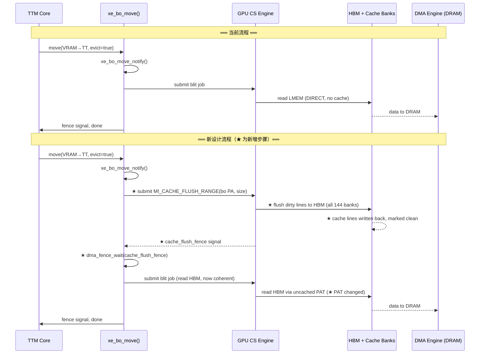
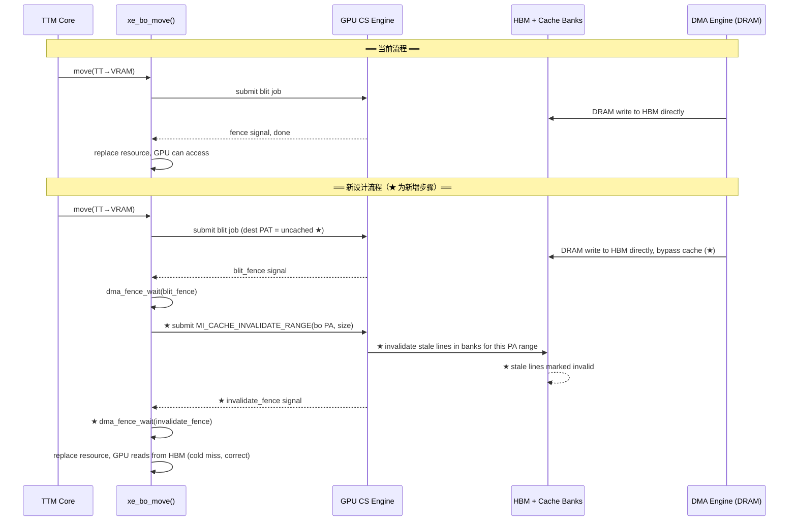
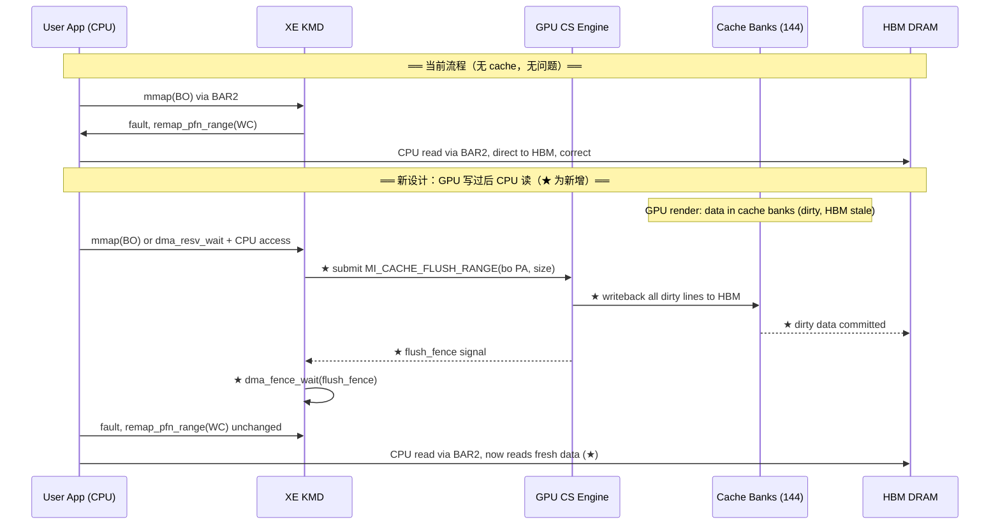
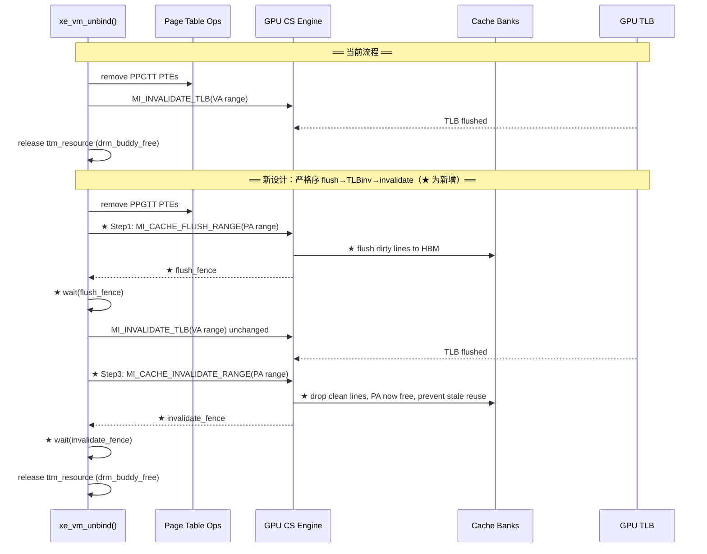
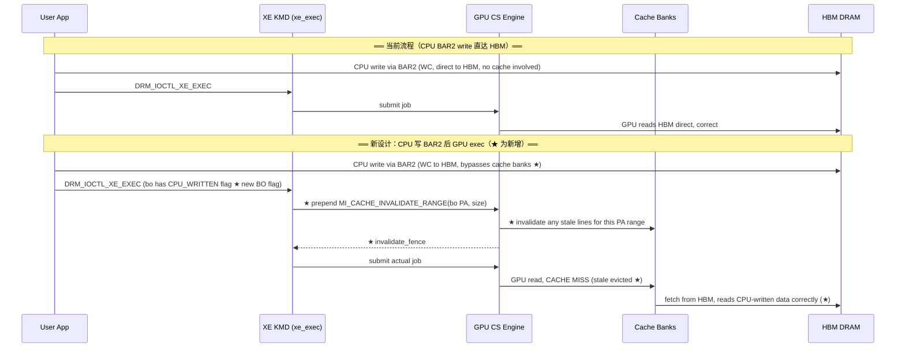
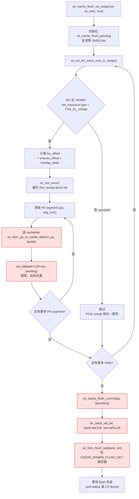
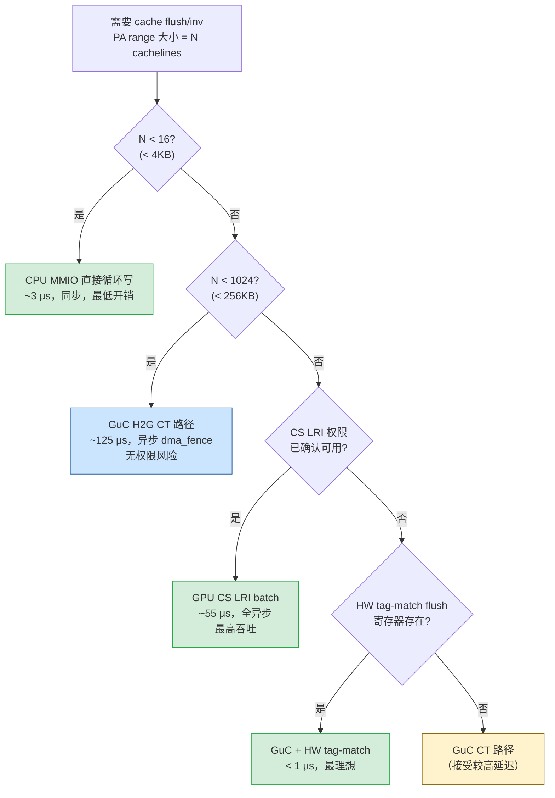

# Part 12: 新型 HBM Cache 架构下 XE KMD 的适配设计

---

## 12.1 新 GPU Cache 设计描述

假设一个新的 GPU HBM cache 架构，具有以下特性：

1. **HBM 分片**：HBM 按哈希分为 **144 个 bank**，每个 cache line 的数据通过哈希均匀分布到各 bank；每个 bank 有独立的 Memory Controller 和 Cache Bank。
2. **无 MESI 协议**：所有 cache bank 中同一 HBM 物理地址**只有一份副本**。请求方（任何 agent）对 HBM 物理地址的访问通过哈希路由到对应的专属 MC/Cache Bank。
3. **软件负责 cache maintenance**：flush（脏数据写回 HBM）和 invalidate（无效化 cache line）均为**软件职责**，硬件不提供自动一致性保证。
4. **每个 Cache Bank 的结构**：128 sets × 8 ways。

### Cache 规模估算

- 每个 bank：128 sets × 8 ways × 128B cache line = **128 KB/bank**
- 总容量：144 × 128 KB = **~18 MB** 等效 L2 cache
- 任意 PA 只映射到一个 bank 的一个 set（8-way associativity），无跨 bank 副本

**本质**：这是一个 **software-managed, physically-indexed, hash-distributed, write-back cache**，类似 Intel PVC 的 HBM L2 cache，但去掉了硬件一致性协议。

---

## 12.2 XE KMD 需要适配的核心问题

### 12.2.1 最大变化：软件 Cache Maintenance Primitives

**当前 XE** 对 VRAM 访问无缓存假设（GPU 直达 LMEM 控制器）。新设计在 HBM 前加了 cache，但没有 MESI，驱动必须显式管理：

| 操作 | 时机 | 影响路径 |
|------|------|---------|
| **Cache Flush（dirty → HBM）** | VRAM BO 被驱逐到 sysmem 之前 | `xe_bo_move()` eviction 路径 |
| **Cache Invalidate（stale → drop）** | BO 迁入 VRAM 后 GPU 首次访问前 | `xe_bo_move()` migration 路径 |
| **Flush + Invalidate** | CPU 需通过 BAR2 读 GPU 写过的 VRAM | `xe_ttm_bo_swap_notify`、CPU readback 路径 |
| **Invalidate on VM unmap** | `xe_vm_unbind()` 解绑 VRAM range 时 | 防止 stale line 被后续 BO 误读 |

驱动需要新的 **MI 命令或 MMIO 寄存器**实现 PA-range 级别的 flush/invalidate。对比当前 `MI_FLUSH_DW` 处理 TLB，新设计需要类似的 `MI_CACHE_FLUSH_RANGE` 命令，插入 CS ringbuffer。

### 12.2.2 `xe_bo_move()` 的前后 Hook 必须加

```
当前: VRAM → TT 驱逐路径
  [xe_bo_move_notify] → GPU blit: LMEM → DRAM → [resource 替换]

新设计必须:
  [xe_bo_move_notify]
    → 提交 MI_CACHE_FLUSH_RANGE(bo PA range)   ← 新增！确保脏 line 写回 HBM
    → dma_fence_wait(flush_fence)               ← 等 flush 完成才能 DMA
    → GPU blit / CPU DMA: HBM → DRAM
    → [resource 替换]

  TT → VRAM 迁入路径:
    → DMA: DRAM → HBM
    → 提交 MI_CACHE_INVALIDATE_RANGE(bo PA range)  ← 新增！清除可能的 stale line
    → dma_fence_wait(invalidate_fence)
    → [resource 替换，GPU 首次读到 HBM 新数据]
```

### 12.2.3 CPU BAR2 读 VRAM 数据的一致性问题

这是最棘手的场景：

```
GPU 写 VRAM → 数据在 cache bank（dirty，HBM 是旧数据）
CPU 通过 BAR2 读同一地址 → BAR2 绕过 GPU cache → 读到 HBM 旧数据 ✗
```

**根本原因**：CPU BAR2 访问直达 HBM，不经过 GPU cache bank。

**KMD 解法**：
- 在 `xe_ttm_io_mem_reserve()` 或 `dma_resv` wait 路径中，CPU map 前必须触发 GPU cache flush
- 类似 `xe_bo_wait_ctx()` 等 fence，但还需加一个 cache-flush fence
- **影响 uAPI**：`DRM_IOCTL_XE_GEM_MMAP_OFFSET` 之后的首次 fault，或 `DRM_IOCTL_SYNC_FENCE` 需要隐式包含 cache flush

### 12.2.4 PAT / coh_mode 修改

现有 `coh_mode` 在新架构下需新增语义：

```c
// 当前 xe_pat.c 的 coh_mode 假设 GPU 直访 LMEM（无 cache）
// 新设计 VRAM PAT 需区分:

coh_mode = 0  → GPU 访问 VRAM: cached，no CPU snoop（普通 GPU workload）
coh_mode = 1  → GPU 访问 VRAM: uncached，bypass cache（DMA 搬移目的端，避免污染）
// 系统内存 PAT 保持不变（PCIe snoop 机制不变）
```

`xe_migrate` 引擎执行 blit 时，**目标 VRAM 的 PTE 应使用 uncached 模式**（避免 blit 数据进 cache 后立刻被 invalidate 浪费带宽），source VRAM 在 flush 后再用 uncached 读。

### 12.2.5 `xe_vm` TLB Invalidation 与 Cache Invalidation 的顺序耦合

当前：
```
unmap VA → TLB invalidation → GPU 停止访问 → 释放 resource
```

新设计：
```
unmap VA → cache flush(PA range) → TLB invalidation → cache invalidate(PA range) → 释放 resource
```

- flush **必须在 TLB invalidation 之前**（否则 GPU 可能在 flush 期间继续写入 cache）
- invalidate **必须在 TLB invalidation 之后**（确保 GPU 已停止访问，不再产生新脏线）

### 12.2.6 `xe_exec` 提交边界的隐式 Cache 操作

对于普通 GPU workload（非迁移），**输入 BO 不需要 invalidate**（GPU 自己产生的缓存命中是正确的）。但以下情况需要：

- **CPU 写过的 VRAM BO**（通过 BAR2 写，数据在 HBM，cache 中无副本）→ 提交前需 invalidate 对应 VRAM range，强制 GPU 从 HBM 重读
- **Multi-engine 同一 BO**：compute engine 和 copy engine 并发访问同一 BO，hash routing 保证同一 PA 只在一个 bank，但需要 engine 间的 cache flush fence 协调

这意味着 `xe_exec` 的 `dma_resv` read/write fences 还不够，需要额外的 **cache coherency fence** 类型。

### 12.2.7 Memory Shrinker / Purgeable 路径

`xe_ttm_tt_unpopulate` 路径中，如果 VRAM BO 被 shrinker 标记为 purgeable（内容可丢弃），当前是直接 `drm_buddy_free_list`。新设计必须先做 cache invalidate：

```c
// 新增: 释放 purgeable VRAM BO 之前
if (xe_tt->purgeable) {
    xe_gpu_cache_invalidate_range(xe, vram_pa, size);  // 不需要 flush，内容丢弃
    dma_fence_wait(...);
}
drm_buddy_free_list(mm, &vres->blocks, 0);
```

否则被释放的 VRAM 地址重新被 buddy 分配后，新 BO 的 GPU 首次读可能命中旧 bank 中的 stale line。

### 12.2.8 KMD 改动优先级汇总

| 优先级 | 改动 | 影响范围 |
|--------|------|---------|
| P0 | PA-range flush/invalidate MI 命令封装 | 新增 `xe_cache_ops.c` |
| P0 | `xe_bo_move()` 前后插入 flush/invalidate fence | 驱逐、迁移正确性 |
| P0 | CPU BAR2 读前隐式 cache flush | mmap 路径、用户可见 bug |
| P1 | PAT coh_mode 新增 VRAM uncached 模式 | blit 性能 |
| P1 | `xe_vm` unmap 的 flush→TLBinv→invalidate 严格序 | VM 管理正确性 |
| P1 | CPU 写 VRAM 后 exec 前的 invalidate | CPU→GPU 数据传递 |
| P2 | purgeable BO 释放时 invalidate | 安全性（旧数据泄漏防护） |
| P2 | `ttm_lru_bulk_move` 级别的批量 cache 操作 | 驱逐性能优化 |

**核心设计原则**：把所有 cache 维护操作表达为 GPU CS 中的 fence-able 命令（`MI_CACHE_*`），而不是 MMIO polling，这样才能与现有的 `dma_resv` / `dma_fence` 流水线无缝集成，保持异步执行效率。

---

## 12.3 新增操作的流程图（对比当前与新设计）

> 红色/高亮框为新增步骤。

### 12.3.1 VRAM → TT 驱逐流程



### 12.3.2 TT → VRAM 迁入流程



### 12.3.3 CPU BAR2 读 GPU 写过的 VRAM



### 12.3.4 VM Unmap（PPGTT 解绑）流程



### 12.3.5 CPU 写 VRAM 后提交 GPU Exec



### 12.3.6 新增 Cache 操作在 `dma_fence` 链中的位置

```mermaid
flowchart TD
    subgraph EVICT["VRAM→TT 驱逐"]
        E1["xe_bo_move_notify()"] --> E2
        E2["★ cache_flush_fence\nMI_CACHE_FLUSH_RANGE"]:::newop --> E3
        E3["blit_fence\nDMA: HBM→DRAM"] --> E4
        E4["release vram resource"]
    end

    subgraph MIGR["TT→VRAM 迁入"]
        M1["blit_fence\nDMA: DRAM→HBM\n★ uncached PAT"]:::changed --> M2
        M2["★ cache_invalidate_fence\nMI_CACHE_INVALIDATE_RANGE"]:::newop --> M3
        M3["replace resource\nGPU 可访问"]
    end

    subgraph UNMAP["VM Unmap"]
        U1["remove PTEs"] --> U2
        U2["★ flush_fence\nMI_CACHE_FLUSH_RANGE"]:::newop --> U3
        U3["TLB invalidate fence\nunchanged"] --> U4
        U4["★ invalidate_fence\nMI_CACHE_INVALIDATE_RANGE"]:::newop --> U5
        U5["drm_buddy_free"]
    end

    subgraph CPUREAD["CPU BAR2 Read"]
        C1["dma_resv_wait\nGPU render done"] --> C2
        C2["★ flush_fence\nhidden in mmap fault path"]:::newop --> C3
        C3["remap_pfn_range WC\nunchanged"]
    end

    subgraph EXEC["CPU→GPU Exec"]
        X1["CPU write via BAR2\nto HBM directly"] --> X2
        X2["★ invalidate_fence\nprepended in xe_exec"]:::newop --> X3
        X3["submit actual GPU job"]
    end

    classDef newop fill:#ffcccc,stroke:#cc0000,color:#000
    classDef changed fill:#fff0cc,stroke:#cc8800,color:#000
```



---

## 12.4 各场景 Cache 操作快速参考

| 场景 | GPU 写前 | GPU 首次读前 | CPU BAR2 读前 |
|------|---------|-------------|--------------|
| VRAM → TT 驱逐 | ★ **FLUSH** | — | — |
| TT → VRAM 迁入 | — | ★ **INVALIDATE** | — |
| CPU BAR2 读（GPU 写后） | ★ **FLUSH** | — | — |
| CPU 写 BAR2 后 GPU exec | — | ★ **INVALIDATE** | — |
| VM unmap (PPGTT 解绑) | ★ **FLUSH** → TLBinv → ★ **INVALIDATE** | — | — |
| Purgeable BO 释放 | — （丢弃，无需 flush） | ★ **INVALIDATE** | — |
| Multi-engine 同 BO 切换 | ★ **FLUSH** | ★ **INVALIDATE** | — |

> **所有 ★ 操作必须以 fence-able GPU CS 命令实现**，不能使用同步 MMIO polling，以保持与现有 `dma_resv`/`dma_fence` 异步 pipeline 的兼容。

---

## 12.5 Q&A：Cacheline 级 Bank 寻址与精确 Flush 实现

### Q: Cache 按 cacheline 粒度 hash 分 bank，一个 4KB page 会涉及多少个 bank？

**A：恰好 16 个 bank（每条 cacheline 对应一个不同的 bank）。**

```
4KB page，cacheline size = 256B:
  4096 / 256 = 16 cachelines

  Cacheline 0:  PA = page_base + 0x000  → hash(PA) → bank_id_0
  Cacheline 1:  PA = page_base + 0x100  → hash(PA) → bank_id_1
  ...
  Cacheline 15: PA = page_base + 0xF00  → hash(PA) → bank_id_15
```

如果 hash 函数使用了 `PA[11:8]`（4 bits → 16 个取值），则一个 4KB page 内的 16 条 cacheline
**精确地分散到 16 个不同的 bank**。这是 hash 设计的刻意行为：最大化多 bank 并发带宽。

因此，对任意 VA range 的 flush，KMD **不能只操作一个 bank**，必须精确计算每条
cacheline 落在的 (bank, set)，逐一触发寄存器写。

---

### Q: PA → (Bank, Set) 的地址分解如何实现？144 不是 2 的幂次怎么处理？

**A：hash 函数必须由 BSpec 给出精确公式，KMD 硬编码实现——任何近似都会导致 flush 打错 bank，造成 silent data corruption。**

```
144 = 16 × 9 = 2^4 × 3^2
```

由于 144 不是 2 的幂次，bank 的 hash 函数**不能是简单的 bit-select/mask**，可能方案：

| 方案 | 公式 | 说明 |
|------|------|------|
| **XOR fold** | `bank = XOR_fold(PA[47:CL_SHIFT]) % 144` | 最常见，需 BSpec 确认折叠宽度 |
| **两级分解** | `bank = (PA_high % 9) * 16 + PA[CL_SHIFT+3:CL_SHIFT]` | 利用 144=9×16 的可分解性 |
| **多项式 hash** | `bank = poly_hash(PA_bits) % 144` | 最均匀，但 SW 计算开销最高 |

**Set index** 通常来自 cacheline index 的低位：

```
cl_idx = PA >> CL_SHIFT              // 去掉 cacheline 内 offset bits (256B → shift 8)
set    = cl_idx & (SETS_PER_BANK-1)  // 取低 7 bits：128 sets → bits[6:0]
```

若 set 也经过了 hash（fully-associative-style routing），则 SW 无法预计算 set，需要
HW 提供 tag-match flush 接口（见下文"关键未解问题"）。

```c
struct xe_cache_addr {
    u32 bank;   /* 0 – 143 */
    u32 set;    /* 0 – 127 */
};

/*
 * xe_hbm_pa_to_cache_addr - 将 VRAM PA 转换为 (bank, set) 坐标
 *
 * !! 此函数的 hash 公式必须与 BSpec 中 cache bank routing 章节完全一致 !!
 * !! 任何偏差会导致 flush 打到错误 bank，造成 silent data corruption     !!
 *
 * @pa:  VRAM DPA（device physical address），cacheline 对齐
 * @out: 输出 (bank, set) 对
 */
static void xe_hbm_pa_to_cache_addr(u64 pa, struct xe_cache_addr *out)
{
    u32 cl_idx = pa >> XE_HBM_CACHELINE_SHIFT;

    /*
     * TODO: 替换为 BSpec 给出的精确公式，以下为占位符示意：
     *   fold  = cl_idx[31:16] ^ cl_idx[15:0]    // 16-bit XOR fold
     *   bank  = xe_hbm_bank_hash(fold)           // % 144，BSpec-defined
     *   set   = cl_idx & (SETS_PER_BANK - 1)     // bits[6:0]
     */
    out->bank = xe_hbm_bank_hash(cl_idx);                      /* BSpec-defined */
    out->set  = cl_idx & (XE_HBM_CACHE_SETS_PER_BANK - 1);
}
```

---

### Q: HW 只提供 set/way 级别的 flush 寄存器，SW 如何知道该用哪个 way？

**A：SW 无法得知 way（tag 只有 HW 知道）。策略：flush 整个 set 的全部 8 ways，对 clean ways HW 自动跳过。**

HW 寄存器接口（per-bank）：

```
CACHE_BANKN_FLUSH_SET_WAY:
  [6:0]  = set_index      (0–127)
  [9:7]  = way_index      (0–7)
  [10]   = flush_all_ways (1 = 忽略 way 字段，flush 整个 set 的所有 ways)
  [31]   = trigger        (写 1 触发，HW auto-clear)
```

**SW 策略：始终置 `flush_all_ways = 1`**：
- 对 **clean ways**：HW 内部 tag 扫描后跳过（no writeback，no penalty）
- 对 **dirty ways**：HW 执行 writeback 到 HBM
- **正确且安全**，最多多扫描 7 个 clean ways，HW 内部开销极小

```c
static void xe_hbm_flush_set(struct xe_gt *gt, u32 bank, u32 set)
{
    u32 val = FIELD_PREP(CACHE_SET_INDEX, set) |
              CACHE_FLUSH_ALL_WAYS |
              CACHE_FLUSH_TRIGGER;
    xe_mmio_write32(gt, CACHE_BANKN_FLUSH_SET(bank), val);
    /* 若需 CPU 同步等待完成：poll CACHE_BANKN_STATUS(bank) until FLUSH_DONE bit set */
}
```

---

### Q: SW 需要什么数据结构来高效管理待 flush 的 (bank, set) 集合并避免重复操作？

**A：使用扁平 bitmap 对 (bank, set) 对进行去重，每对最多触发一次 MMIO 写。**

```
144 banks × 128 sets = 18,432 bits = 2,304 bytes ≈ 2.25 KB（栈分配可接受）
```

```c
/*
 * 每次 VA-range flush 的 pending (bank,set) 集合
 * bit[bank * XE_HBM_SETS_PER_BANK + set] = 1 表示该对需要 flush
 */
struct xe_cache_flush_pending {
    DECLARE_BITMAP(pending,
                   XE_HBM_CACHE_BANKS * XE_HBM_CACHE_SETS_PER_BANK); /* 18432 bits */
};

/* 将 PA range 内的所有 cacheline 对应的 (bank,set) 标入 bitmap */
static void xe_cache_flush_mark_pa_range(struct xe_cache_flush_pending *p,
                                          u64 pa, u64 size)
{
    u64 cl_pa;
    for (cl_pa = ALIGN_DOWN(pa, XE_HBM_CACHELINE_SIZE);
         cl_pa < pa + size;
         cl_pa += XE_HBM_CACHELINE_SIZE) {
        struct xe_cache_addr addr;
        xe_hbm_pa_to_cache_addr(cl_pa, &addr);
        /* set_bit 是幂等的：同一 (bank,set) 被多个 PA aliases 标记，只写一次 MMIO */
        set_bit((u32)addr.bank * XE_HBM_CACHE_SETS_PER_BANK + addr.set,
                p->pending);
    }
}

/* 遍历 bitmap，对每个置位的 (bank,set) 发射一次 MMIO flush */
static void xe_cache_flush_commit(struct xe_gt *gt,
                                   struct xe_cache_flush_pending *p)
{
    unsigned long bit;
    for_each_set_bit(bit, p->pending,
                     XE_HBM_CACHE_BANKS * XE_HBM_CACHE_SETS_PER_BANK) {
        u32 bank = bit / XE_HBM_CACHE_SETS_PER_BANK;
        u32 set  = bit % XE_HBM_CACHE_SETS_PER_BANK;
        xe_hbm_flush_set(gt, bank, set);
    }
}
```

**去重效益**：同一 BO 被多个 VA 映射（DMA-buf 共享，PA aliasing）时，相同 PA 的
cacheline 在 bitmap 中只置位一次，**保证每个 (bank, set) 最多触发一次 MMIO 写**。

---

### Q: 从 VA range 到实际 MMIO flush 的完整流程是什么？

**A：三层转换——VA→VMA→PA segments→(bank,set) bitmap→MMIO。**

```
Layer 1: VA range → xe_vma 列表
  xe_vm_for_each_vma_in_range(vm, va_start, va_end, vma)
  ├─ 跳过非 VRAM BO（sysmem 走 PCIe snoop，无需 SW flush）
  └─ bo_offset = xe_vma_bo_offset(vma) + (overlap_start - xe_vma_start(vma))

Layer 2: (bo, bo_offset, flush_len) → PA segment 列表
  xe_res_first(bo->ttm.resource, bo_offset, flush_len, &cursor)
  while (xe_res_cursor_remaining(&cursor)):
      pa   = cursor.start
      size = min(cursor.size, remaining)
      xe_cache_flush_mark_pa_range(&pending, pa, size)
      xe_res_cursor_advance(&cursor)

Layer 3: bitmap → MMIO
  xe_cache_flush_commit(gt, &pending)
```



---

### Q: 最坏情况需要多少次 MMIO 写？是否对 CPU 可接受？

**A：最坏情况 18,432 次，耗时约 2–6ms（CPU 侧），超过阈值必须走 GPU CS 路径。**

| 场景 | Cachelines | 涉及 (bank,set) 对 | MMIO 次数 | CPU 耗时估算 |
|------|-----------|-------------------|----------|------------|
| 单个 4KB page | 16 | 最多 16 | 16 | ~1.6 μs |
| 256KB BO（典型纹理） | 1,024 | 最多 1,024 | ≤ 1,024 | ~100 μs |
| 1MB BO | 4,096 | 最多 4,096 | ≤ 4,096 | ~400 μs |
| 全量 VRAM flush | 巨大 | **18,432（满 bitmap）** | **18,432** | **~2–6 ms** |
| 局部性好（同 set 被多个 cacheline 复用） | N | << N | 远小于 N | 可忽略 |

- 每次 uncached MMIO write ≈ **100–300 ns**（PCIe MMIO latency）
- 18,432 次 × 200 ns ≈ **3.7 ms**：对于驱逐/迁移路径完全不可接受，**必须走 GPU CS 路径**

---

### Q: 应该用 CPU MMIO 还是 GPU CS 命令来发射 flush 寄存器写？

**A：生产路径优先 GPU CS（异步、快速、与 dma_fence 原生集成），CPU MMIO 仅用于小范围同步调试场景。**

| 维度 | CPU MMIO 路径 | GPU CS 路径（推荐） |
|------|-------------|-------------------|
| 实现复杂度 | 低（直接循环 `xe_mmio_write32`） | 高（构造 LRI batch buffer） |
| 速度（小 flush < 4KB） | 快（无提交调度开销） | 慢（submit latency） |
| 速度（大 flush > 256KB） | 慢（大量 PCIe uncached writes） | 快（GPU 内部总线并发写多 bank） |
| 异步性 | 阻塞 CPU | 完全异步，返回 `dma_fence` |
| 与 `dma_resv` 集成 | 不兼容（需手动 fence 封装） | 原生兼容 |
| 流水线并发 | 阻塞等待 | flush 与下一 job 可流水 |
| 适用场景 | 调试、< 4KB 的同步 flush | 生产路径、大 BO、eviction |

**GPU CS 方案**（构造 `MI_LOAD_REGISTER_IMM` 序列的 batch buffer）：

```c
/*
 * 构造 CS flush batch：为 pending bitmap 中每个 (bank,set) 发一条 LRI
 * 最坏情况 batch size: 18432 × 3 DWORDs = ~221 KB
 *
 * 前提：CACHE_BANKN_FLUSH_SET 寄存器必须位于 GT MMIO 地址空间
 *       且 CS ring 的特权级允许 LRI 写该地址范围（需 BSpec 确认）
 */
static int xe_cache_flush_build_cs_batch(struct xe_cache_flush_pending *p,
                                          struct xe_bb *bb)
{
    unsigned long bit;
    for_each_set_bit(bit, p->pending,
                     XE_HBM_CACHE_BANKS * XE_HBM_CACHE_SETS_PER_BANK) {
        u32 bank = bit / XE_HBM_CACHE_SETS_PER_BANK;
        u32 set  = bit % XE_HBM_CACHE_SETS_PER_BANK;
        u32 val  = FIELD_PREP(CACHE_SET_INDEX, set) |
                   CACHE_FLUSH_ALL_WAYS | CACHE_FLUSH_TRIGGER;
        bb_emit_lri(bb, CACHE_BANKN_FLUSH_SET(bank).addr, val);
    }
    return 0;
}
```

---

### 12.5 关键未解问题汇总

| # | 问题 | 影响范围 | 需要确认来源 |
|---|------|---------|------------|
| 1 | **Bank hash 函数的精确公式**（`xe_hbm_bank_hash` 实现） | 错误 hash → silent data corruption | BSpec cache routing 章节 |
| 2 | **Set index 来自 PA 哪些 bits**（直接 bit-select 还是也经过 hash） | 决定 `xe_hbm_pa_to_cache_addr` 能否纯 SW 预计算 set | BSpec |
| 3 | **是否支持 tag-match flush（by PA，HW 内部做 CAM 查找 set/way）** | 若支持，SW 无需预计算 (bank,set)，大幅简化实现 | BSpec / HW team |
| 4 | **Flush 完成的同步机制**（poll status bit 还是 CS completion signal） | 影响 CPU MMIO 路径的轮询方式与 CS 路径的 fence 插入点 | BSpec |
| 5 | **CS LRI 能否写 HBM bank flush 寄存器**（CS 特权级 vs HBM controller 地址范围） | 决定是否能走 GPU CS 异步路径；若不能，生产路径只能 CPU MMIO | BSpec + CS privilege model |
| 6 | **Cacheline size 是 128B 还是 256B** | 直接影响 4KB page 涉及 bank 数量（32 vs 16），以及 bitmap 大小计算 | BSpec |

---

## 12.6 Q&A：由 GuC FW 执行 Cache Flush/Inv 的性能可行性分析

### Q: 如果把 cache flush/invalidate 交给 GuC FW 执行，性能是否可以接受？

**A：GuC FW 方案比 CPU MMIO 快约 8×，整体可接受，但有 CT 往返开销和单线程串行的局限。**

### 核心优势：绕开 PCIe，换成 on-die GT 内部 fabric

GuC 是 GT 片上的微控制器（~400 MHz），它写 MMIO 寄存器走的是 **GT 内部总线**，
而不是 CPU 侧的 PCIe MMIO 路径：

```
CPU MMIO write:   CPU → PCIe Root Complex → PCIe link → GT MMIO
                  latency ≈ 100–300 ns per write

GuC MMIO write:   GuC uC → GT internal fabric → cache bank register
                  latency ≈ 10–25 ns per write (on-die)
```

**全量 18,432 次写的耗时估算**：

| 执行者 | 单次 MMIO 延迟 | 18,432 次总耗时 | 可接受性 |
|--------|--------------|----------------|---------|
| CPU（PCIe MMIO） | ~200 ns | **~3.7 ms** | ✗ 不可接受 |
| **GuC uC（on-die）** | ~25 ns | **~460 μs** | △ 勉强可接受 |
| GPU CS LRI（~1 GHz ring） | ~3 ns | **~55 μs** | ✓ 最快（存在权限不确定性） |
| GuC + HW tag-match flush（若 BSpec 支持） | N/A | **< 1 μs** | ✓✓ 最理想 |

### GuC 方案的执行流程

```
KMD 侧:
  1. 将 xe_cache_flush_pending bitmap 放入 GGTT-mapped buffer（GuC 可访问）
  2. xe_guc_ct_send(H2G: XE_GUC_ACTION_CACHE_FLUSH,
                    bitmap_ggtt_addr, bitmap_size_bits)
  3. 挂起等待 G2H 回复（映射为 dma_fence）

GuC FW 侧:
  1. 收到 H2G，读取 bitmap buffer
  2. for_each_set_bit(bit, bitmap):
       bank = bit / SETS_PER_BANK
       set  = bit % SETS_PER_BANK
       MMIO_WRITE(CACHE_BANKN_FLUSH_SET(bank),
                  set | FLUSH_ALL_WAYS | TRIGGER)  ← on-die, ~25ns/write
  3. xe_guc_ct_send(G2H: XE_GUC_RESPONSE_CACHE_FLUSH_DONE, seqno)

KMD 侧:
  4. 收到 G2H → dma_fence_signal(flush_fence)
  5. 返回 fence 给调用者（完全异步）
```

与 CS LRI 方案不同，GuC 写 GT MMIO 不存在权限问题（GuC 本身就有完整的
GT MMIO 访问权，`xe_guc_mmio_write` 路径已有先例）。

### GuC 方案的主要局限

| 问题 | 影响 |
|------|------|
| **CT 往返开销约 50–200 μs** | 对小 flush（≤ 16 cachelines），CT 调度开销大于实际 MMIO 时间，不如 CPU 直接写 |
| **GuC 单线程串行** | GuC ~400 MHz 且串行写寄存器，无法并发利用 144 bank 的物理并行能力 |
| **GuC 与调度竞争** | GuC 同时负责 context scheduling、GuC-PC 功耗管理、reset handling；大量 flush 会增加调度 latency |
| **FW 复杂度增加** | GuC FW 中加入 bitmap 迭代逻辑，增加验证难度，影响 FW 发布节奏 |

### 最优分级策略

根据 flush 规模选择最合适的执行路径：

```
flush size < 4KB (≤ 16 cachelines):
    → CPU MMIO 直接写
      16 × ~200ns = ~3.2 μs，无 CT 往返开销
      适用：调试路径、同步 readback、小 BO

4KB ≤ flush size < 256KB (16 – 1024 cachelines):
    → GuC H2G CT 路径
      1024 × 25ns = ~25 μs（GuC 执行）+ CT ~100 μs = ~125 μs
      CT 开销可被摊薄，GuC 权限无风险

flush size ≥ 256KB 或 eviction/migration 主路径:
    → GPU CS LRI batch（若 BSpec 确认 CS 有 MMIO 写权限）
      18432 × 3ns = ~55 μs，全异步，原生 dma_fence
    → 或 GuC + HW tag-match flush（若 BSpec 提供 PA 级 flush 接口，最理想）
```



### 结论

**GuC FW 方案在性能上是可行的**（比 CPU MMIO 快 8×，且规避了 CS LRI 的权限不确定性），
适合作为中等规模 flush 的标准路径。其主要制约是 CT 往返开销（对小 flush 不划算）和 GuC
单线程串行的固有上限。

**最理想组合**：GuC FW 执行 + HW 提供 **PA 级 tag-match flush 接口**（HW 内部自动
做 set/way CAM 查找）→ GuC 只需写一个 PA range 命令，HW 完成 ~μs 级精确 flush，同时
彻底解决 SW 无法预知 way 的问题。这也是 §12.5 关键未解问题 #3 的最优解。
---

## 12.7 Q&A：SW 无法知道 Way——`flush_all_ways` 的设计意义

### Q: Bank 和 Set 可以从 PA 推导，但 Way 无法推导。SW 如何知道一个 PA 是否被缓存？如果被缓存，在哪个 Way？

**A：SW 永远无法知道 Way，也无法知道 PA 是否被缓存。这两个问题都由 `flush_all_ways=1`
寄存器位在 HW 内部解决——SW 无需知道。**

### 三个地址分量的可知性分析

```
PA → bank:  hash(PA)            ✓  SW 可计算（须与 BSpec hash 公式完全一致）
PA → set:   PA[set_high:set_low] ✓  SW 可计算（直接取 PA 的固定 bit 段）
PA → way:                       ✗  SW 永远不可知
PA → "是否被缓存":               ✗  SW 同样不可知
```

**Way 不可知的根本原因**：Way 是在 cacheline 被**加载进 cache 时**，由 HW 替换策略
（LRU / pseudo-LRU / random）在 8 个 way 中选择一个空闲或最老的 slot 填入的。这个决策
完全发生在 HW 内部，KMD 不参与，也没有任何接口事后查询。同理，"PA 是否被缓存"等价于
"某个 way 的 tag 是否等于该 PA 的 tag bits"——仍然只有 HW tag array 知道。

### `flush_all_ways=1` 的本质：set 级别的 HW tag-match 操作

SW 写寄存器时只提供 **(bank, set)**，剩下的 tag 比较和 way 选择完全由 HW 完成：

```
SW 提供: bank (from hash), set (from PA bits), flush_all_ways=1, trigger=1

HW 内部执行（并行扫描全部 8 ways）:
  for way in 0..7:
      tag_stored  = cache_bank[bank].set[set].way[way].tag_bits
      tag_from_pa = PA[63 : set_high+1]            ← PA 的高位 tag 段
      if tag_stored == tag_from_pa:                 ← CAM tag 比较
          if op == FLUSH and dirty_bit[way]:
              writeback cacheline to HBM            ← 脏数据写回
          if op == INVALIDATE:
              mark way[way] as INVALID              ← 清除有效位（不管 dirty）
          if op == FLUSH_AND_INVALIDATE:
              writeback if dirty, then mark INVALID
      else:
          no-op                                     ← tag 不匹配，跳过
```

**关键结论**：
1. **PA 没有被缓存**（8 个 way 全部 tag miss）→ 全部 no-op → **自动正确，零副作用**
2. **PA 被缓存在某个 way**（恰好一个 way tag match）→ 精确 flush/invalidate 该 way
3. **SW 完全不需要知道 way**，`flush_all_ways` 本质上是把"查 way"这一步下推到 HW

这正是 `flush_all_ways=1` 的设计意义：**在 set 粒度上做正确的 tag-match，代价仅是
HW 并行扫描 8 ways**（在 cache 硬件里是极低延迟的并行 CAM 操作，无额外性能开销）。

### 两种 flush 接口的对比

| 接口 | SW 提供 | HW 责任 | Way 可知性要求 |
|------|---------|---------|--------------|
| `flush_set_way(bank, set, way)` | (bank, set, **way**) | 直接操作指定 way | SW 必须知道 way ✗ |
| **`flush_all_ways(bank, set)`** | (bank, set) | **内部 tag-match，选正确 way** | SW 无需知道 way ✓ |
| `flush_by_pa(PA)` （理想接口） | **完整 PA** | 内部做 hash→bank，取 set bits，tag-match | SW 连 bank/set 都不需要计算 ✓✓ |

`flush_all_ways` 是现有寄存器接口下的最优方案。`flush_by_pa` 是 §12.5 未解问题 #3
（tag-match flush）的理想形态——如果 BSpec 提供此接口，SW 只需传 PA，HW 完全自主。

### 对正确性的影响：多余的 way 扫描是否有问题？

```
一个 set 有 8 ways，PA 只在其中一个 way（或根本不在）：
  - 匹配的 way（0或1个）: 执行 flush/invalidate → 正确
  - 不匹配的 7 ways: tag 比较失败 → no-op → 正确
  - 脏的不匹配 way: tag 不同 → 跳过 → 正确（属于其他 PA，不能动）
```

**`flush_all_ways` 是幂等且无副作用的**：它只操作 tag 精确匹配的 way，
其他 way 的数据完全不受影响。反复调用同一 (bank, set) 的结果与调用一次相同。

### 实现简化

这一分析的重要推论：§12.5 中的 `xe_hbm_flush_set()` 实现**不需要任何 way 参数**，
始终使用 `flush_all_ways=1`，这是正确且唯一可行的 SW 接口：

```c
/*
 * xe_hbm_flush_set - flush/invalidate a cache set across all ways
 *
 * SW cannot determine which way a PA occupies (way is assigned by HW
 * replacement policy at load time, not derivable from PA).
 * Setting CACHE_FLUSH_ALL_WAYS delegates tag comparison to HW:
 *   - HW scans all 8 ways in parallel
 *   - Only the way whose tag matches PA[tag_bits] is flushed/invalidated
 *   - Non-matching ways are silently skipped (no side effects)
 *   - If PA is not cached (all ways miss), the operation is a no-op
 *
 * This is correct, safe, and the only viable approach for SW-managed flush.
 *
 * @gt:   GT instance
 * @bank: cache bank index (0–143), derived from xe_hbm_bank_hash(PA)
 * @set:  set index (0–127), derived from PA[set_high:set_low]
 * @op:   XE_HBM_FLUSH, XE_HBM_INVALIDATE, or XE_HBM_FLUSH_AND_INVALIDATE
 */
static void xe_hbm_flush_set(struct xe_gt *gt, u32 bank, u32 set,
                              enum xe_hbm_cache_op op)
{
    u32 val = FIELD_PREP(CACHE_SET_INDEX, set) |
              CACHE_FLUSH_ALL_WAYS;   /* always: SW cannot know the way */

    if (op == XE_HBM_FLUSH || op == XE_HBM_FLUSH_AND_INVALIDATE)
        val |= CACHE_OP_FLUSH;
    if (op == XE_HBM_INVALIDATE || op == XE_HBM_FLUSH_AND_INVALIDATE)
        val |= CACHE_OP_INVALIDATE;

    val |= CACHE_FLUSH_TRIGGER;
    xe_mmio_write32(gt, CACHE_BANKN_FLUSH_SET(bank), val);
}

---

## 12.8 Q&A：其他 GPU 厂商如何处理类似的 Cache 维护问题？

> 本节基于 Linux 内核 `drivers/gpu/drm/` 下各厂商驱动源码的实际分析，
> 并结合公开 ISA/架构文档。

### Q: AMD、NVIDIA、Qualcomm、ARM Mali 等厂商如何处理 GPU cache flush/invalidate？与新 HBM cache 设计有何本质区别？

**A：所有主流 GPU 厂商均通过单条 CS 数据包发出全局 cache 操作，不需要 SW 感知
bank/set/way 结构。这是与新 HBM cache 设计最核心的架构差异。**

---

### 12.8.1 AMD RDNA3（GFX11）——`ACQUIRE_MEM` + `GCR_CNTL` 数据包

**驱动来源**：`drivers/gpu/drm/amd/amdgpu/gfx_v11_0.c`，
函数 `gfx_v11_0_emit_mem_sync()`

```c
/* 实际内核代码（来自 gfx_v11_0.c:6736）*/
static void gfx_v11_0_emit_mem_sync(struct amdgpu_ring *ring)
{
    const unsigned int gcr_cntl =
        PACKET3_ACQUIRE_MEM_GCR_CNTL_GL2_INV(1) |  /* L2 cache (GL2) invalidate */
        PACKET3_ACQUIRE_MEM_GCR_CNTL_GL2_WB(1)  |  /* L2 cache writeback        */
        PACKET3_ACQUIRE_MEM_GCR_CNTL_GLM_INV(1) |  /* metadata cache invalidate */
        PACKET3_ACQUIRE_MEM_GCR_CNTL_GLM_WB(1)  |  /* metadata cache writeback  */
        PACKET3_ACQUIRE_MEM_GCR_CNTL_GL1_INV(1) |  /* per-shader-array L1 inv   */
        PACKET3_ACQUIRE_MEM_GCR_CNTL_GLV_INV(1) |  /* vertex data cache inv     */
        PACKET3_ACQUIRE_MEM_GCR_CNTL_GLK_INV(1) |  /* scalar data (K$) inv      */
        PACKET3_ACQUIRE_MEM_GCR_CNTL_GLI_INV(1);   /* instruction cache inv     */

    amdgpu_ring_write(ring, PACKET3(PACKET3_ACQUIRE_MEM, 6));
    amdgpu_ring_write(ring, 0);           /* CP_COHER_CNTL */
    amdgpu_ring_write(ring, 0xffffffff);  /* CP_COHER_SIZE    ← 全范围 */
    amdgpu_ring_write(ring, 0xffffff);    /* CP_COHER_SIZE_HI ← 全范围 */
    amdgpu_ring_write(ring, 0);           /* CP_COHER_BASE    ← base=0  */
    amdgpu_ring_write(ring, 0);           /* CP_COHER_BASE_HI */
    amdgpu_ring_write(ring, 0x0000000A);  /* POLL_INTERVAL */
    amdgpu_ring_write(ring, gcr_cntl);    /* GCR_CNTL */
}
```

**架构特点**：
- `ACQUIRE_MEM` 数据包**架构上支持 PA range**（`CP_COHER_BASE + CP_COHER_SIZE`）
- 但驱动实际使用 `BASE=0, SIZE=0xffffffff` → **全局 flush**——无需 SW 知道 PA
- HW 内部自行确定哪些 cache line 属于该 range，SW 完全不参与 bank/set/way 计算
- `GCR_CNTL` 各位独立控制多级 cache（GL2/GL1/GLM/GLV/GLK/GLI），精细度高但仍是广播

---

### 12.8.2 Qualcomm Adreno A6xx——`CP_EVENT_WRITE` + CCU flush 事件

**驱动来源**：`drivers/gpu/drm/msm/adreno/a6xx_gpu.c`

```c
/* 每次 job 提交前：CCU（Color Cache Unit）全局 invalidate */
OUT_PKT7(ring, CP_EVENT_WRITE, 1);
OUT_RING(ring, CP_EVENT_WRITE_0_EVENT(PC_CCU_INVALIDATE_DEPTH));

OUT_PKT7(ring, CP_EVENT_WRITE, 1);
OUT_RING(ring, CP_EVENT_WRITE_0_EVENT(PC_CCU_INVALIDATE_COLOR));

/* job 执行完毕后：CACHE_FLUSH_TS 事件写 fence 值并触发中断 */
OUT_PKT7(ring, CP_EVENT_WRITE, 4);
OUT_RING(ring, CP_EVENT_WRITE_0_EVENT(CACHE_FLUSH_TS) | CP_EVENT_WRITE_0_IRQ);
OUT_RING(ring, lower_32_bits(rbmemptr(ring, fence)));
OUT_RING(ring, upper_32_bits(rbmemptr(ring, fence)));
OUT_RING(ring, submit->seqno);
```

**架构特点**：
- CCU（Color Cache Unit）是每个 RB（Render Backend）的写合并缓冲区，类似 L1 write buffer
- `CP_EVENT_WRITE` 事件是**全局广播**，不带任何 PA 地址参数
- SW 完全无需了解 CCU 内部结构（set/way/bank 等），HW 自动 flush 所有 CCU
- Adreno 的 L2（UCHE，Unified Command/Constant/Clip/Color/Compute Cache）同样通过
  `CP_EVENT_WRITE(FLUSH_INVALIDATE_CACHE)` 整体 flush，无 PA range

---

### 12.8.3 NVIDIA Hopper/Ampere（以 Nouveau/CUDA 公开信息为参考）

**NVIDIA 方式**：通过 **PTX `membar` 指令** + **CS SEMAPHORED packet** 处理一致性

```
# Shader 内：全局内存屏障（等价于 flush 所有 L1/L2 pending write）
membar.gl;      /* GPU-global scope: 等待所有 prior global writes visible to all SMs */
membar.sys;     /* System scope:     还包含 CPU 可见性 (NVLink / PCIe flush) */

# Driver CS path：
# SEMAPHORED packet 中的 RELEASE_WFI=EN 确保 GPU idle 后才写 semaphore
# 等价于隐式的全局 L2 flush（GPU 内部自动处理）
```

**架构特点**：
- NVIDIA L2 cache 对所有 SM **硬件一致**（SM 之间 L2 line 共享，无手动 inv 需求）
- SW 的工作仅是内存序屏障（`membar`），而非显式 cache maintenance
- NVIDIA 从不向 KMD 暴露 L2 bank/set/way 结构——完全黑盒
- CUDA `__threadfence_system()` 扩展到 CPU 可见性（隐含 NVLink/PCIe flush）

---

### 12.8.4 ARM Mali（Panfrost 驱动）

**驱动来源**：`drivers/gpu/drm/panfrost/`

Mali 几乎**不需要显式 GPU cache maintenance**，原因：

```
Mali GPU → ARM bus interconnect (ACE-Lite / CHI) → ARM CPU LLC
                     ↑
              HW 硬件一致性协议
              Mali L2 cache 参与 ARM coherency domain
              CPU/GPU 对同一 PA 的访问自动一致
```

- Mali GPU 使用 ARM **ACE-Lite 总线协议**，GPU L2 自动参与 ARM CPU 的 coherency domain
- 对于 DMA 操作，使用标准 Linux `dma_sync_*` / IOMMU 维护，不需要 GPU-specific cache ops
- Panfrost 驱动中唯一的 cache 操作是 **MMU TLB flush**，不涉及 data cache

---

### 12.8.5 各厂商对比汇总

| 维度 | AMD RDNA3 | Qualcomm Adreno | NVIDIA Hopper | ARM Mali | **新 HBM cache 设计** |
|------|----------|-----------------|---------------|---------|----------------------|
| **Cache 一致性机制** | SW 显式 CS 数据包 | SW 显式 CS 事件 | HW 一致（L2） | HW 一致（ACE-Lite） | **SW 显式 MMIO 循环** |
| **flush 接口** | `ACQUIRE_MEM` packet | `CP_EVENT_WRITE` | `membar` 指令 | `dma_sync_*` | **CACHE_BANKN_FLUSH_SET MMIO** |
| **PA range 支持** | 架构支持（驱动用全局） | 不支持 | 不支持 | 不适用 | **必须按 cacheline 逐一操作** |
| **SW 需知 bank/set/way** | 否 | 否 | 否 | 否 | **bank+set 需 SW 计算**（way 由 HW 决定） |
| **单次操作代价** | 1 条 PM4 数据包 | 1 条 PM4 事件 | 1 条 PTX 指令 | 无 | **最坏 18,432 次 MMIO** |
| **异步 fence 集成** | 原生（PM4 pipeline） | 原生（PM4 pipeline） | 原生（semaphore） | 原生（dma_fence） | **需要额外封装** |
| **KMD 感知 cache 结构** | 否 | 否 | 否 | 否 | **是（hash 函数必须硬编码）** |

---

### 12.8.6 关键启示：推荐的硬件接口设计方向

从所有主流厂商的实践来看，正确的解决方案是**让 HW 承担 PA→bank/set/way 的映射**，
SW 只需提供 PA range（或 CS packet 触发全局 flush）：

```
主流厂商范式（SW 只看 PA，HW 内部做 bank/set/way）：

  SW: ACQUIRE_MEM(PA_base=X, size=N)
       ↓
  HW: for each PA in [X, X+N):
          bank = hash(PA)             ← HW 内部，SW 不可见
          set  = PA[bits]             ← HW 内部，SW 不可见
          tag  = PA[tag_bits]         ← HW 内部，SW 不可见
          for way in 0..7:
              if cache[bank][set][way].tag == tag:
                  writeback if dirty
                  invalidate
```

**推论**：新 HBM cache 设计如果要对齐业界标准，**最应该提供的 HW 接口是
PA-range flush CS packet**（类似 AMD `ACQUIRE_MEM` 带精确 range），而不是让
SW 逐 bank 写 MMIO 寄存器。这样可以：

1. 消除 SW 硬编码 hash 函数的风险
2. 操作代价从 O(cachelines) 降至 O(1) 个 CS packet
3. 与 dma_fence 原生集成（CS pipeline 异步执行）
4. 未来 hash 函数变更不需要修改 KMD

**SW MMIO loop 方案**（当前讨论的路径）应仅作为 HW PA-range packet 不可用时的
fallback，而非主路径。

```mermaid
flowchart LR
    subgraph AMD["AMD RDNA3"]
        A1["SW: ACQUIRE_MEM\n(PA_base, size)\n1 packet"] --> A2["HW: 内部 bank/set/way\nCAM lookup\n透明"]
    end
    subgraph QCOM["Qualcomm Adreno"]
        Q1["SW: CP_EVENT_WRITE\n(CACHE_FLUSH_TS)\n1 event"] --> Q2["HW: CCU/UCHE\nglobal flush\n透明"]
    end
    subgraph NV["NVIDIA"]
        N1["SW: membar.gl\n1 PTX instruction"] --> N2["HW: L2 coherency\nauto-managed\n完全透明"]
    end
    subgraph NEW["新 HBM cache（当前方案）"]
        X1["SW: 计算 hash\n→ 18432 次 MMIO"] --> X2["HW: 单个 set 操作\n需 SW 驱动循环"]
    end
    subgraph IDEAL["新 HBM cache（理想方案）"]
        I1["SW: 类 ACQUIRE_MEM\n1 CS packet\n(PA_base, size)"] --> I2["HW: 内部 hash+CAM\n透明完成"]
    end

    style X1 fill:#ffcccc,stroke:#cc0000
    style X2 fill:#ffcccc,stroke:#cc0000
    style I1 fill:#d4edda,stroke:#28a745
    style I2 fill:#d4edda,stroke:#28a745